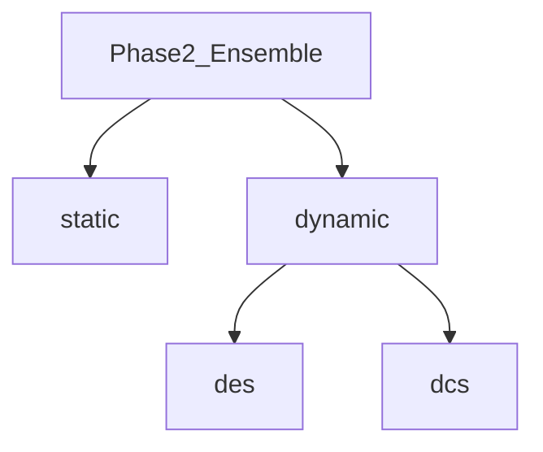

# 專案階段結構、階段二重組與 README／UML 更新計畫（修訂版）

## 你的階段定義（不變）

| 你的階段 | 含義 |
|---------|------|
| Phase 1 | Baseline：多分類器、多資料集 |
| Phase 2 | **集成**：僅分**靜態**與**動態**；動態再細分 **DES** 與 **DCS** |
| Phase 3 | **FS**（特徵選取），先建置、尚未開跑 → 仍對應倉庫 `phase4_feature/` |

## 現況問題（為何要改計畫）

- 原計畫以「文件對照」為主、**不搬目錄**；但你現在要求 **階段二在目錄上就拆成靜態／動態**，且動態內再分 **DES／DCS**，與論述一致。
- 目前 `phase2_ensemble/` 混有靜態腳本與 **XGB Old/New 年份切割**（同時含靜態與動態 DES 輸出）；`phase3_dynamic/` 另放 **DES／DCS** 主線，語意上同屬「階段二集成」，但**編號分裂**。

## 目標目錄結構（階段二）

在 **`experiments/phase2_ensemble/`** 下統一為：

```text
experiments/phase2_ensemble/
├── static/                    # 靜態集成（目前主線）
│   ├── undersampling.py
│   ├── oversampling.py
│   ├── hybrid.py
│   ├── all_combinations.py
│   ├── xgb_oldnew_ensemble_common.py   # 共用（若僅靜態＋表格式輸出可放此或上層 _shared）
│   └── xgb_oldnew_ensemble_*_year_splits_all_sampling.py   # 僅靜態列／或整支保留在此若仍與動態共用 common
├── dynamic/
│   ├── des/                   # 動態集成選擇 DES（KNORA、year-split DES、advanced 等）
│   │   ├── standard.py       # 由原 phase3_dynamic/des/standard.py 移入
│   │   ├── advanced.py
│   │   └── …（XGB year-split 動態 DES 專用腳本，自原 phase2 根目錄移入）
│   └── dcs/                  # 動態分類器選擇 DCS
│       └── comparison.py     # 由原 phase3_dynamic/dcs/comparison.py 移入
└── __init__.py
```

**設計要點：**

- **同一階段、兩種融合方式**：`static/`（平均／固定組合＋閾值）vs `dynamic/`（依樣本鄰域選模或加權）。
- **`dynamic/des` vs `dynamic/dcs`**：DES 為**多模型融合**；DCS 為**單一模型選擇**（與既有 `common_des` / `common_dcs` 分工一致）。
- **`xgb_oldnew_ensemble_common.py`**：若靜態與動態 DES 共用，可放在 `phase2_ensemble/` **根**（與 `static/`、`dynamic/` 同層）或 `experiments/_shared/`，避免重複；計畫執行時以**最少重複**為準。

## 與舊路徑的對應與相容

| 舊路徑 | 新歸屬（目標） |
|--------|----------------|
| `phase2_ensemble/undersampling.py` 等 | `phase2_ensemble/static/` |
| `phase2_ensemble/xgb_oldnew_ensemble_*.py`（動態 DES 段落） | 邏輯上屬 `dynamic/des/`；若與靜態同檔，**拆檔**或**參數開關**二選一（執行時再定） |
| `phase3_dynamic/des/*` | `phase2_ensemble/dynamic/des/*` |
| `phase3_dynamic/dcs/*` | `phase2_ensemble/dynamic/dcs/*` |

**相容策略（擇一或並用）：**

1. **搬移後刪除** `experiments/phase3_dynamic/`（需全倉替換 import 與 `run_all_experiments.py`）。
2. **暫留** `phase3_dynamic/` 內 **一個 README** 說明「已遷移至 `phase2_ensemble/dynamic/`」，並可選 **shim 腳本**轉呼叫新路徑（減少外部連結失效）。

## results／logs 建議（可與目錄一併調整）

- 建議對齊：`results/phase2_ensemble/static/`、`results/phase2_ensemble/dynamic/des/`、`results/phase2_ensemble/dynamic/dcs/`（或維持現有檔名只改實驗腳本輸出路徑）。**若需保留舊 CSV 路徑**，可只在腳本中 **預設輸出到新路徑**，舊檔保留不刪。

## README 與 UML

- **根 [README.md](README.md)**：新增 **`UML/`** 小節；**階段對照表**中 Phase 2 改為**一行拆三格**：靜態目錄、dynamic/des、dynamic/dcs；Phase 3 FS 仍指向 `phase4_feature/`。
- **[UML/README_圖表建議.md](UML/README_圖表建議.md)**：`ensemble_flow.puml` 對應 **static**；DCS/DES 圖對應 **dynamic/des** 與 **dynamic/dcs**（必要時補一張「階段二總覽」連結）。

## 實作順序建議

1. 建立 `static/`、`dynamic/des/`、`dynamic/dcs/` 與 `__init__.py`。
2. 先移 **動態**（原 `phase3_dynamic`）→ 驗證 import 與一鍵腳本。
3. 再移 **靜態**（原 `phase2_ensemble` 根下舊檔）→ 修正 `sys.path`／相對 import。
4. 處理 **xgb_oldnew** 與 **common**：拆檔或共用模組決策。
5. 更新 **scripts/run/run_all_experiments.py**、**docs/STRUCTURE.md**、**根 README**。
6. （可選）**deprecate** `phase3_dynamic`。

## 修訂後的階段對照（mermaid）



以上為計畫修訂全文；**執行**時需實際搬檔與跑迴歸測試（至少 import 與單一腳本 smoke run）。
