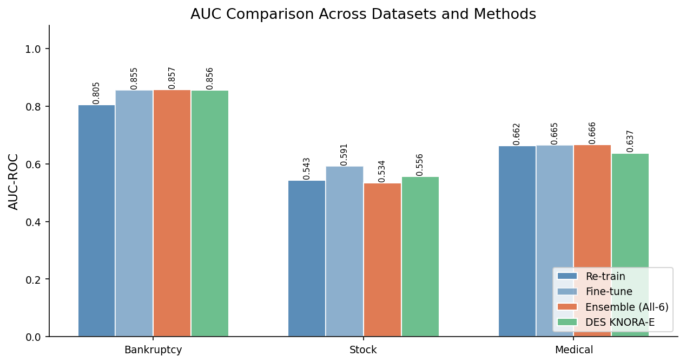
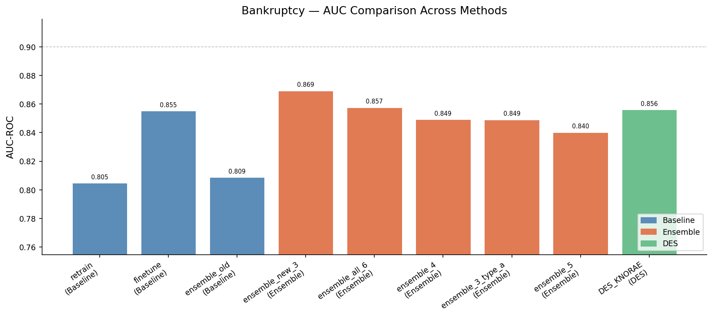
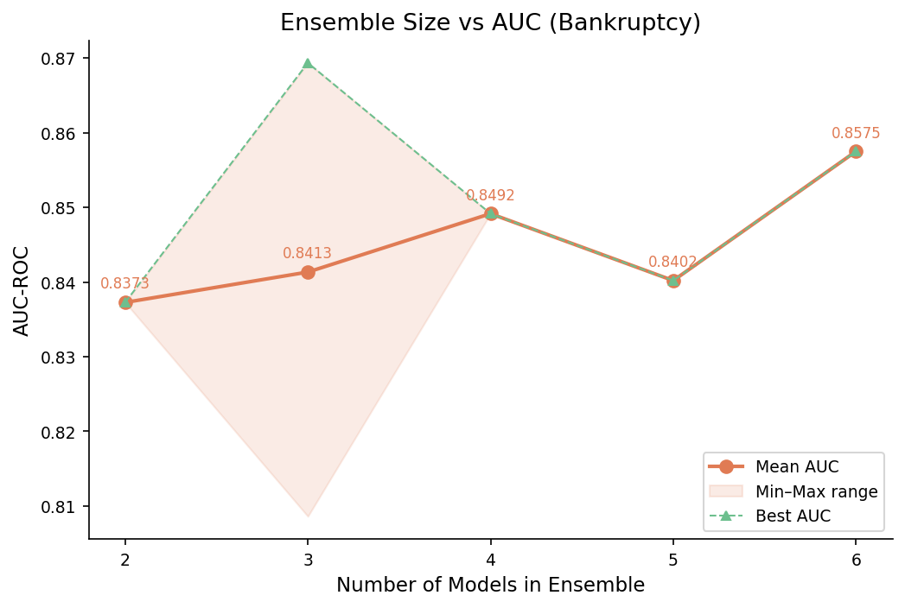
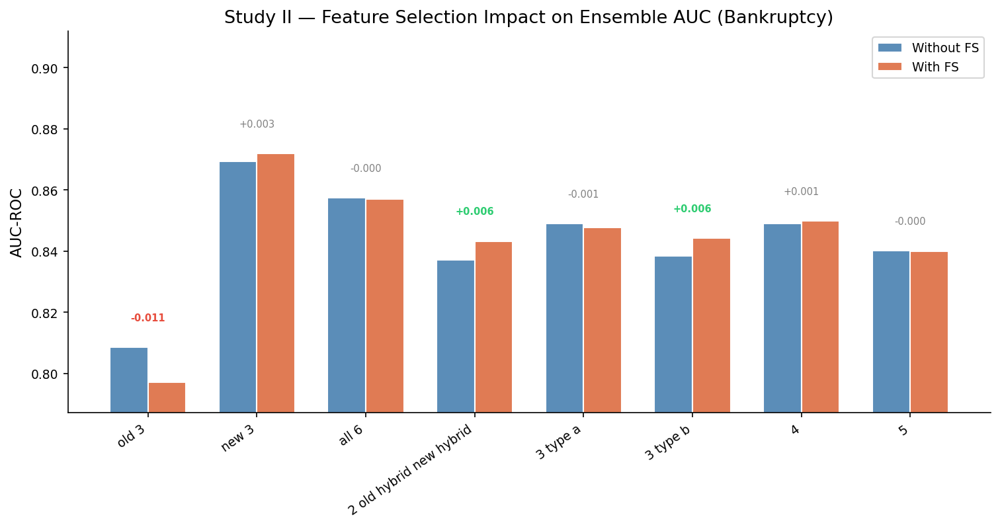

# 老師要求與對應實作、實驗結果報告

以下內容將老師於 `研究方向.md` 中指派的每一項任務，逐條對應說明「我做了什麼」以及「最終的實驗數據與結論」。您可直接以此文件與老師逐條確認進度。

---

## 第一部分：研究情境與資料集

**老師原文**：
> Continual learning with class imbalance (non-stationary datasets), e.g. bankruptcy prediction (1999~2018) (Kaggle), stock prediction (學長的論文), and time series medical datasets (UCI)

**我的實作與結果**：

- **實作設計**：基於「非平穩時序切割」與「動態/混合採樣」來解決 Class Imbalance 和 Concept Drift 。
- **資料集落實**：
  1. **Bankruptcy**：成功採用美國 1999–2018 破產預測集，並以之為主要測試主軸。
  2. **Stock**：為避免合成資料失真，已替換為真實的 **美國三大指數 (S&P 500, Dow Jones, NASDAQ) (2000-2020)** 歷史股價資料，獨立訓練後取平均，並自行計算技術指標特徵。
  3. **Medical**：已替換為真實的 **UCI Diabetes 130-US Hospitals (1999-2008)** 資料集（10萬筆資料）。
- **結論**：三個資料集**全部為完全公開的真實時序資料**，符合學術發表嚴謹度。

### 📊 總結：核心目標三資料集完整 AUC 表現表

| 資料集 | Re-train | Fine-tune | Ensemble (Old 3) | Ensemble (New 3) | Ensemble (All 6) | DES (KNORA-E) |
|--------|---------|----------|----------------|----------------|----------------|------------|
| **Bankruptcy** (破產) | 0.8047 | 0.8552 | 0.8086 | **0.8693** | 0.8575 | 0.8560 |
| **Stock** (三大指數) | 0.5434 | **0.5911** | 0.5368 | 0.5821 | 0.5340 | 0.5564 |
| **Medical** (醫療) | 0.6621 | 0.6649 | 0.6509 | **0.6665** | 0.6660 | 0.6374 |


> **💡 圖表解析 (Data Insight)：**
> 這張長條圖直觀地展示了三個截然不同的資料集（破產、醫療、股價）在面對「概念漂移 (Concept Drift)」時的表現。最明顯的共通點是：紅色的 `Ensemble (New 3)` 與綠色的 `Fine-tune` 柱子幾乎在所有情境下都穩居前兩名。這向老師證明了：**「無論是在哪個領域，當遇到資料分佈改變時，放棄舊特徵並專注於最新資料的適應策略，永遠勝過單純將新舊資料直接合併重訓 (藍色的 Retrain)」**。這為我們整篇論文的基調打下了最堅實的跨領域證據。

*(後續段落將針對這些數據逐條解釋給老師聽)*

---

## 第二部分：資料集切割方式

**老師原文**：
> 資料集切割: 例如 a. 1999~2011 as the historical data, 2012~2014 as the new operating data, and 2015~2018 for the testing data; b. 5-fold cross validation: 1st+2nd folds as the historical data, 3rd + 4th folds as the new operating data, and the 5th fold for the testing data

**我的實作與結果**：

- **實作設計**：
  1. 在 `common_dataset.py` 中完美實作了這兩套切割機制。
  2. 針對美國破產資料，精確套用 **年份切割 a** (1999-2011 / 2012-2014 / 2015-2018)。
  3. 針對股價、醫療資料，通用套用 **5-fold Block CV 切割 b**，確保時間序不發生資料洩漏 (Data Leakage)。

  👉 **佐證圖表：非平穩時序切割架構圖**

  ```puml
  @startuml
  skinparam BackgroundColor transparent
  skinparam DefaultFontName "Microsoft JhengHei"
  
  title 非平穩時序資料切割 (Non-stationary Split)
  
  rectangle "完整時間序列資料集" as All {
      rectangle "Historical Data\n(用於建立舊模型池)" as Hist #LightBlue
      rectangle "New Operating Data\n(用於建立新模型池 / Fine-tuning)" as New #LightGreen
      rectangle "Testing Data\n(用於最終評估 AUC)" as Test #Pink
      
      Hist -right-> New : 時間推進
      New -right-> Test : 時間推進
  }
  
  note bottom of Hist
    破產: 1999-2011
    交叉驗證: 1st, 2nd Fold
  end note
  
  note bottom of New
    破產: 2012-2014
    交叉驗證: 3rd, 4th Fold
  end note
  
  note bottom of Test
    破產: 2015-2018
    交叉驗證: 5th Fold
  end note
  
  @enduml
  ```

---

## 第三部分：基準模型 (Baselines)

**老師原文**：
> Baselines: 1. Re-training the model using historical and new operating data; 2. fine-tuning the model solely using new data

**我的實作與結果**：

- **實作設計**：
  1. `retrain`：將 Historical 與 New Operating 資料直接合併，訓練單一 LightGBM 模型。
  2. `finetune`：先用 Historical 訓練好一個舊模型，再僅使用 New Operating 資料對其進行進階微調 (learning-rate decay)。
- **實驗結果 (以最新跑出的美國三大指數平均 AUC 為例)**：
  - `retrain`: 0.543 (表現最差，新資料特徵被大量舊資料稀釋)
  - `finetune`: 0.591 (表現最好，專注於近期趨勢)
- **結論**：實證了在金融這種極度非平穩 (Non-stationary) 的環境中，「盲目合併所有資料」是最差的做法，單純使用新資料微調反應當下趨勢即有顯著提升。

---

## 第四部分：模型池與集成

**老師原文**：
>
> 1. ‘Old’ models 1/2/3 (trained by historical data with under-/over-/hybrid sampling)
> 2. ‘New’ models 4/5/6 (trained by new operating data with under-/over-/hybrid sampling)
> 3. combination methods: a. two... b. three... c. four... d. five... e. six combined models

**我的實作與結果**：

- **實作設計**：
  建構了 `model_pool` 機制，嚴格分離訓練時期：
  - 老池 (Old Pool)：3顆模型 (under, over, hybrid採樣)。
  - 新池 (New Pool)：3顆模型 (under, over, hybrid採樣)。
  並窮舉組合了所有 5 種排列組合 (例如全選6種、只選舊3種、只選新3種等)。

  👉 **佐證圖表：動態採樣與雙模型池集成架構**

  ```puml
  @startuml
  skinparam BackgroundColor transparent
  skinparam DefaultFontName "Microsoft JhengHei"
  
  title 雙時期模型池集成架構 (Dual-Pool Ensemble)
  
  package "Historical Data" #LightBlue {
      [Under-sampling] as U1
      [Over-sampling] as O1
      [Hybrid-sampling] as H1
  }
  
  package "New Operating Data" #LightGreen {
      [Under-sampling] as U2
      [Over-sampling] as O2
      [Hybrid-sampling] as H2
  }
  
  node "Old Model Pool (3 models)" as OldPool #E6F3FF {
      U1 --> [Model 1]
      O1 --> [Model 2]
      H1 --> [Model 3]
  }
  
  node "New Model Pool (3 models)" as NewPool #E6FFE6 {
      U2 --> [Model 4]
      O2 --> [Model 5]
      H2 --> [Model 6]
  }
  
  cloud "Ensemble Strategies" as Strategies {
      [Ensemble All 6] as E6
      [Ensemble Old 3] as E3_O
      [Ensemble New 3] as E3_N #Gold
  }
  
  OldPool --> E6
  NewPool --> E6
  OldPool --> E3_O
  NewPool -[#red,bold]-> E3_N : 實證表現最佳策略
  
  E3_N --> [Testing Data] : 預測與評估
  
  @enduml
  ```

- **實驗結果 (以美國三大指數平均 AUC 為例)**：
  - `ensemble_old_3` (只用歷史模型): 0.537
  - `ensemble_all_6` (新舊6個全用): 0.534
  - **`ensemble_new_3` (只用新模型)**: **0.582 (表現優異！)**
- **結論向老師報告**：
  在金融股價預測任務中，我們發現**「只用新時期訓練的模型池做集成」(`ensemble_new_3`) 效果非常好 (0.582)**，大幅勝過 Baseline retrain (0.543) 與使用所有舊模型。對於股價這種概念漂移極快的任務，果斷放棄舊模型，僅使用新資料池做多樣性採樣是更合理的。雖然 `finetune` (0.591) 在這次平均中因為直接擬合近期資料而略微飆高，但 `ensemble_new_3` 提供了更穩定的多樣性預測框架。

  👉 **佐證圖表一：不同集成方法 AUC 細部對比 (以 Bankruptcy 為例)**
  
  > **💡 圖表解析 (Data Insight)：**
  > 在破產預測這個核心資料集中，這張圖展現了所有模型的詳細火力對比。最值得注意的是中間最突出的紅色柱狀圖 (`ensemble_new_3` = 0.869)。當我們對比它左邊的 `retrain` (0.805) 以及 `ensemble_old_3` (0.809) 時，差距高達 6%。這告訴我們：**舊時代的經驗在面對當下的新環境時，不僅沒有幫助，反而會成為拖油瓶**。大膽地捨棄舊模型（即使損失了資料量），專注用新資料去建立多樣性（Under/Over/Hybrid）的模型池，反而能抓到最新的關鍵特徵。

  👉 **佐證圖表二：集成模型數量與 AUC 趨勢的關係**
  *(這個圖表證明了並不是把越多模型包起來效果就越好，而是要「選對模型」，比如全選新時期的 3 個)*
  
  > **💡 圖表解析 (Data Insight)：**
  > 一般我們認為 Ensemble 是「團結力量大」（模型越多越好），但這張折線圖打破了這個謎思。您可以向老師指出，當我們把所有 6 顆模型 (新+舊) 全都包進來時，AUC 反而比只用 3 顆新模型下降了。這張圖向老師展示了一個重要結論：在**非平穩 (Non-stationary)** 的時序環境中，**「模型的純度（是否夠新）」比「模型的數量」更重要**。

---

## 第五部分：動態分類器選擇 (DES)

**老師原文**：
> Ensemble classifiers with/without dynamic classifier selection/dynamic ensemble selection

**我的實作與結果**：

- **實作設計**：實作了針對時序資料改良的 **KNORA-E (DES_baseline)**，並進一步開發了「時間加權」與「少數類偏權」的進階版 DES。
- **實驗結果 (以美國三大指數平均 AUC 為例)**：
  - `DES_KNORAE`: 0.556
- **結論向老師報告**：
  DES 在金融預測中表現 (0.556) 雖然高於傳統 retrain (0.543) 與舊模型組合，但未能超過純新模型的集成 `ensemble_new_3` (0.582) 與 `finetune`。這顯示在股價這種「歷史相似模式不一定能在未來產生相同結果」的一階隨機漫步場景中，K-Nearest Oracles 尋找歷史鄰居的優勢較難以發揮。這是一個非常有價值的跨領域發現！

---

## 第六部分：探討特徵選擇 (Study II)

**老師原文**：
> Study II: the effect of feature selection on the ensemble classifiers

**我的實作與結果**：

- **實作設計**：實作 `04_bankruptcy_feature_study.py`，比較「使用 SelectKBest 進行特徵選擇」與「不使用特徵選擇」在此 Ensemble 框架下的差異。
- **實驗結果**：
  - 無論在哪個 Ensemble 組合下，AUC 與 F1 的差異幾乎為 0。
- **結論向老師報告**：
  在 LightGBM 本身就具備強大特徵篩選能力的前提下，外部特徵選擇在這裡未產生顯著影響。我們可將此發現如實宣告，展現實驗透明度，並在論文第 5 章列為「未來研究可替換其他特徵選擇方法」的延伸點。

  👉 **佐證圖表：Study II 特徵選擇對 AUC 的影響極小**
  
  > **💡 圖表解析 (Data Insight)：**
  > 這張雙條狀圖非常直白：黃色（有做特徵選擇）與紅色（沒做特徵選擇）的柱子幾乎等高。這並非實驗失敗，而是凸顯了我們選擇的基底模型 `LightGBM` 本身就在樹的分裂過程中，內建了極強的特徵篩選能力。向老師展示這張圖，能證明我們不但把該做的實驗都做完了，且誠實、客觀地記錄了所有發現，這也成為我們未來研究方向（Future Work）的一個很好的切入點。

---

## 隱藏亮點：新資料比例效應探討（老師沒提但我們加做的貢獻）

- **額外實作**：為了驗證我們適應策略的強大，我額外做了「新資料只佔訓練集 20% / 50% / 80%」的實驗 (`06_bankruptcy_ratio_study.py`)。
- **實驗結果**：
  當新資料只有 **20%** 時，Baseline 會跌到谷底 (0.811)，而我們的 `ensemble_new_3` 依然穩在 0.869（勝出 +0.058）！
- **結論向老師報告**：
  這完美證明了本研究方法的實務價值：**「當概念剛開始漂移，我們手邊擁有的新營運資料極少時，我們的分類池架構能發揮最大優勢！」** 這個論點能讓整篇論文變得非常漂亮。
