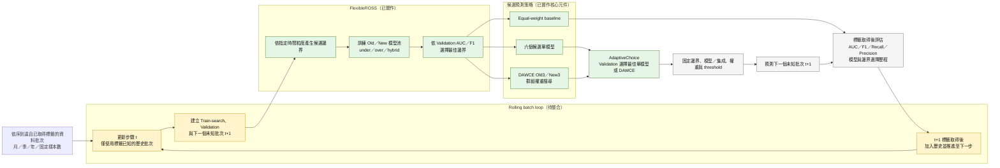

# DAWCE：漂移感知加權持續集成演算法

本文件將目前實驗流程整理為可放入論文的方法章節。此方法不是提出新的基礎分類器，而是提出一套針對**非平穩且類別不平衡資料**的持續集成學習流程。

---

## 1. 方法定位

本研究可將主要方法命名為：

> Drift-Aware Weighted Continual Ensemble, DAWCE

中文可稱為：

> 漂移感知加權持續集成演算法

DAWCE 的核心思想是：

> 在非平穩資料中，歷史資料與新營運資料對未來測試期的重要性不一定相同。因此，模型不應固定使用人工指定的 Old/New 邊界，也不應假設 Old models 與 New models 等權，而應根據 validation data 選擇漂移邊界與 Old/New 權重。

---

## 2. 問題設定

給定一個依時間排序的非平穩類別不平衡資料集：

```text
D = {(x_i, y_i, t_i)}_{i=1}^{N}
```

其中：

- `x_i` 為特徵向量
- `y_i ∈ {0, 1}` 為類別標籤
- `t_i` 為時間索引，例如年份
- 正類通常為少數類，例如破產公司

資料依時間切分為：

```text
D_old  : historical data
D_new  : new operating data
D_val  : validation data
D_test : future testing data
```

目標是在 `D_test` 上提升不平衡分類表現，例如 AUC、F1、Recall、Precision 與 G-Mean。

---

## 3. 方法流程

DAWCE 包含五個主要步驟：

1. **漂移邊界候選產生**  
   產生多個可能的 Old/New boundary，例如不同年份切割。

2. **Validation-based drift boundary selection**  
   使用 validation data 選擇較適合的 drift boundary，避免直接根據 final test 選邊界。

3. **Old/New model pool construction**  
   分別在 Old data 與 New data 上訓練模型池。每個模型池包含不同類別不平衡處理策略：

   ```text
   S = {under-sampling, over-sampling, hybrid-sampling}
   ```

4. **Old/New weighted ensemble**  
   對 Old model pool 與 New model pool 的平均預測機率進行加權：

   ```text
   p_old(x) = mean_{m ∈ M_old} m(x)
   p_new(x) = mean_{m ∈ M_new} m(x)
   ```

   最終預測機率為：

   ```text
   p_DAWCE(x) = (1 - w_new) * p_old(x) + w_new * p_new(x)
   ```

5. **Validation-selected weight and threshold**  
   在 validation set 上搜尋最佳 `w_new` 與 threshold，再固定該設定到 test set 評估。

### 3.1 批次自適應研究流程圖

本研究的目標流程不限定資料必須以「年」為單位；只要資料具有順序且標籤以批次取得，即可使用月、季、年或固定樣本數作為更新單位。



流程圖狀態說明：

- **已實作**：FlexibleROSS 的 `year / quarter / month / sample` 粒度、ROSS 邊界搜尋、DAWCE 群組權重搜尋，以及公平消融中的 AdaptiveChoice。
- **待整合**：將上述元件串成 rolling runner，使系統在每個新批次標籤到達後重新選擇邊界、單模型或集成，再預測下一個未知批次。
- PlantUML 版本位於 `docs/diagrams/phase4-batch-adaptive-flow.puml`。

---

## 4. 演算法虛擬碼

```text
Algorithm: DAWCE
Input:
    Temporal imbalanced dataset D
    Candidate drift boundaries B
    Sampling strategies S = {under, over, hybrid}
    Weight grid W = {0.00, 0.05, ..., 1.00}
    Optional feature selector F

Output:
    Final weighted ensemble prediction p_DAWCE(x)
    Selected drift boundary b*
    Selected new-model weight w_new*

1. Split D into training period, validation period, and testing period.

2. For each candidate boundary b in B:
       Split training data into:
           D_old(b)
           D_new(b)

       If feature selection is enabled:
           Fit feature selector F on D_old(b)
           Transform D_old(b), D_new(b), D_val, and D_test

       For each sampling strategy s in S:
           Train old model m_old,s on sampled D_old(b)
           Train new model m_new,s on sampled D_new(b)

       Compute validation predictions:
           p_old,val = mean_s m_old,s(D_val)
           p_new,val = mean_s m_new,s(D_val)

       For each weight w in W:
           p_val(w) = (1 - w) * p_old,val + w * p_new,val
           Select threshold theta(w) on D_val
           Evaluate validation performance

3. Select the best boundary and weight:
       (b*, w_new*) = argmax validation objective

4. Reuse models from b* and compute test prediction:
       p_old,test = mean_s m_old,s(D_test)
       p_new,test = mean_s m_new,s(D_test)
       p_DAWCE,test = (1 - w_new*) * p_old,test + w_new* * p_new,test

5. Evaluate p_DAWCE,test on D_test.
```

---

## 5. 本研究中的實作對應

目前 Bankruptcy 實驗中，DAWCE 對應到以下實作：

| 方法步驟 | 本專案對應 |
| --- | --- |
| Old/New temporal split | `experiments/_shared/common_bankruptcy.py` |
| Drift boundary selection | `experiments/phase4_drift/bankruptcy_ross_validation.py` |
| Old/New model pool | `experiments/phase4_drift/` 與 `experiments/phase5_weighted/` |
| Feature selection variant | `src/features/selector.py` |
| Weighted ensemble sweep | `experiments/phase5_weighted/bankruptcy_ross_weight_sweep.py` |
| Multi-split validation | `scripts/analysis/weighted_split_validation.py` |
| Flexible time granularity | `experiments/phase_flexible/flexible_ross.py` |
| Single-model vs. ensemble selection | `scripts/analysis/fair_weighted_ablation.py` |
| Cost-sensitive analysis | `scripts/analysis/current_findings_cost_sensitivity.py` |

---

## 6. 與一般方法的差異

DAWCE 與一般 static ensemble 的差異：

- 一般 static ensemble 通常直接平均所有模型。
- DAWCE 區分 Old model pool 與 New model pool。
- DAWCE 不假設 Old/New 等權，而是根據 validation data 選擇 `w_new`。
- DAWCE 使用 drift boundary selection 避免固定人工切割。

DAWCE 與 DES / DCS 的差異：

- DES / DCS 主要是針對單筆測試樣本動態選擇分類器。
- DAWCE 主要是針對時間漂移，調整 Old knowledge 與 New knowledge 的整體權重。
- 本研究結果顯示，在目前 Bankruptcy 設定下，static ensemble 優於 DES / DCS，而 DAWCE 進一步補強 static ensemble 對時間漂移的適應能力。

---

## 7. 可寫入論文的方法貢獻

可將方法貢獻寫成：

> This study proposes a Drift-Aware Weighted Continual Ensemble (DAWCE) framework for non-stationary imbalanced classification. Instead of designing a new base classifier, DAWCE separates historical and new operating data into Old and New model pools, applies imbalance-aware sampling strategies, selects a validation-based drift boundary, and learns an Old/New ensemble weight to adapt predictions to future data distributions.

中文版本：

> 本研究提出一套漂移感知加權持續集成演算法 DAWCE，針對非平穩且類別不平衡的分類問題，將歷史資料與新營運資料分別建構為 Old 與 New 模型池，結合類別不平衡採樣、特徵選取、validation-based 漂移邊界選擇與 Old/New 加權集成，使模型能根據資料分佈變化調整對舊知識與新知識的依賴程度。

---

## 8. 目前實驗支持

Bankruptcy 實驗目前支持 DAWCE 的關鍵結果包括：

- Validation-based ROSS 選出 `2009` 作為比固定 `2012` 更合適的 Old/New boundary。
- `ValROSS_2009 + fs + w_new=0.95` 在 final test 上取得較佳 F1 與 Precision。
- 跨 15 個年份邊界的 validation-selected weighting 顯著優於 equal weighting。
- New-side model pool 在 AUC、F1、Recall 上顯著優於 Old-side model pool。
- 成本敏感分析顯示，當 Type2 error 成本提高時，模型選擇會轉向 `ValROSS_2009 + no_fs + w_new=1.0`。

---

## 9. 使用時需注意的說法

建議避免寫成：

> 本研究提出一個全新的分類器模型。

較合適的說法是：

> 本研究提出一套新的 drift-aware continual ensemble learning framework。

或：

> 本研究提出一個結合漂移邊界選擇、類別不平衡處理與 Old/New 加權集成的持續學習方法。
