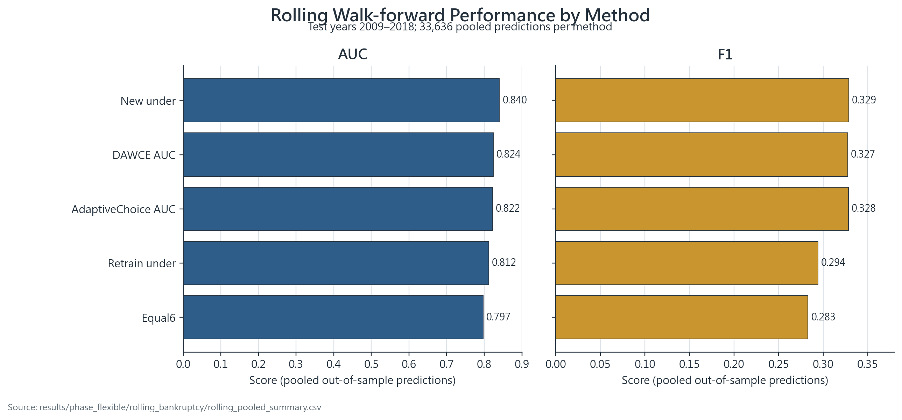
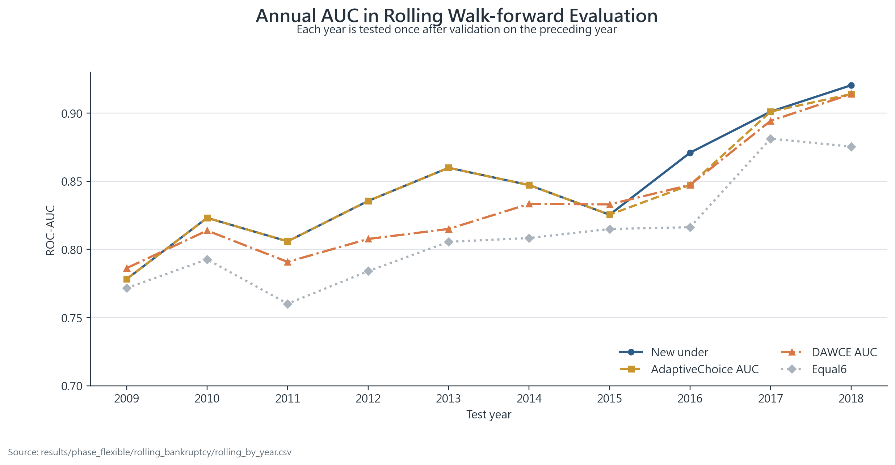
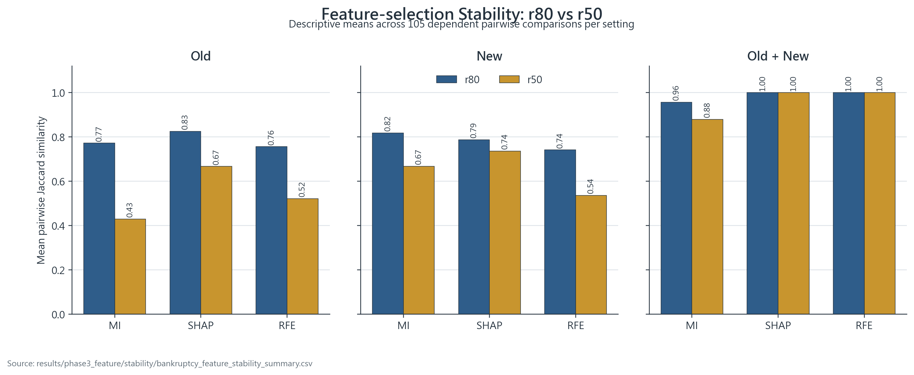

# 持續式不平衡集成研究：目前實驗成果報告

更新日期：2026-09-08  
報告用途：與指導教授討論目前成果、證據強度與投稿前補強方向。

## 技術摘要

目前主實驗已完成從固定時序切割、模型池與集成比較，到 ROSS、DAWCE、公平消融及年度 rolling walk-forward 的完整流程。程式測試共 19 項，全部通過；985 個結果 CSV 已通過嚴格可讀性稽核，未發現完全重複列。結果與 raw data 的 checksum、環境版本與 Git 狀態已寫入 `results/RESULT_MANIFEST.json`。

**最穩健的實驗結論是：以近期資料訓練的 `New_under` 是目前最強基準。** 在 2009–2018 rolling walk-forward 的 33,636 筆 pooled 預測中，`New_under` 的 AUC/F1 為 0.8403/0.3287；AdaptiveChoice 為 0.8221/0.3283。AdaptiveChoice 經 Holm 校正後僅在 AUC 上顯著優於 Equal6，未顯著優於 `New_under`。

因此，現有證據支持兩個較保守的主張：

1. validation-guided weighting 能降低 Equal6 把弱模型平均納入所造成的損失；
2. 當近期單模型長期占優時，強制集成未必比直接選擇該模型更好。

ROSS 與 DAWCE 已完成可運行的研究框架，但現階段應定位為**可重現的選擇流程與適用邊界研究**，不宜宣稱普遍優於強單模型。

## 目前實驗完成度

| Study | 已完成內容 | 現況 | 可向教授報告的結論 |
|---|---|---|---|
| Study 1 | Re-training、Fine-tuning、Old/New 模型池、靜態集成、DES/DCS、15-split 比較 | 已完成；統計屬診斷性 | New-side 模型具有一致方向優勢；static oracle 與 DES/DCS 的比較不能當作無偏部署結論 |
| Study 2 | MI、CART、SHAP、RFE 與 r80/r50 穩定性 | 效能與描述統計完成；推論需重做 | r80 的 Jaccard 均值大多高於 r50，但原 105-pair 檢定有偽重複 |
| Study 3 | ROSS、DAWCE、k=2、AWE-inspired、公平消融、Rolling AdaptiveChoice | 核心流程完成 | DAWCE 改善 Equal6，但未超越 `New_under`；ROSS 2009 未改善最終 Test F1 |
| Study 4 | 成本權重敏感度、10-seed 輔助結果 | 部分完成 | 成本排序會隨 FNR/FPR 權重改變；現有 multi-seed 尚未對齊主 XGBoost 流程 |
| 工程驗證 | 單元測試、CSV 盤點、前處理檢查 | 主要測試通過；一個輔助腳本有語法錯誤 | 核心實驗可重跑，但投稿前仍需補齊 provenance 與全專案語法檢查 |

## Rolling 結果顯示近期單模型仍是最強基準

下圖比較十個年度測試批次串接後的 pooled 指標。`New_under` 在 AUC 上明顯領先；F1 則與 AdaptiveChoice、DAWCE-AUC 接近。這表示動態框架可以避免 Equal6 的主要損失，但尚未形成超越強單模型的新效能優勢。

資料來源：[rolling_pooled_summary.csv](../results/phase_flexible/rolling_bankruptcy/rolling_pooled_summary.csv)。每種方法皆有 33,636 筆 pooled out-of-sample 預測。

| 方法 | AUC | F1 | Recall | Precision |
|---|---:|---:|---:|---:|
| New_under | **0.8403** | **0.3287** | **0.3673** | 0.2975 |
| DAWCE-AUC | 0.8237 | 0.3275 | 0.3392 | **0.3165** |
| AdaptiveChoice-AUC | 0.8221 | 0.3283 | 0.3652 | 0.2982 |
| Retrain-under | 0.8116 | 0.2943 | 0.3146 | 0.2764 |
| Equal6 | 0.7971 | 0.2830 | 0.3553 | 0.2351 |

## 年度結果顯示方法排名會變動，但 New-under 長期占優

年度 AUC 圖呈現 2009–2018 的逐批次結果。AdaptiveChoice 在 10 次更新中有 8 次選擇 `New_under`、2 次選擇 DAWCE-AUC；Validation 每年選出的最佳單模型則全部是 `New_under`。這說明動態選擇流程確實會更新，但本資料上的主導訊號仍是近期 under-sampling 模型。

資料來源：[rolling_by_year.csv](../results/phase_flexible/rolling_bankruptcy/rolling_by_year.csv)與[rolling_selection_history.csv](../results/phase_flexible/rolling_bankruptcy/rolling_selection_history.csv)。年度批次在資料列上互不重疊，但公司可能跨年度重複。

Holm 校正後的主要比較為：

- AdaptiveChoice vs Equal6，AUC：平均年度差 +0.0327，raw p = 0.001953，Holm p = 0.031250。
- AdaptiveChoice vs New_under，AUC：平均年度差 -0.0030，Holm p = 1.000000。
- AdaptiveChoice vs New_under，F1：平均年度差 -0.0030，Holm p = 1.000000。

因此可報告「AdaptiveChoice 的 AUC 優於 Equal6」，但不能報告其優於 `New_under`。

## 公平消融確認 DAWCE 的改善主要來自避免等權稀釋

公平消融讓各方法共用相同模型池、前處理與 Test，只改變模型／權重選擇規則。無特徵選取時，`New_under` 的平均 AUC/F1 為 0.8498/0.2143，DAWCE-F1 為 0.8336/0.1886，Equal6 為 0.8086/0.1611。

資料來源：[bk_fair_ablation_summary.csv](../results/phase5_weighted/bk_fair_ablation_summary.csv)。圖中為 15 個相依時序切割的平均，因多數切割共享 2015–2018 Test，不應視為 15 次獨立重複實驗。

這項結果支持以下機制解釋：DAWCE 能提高 New-side 權重並改善 Equal6，但群組內仍固定平均 under、over、hybrid 三個模型；當 `New_under` 明顯較強時，其他 New-side 模型仍會稀釋它。

## 特徵保留率 r80 較穩定，但顯著性必須重做

在 Old 與 New 模型池中，MI、SHAP、RFE 的 r80 平均 Jaccard 都高於 r50；Old+New joint 的 MI 也呈相同方向。這支持「保留較多特徵可能提高跨時期一致性」的描述性結論。

資料來源：[bankruptcy_feature_stability_summary.csv](../results/phase3_feature/stability/bankruptcy_feature_stability_summary.csv)。每個設定的 105 個 pair 都由同一組 15 splits 組合而來，每個 split 被重複使用，因此圖中只呈現描述性均值，不能用原始極小 p-value 宣稱確認性顯著。

值得特別注意：Old+New joint 的 SHAP 與 RFE 在 r80、r50 下皆為 1.00，並沒有 r80 優於 r50。論文已改為僅主張表列設定中的描述性方向，不再宣稱所有方法與範圍皆顯著。

## 類別不平衡隨年度加劇

資料共有 78,682 筆 company-year、8,971 家公司與 5,220 筆破產觀測，整體破產率為 6.63%。然而破產比例隨年度下降，主測試期 2015–2018 的破產率僅 2.34%，使 Accuracy 不適合作為主要指標，也讓 PR-AUC、Recall、Precision、F1 與校準更加重要。

資料來源：[american_bankruptcy_dataset.csv](../data/raw/bankruptcy/american_bankruptcy_dataset.csv)。2015–2018 測試期共 12,282 筆，其中 287 筆為 failed。

## 實驗範圍、資料與指標定義

- **觀測單位**：公司年度（company-year），正類為 `failed`。
- **時間範圍**：1999–2018。
- **主要固定切割**：Old 1999–2011、New 2012–2014、Test 2015–2018。
- **Rolling 切割**：以 $t-2$ 以前訓練、$t-1$ 驗證、$t$ 測試，測試年度為 2009–2018。
- **主要模型**：XGBoost；Old/New 各使用 TomekLinks、ADASYN、SMOTEENN 建立模型池。
- **主要指標**：ROC-AUC、F1、G-Mean、Recall、Precision、FPR、FNR。
- **目前缺口**：程式已支援 PR-AUC，但主要歷史結果未一致保存，尚不能在本報告補造數值。

## 方法與驗證設計

ROSS 使用隔離的 Validation period 搜尋 Old/New 邊界；DAWCE 在 Validation 上搜尋 New-side 群組權重與分類閾值；Rolling AdaptiveChoice 再由 Validation 選擇最佳單模型或 DAWCE。Test 標籤不參與邊界、權重、閾值或候選模型選擇。

新增 Study 3 與 rolling 流程的補值、標準化及特徵選取皆只以 fitting data 擬合。舊版部分切割函式會分別使用各資料分割自身平均數補值，但目前 bankruptcy raw data 沒有缺失值，因此不改變本次數值；方法上仍應保留此限制說明。

## 目前結論的證據強度

| 結論 | 證據強度 | 原因 |
|---|---|---|
| New_under 是目前最強基準 | 較強 | 公平消融與 rolling pooled 結果方向一致 |
| AdaptiveChoice AUC 優於 Equal6 | 中等 | 10 年 rolling、Holm p = 0.03125；仍有公司跨年相關性 |
| DAWCE 普遍優於強單模型 | 不支持 | 公平消融與 rolling 均未超越 New_under |
| ROSS 2009 優於固定 2012 | 不支持 | Test F1 0.1947，低於固定邊界 0.2039 |
| r80 比 r50 穩定 | 描述性支持 | 平均 Jaccard 多數較高；原檢定有偽重複 |
| 全部主要結論具 10-seed 重現性 | 尚未確認 | 現有檔案採 LightGBM/block-CV；seed 傳遞程式已修正，但結果尚未依主流程重跑 |
| 成本分析可直接作部署決策 | 尚不支持 | 現有 $\mathrm{FPR}+r\mathrm{FNR}$ 未納入盛行率與金額成本 |

## 目前最重要的限制

1. **公司重複問題**：3,700 家測試公司中有 3,232 家曾出現在訓練期，占 87.35%。模型沒有使用公司 ID，但目前結果不是純粹的 unseen-company 泛化。
2. **15-split 相依性**：多數 splits 共用 2015–2018 Test 且訓練窗巢狀重疊，相關 Wilcoxon p-value 只作診斷。
3. **特徵穩定性偽重複**：105 個 pair 不是 105 個獨立樣本。
4. **Multi-seed 尚未對齊**：需用主 XGBoost 流程重新執行，並確保 sampling、模型池與 DES/DCS 全部接收 seed。
5. **PR-AUC 與不確定性尚缺**：投稿前應補 PR-AUC、bootstrap confidence interval 與必要的 calibration 評估。
6. **DES/DCS 比較有限**：舊版 DSEL 與模型訓練資料重疊，且靜態端曾使用 test-selected oracle，不能推論一般演算法優劣。

## 建議接下來依序完成

1. 以主 XGBoost 流程執行 10–30 seeds，統一所有 seed 傳遞與結果 provenance。
2. 對 rolling predictions 做 company-cluster bootstrap，補 AUC、PR-AUC、F1 的 95% 信賴區間。
3. 增加 seen-company／unseen-company 分層結果，必要時加入 entity-holdout sensitivity analysis。
4. 重做特徵穩定性推論，使用 split-level permutation、cluster bootstrap 或獨立 temporal resampling。
5. 使用獨立 Validation DSEL 重跑 DES/DCS，避免訓練與 competence estimation 重疊。
6. 修復 `scripts/run/_write_common_dcs.py` 語法問題，並將 compileall 與結果 schema 驗證納入 CI。

## 與教授討論時可使用的三句話

> 第一，目前最可靠的發現不是新集成全面勝出，而是近期資料訓練的 under-sampling 模型長期最強。

> 第二，DAWCE 的價值在於以 Validation 自動調整 Old/New 權重並避免 Equal6 稀釋，但現行群組平均仍可能壓低最強單模型。

> 第三，下一階段會集中補強 company-level 推論、真正的主流程 multi-seed、PR-AUC/信賴區間，以及特徵穩定性的正確統計單位。

## 待與教授確認的研究決策

- 論文主貢獻要定位為「效能優越的新演算法」，還是較穩健的「validation-guided 決策框架與負向結果／適用邊界」？目前證據較支持後者。
- 最終部署問題要聚焦「未來年度的已知與未知公司混合辨識」，或「完全未見公司的破產泛化」？兩者需要不同的切割與統計設計。
- 是否把 PR-AUC 與 company-cluster confidence interval 升級為主要結果，並將 15-split p-value 降為附錄敏感度分析？
