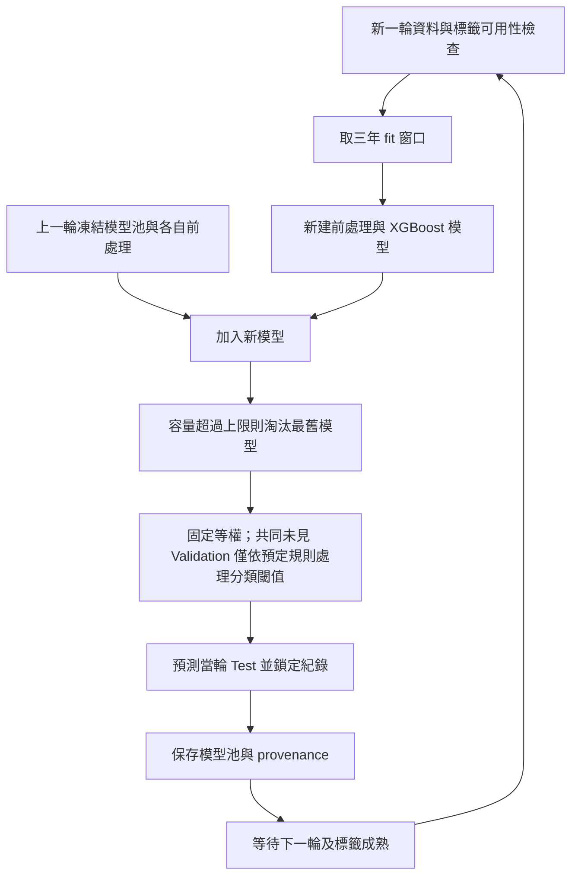

# Study 3 B 路線：重疊時間窗口與持續集成研究提案

記錄日期：2026-09-08  
決策與資料查核更新：2026-09-09  
研究範圍：American Bankruptcy，觀測單位為 company-year。  
文件狀態：**第一版已實作，2009–2018 × 10 seeds 已完成；同 target 公平 A/B 比較與 1,000 次 company-cluster bootstrap 已完成，時間相依不確定性仍待補。**

本文件記錄與教授討論後提出的方向，保留原 Study 3 A 路線，不取代既有研究規格、結果文件或流程圖。

## 1. 提案摘要

原 A 路線著重在一段**已知、封閉的歷史資料範圍**內，人工指定候選年份範圍、Old/New 定義與搜尋規則，再由 Validation 選出切點或比例。選擇步驟雖可自動化，研究框架仍屬離線、bounded hindsight design。B 路線則研究：在未預先知道後續會有多少年度、未看到未來資料內容與標籤時，能否只依預先固定的更新規則，讓有限模型池持續往下一期演進？

使用者已同意 B-model 第一版採 **三年窗口、每年推移一年、每輪加入一個新模型、最多保留三個模型、FIFO**，並比較 B-data 與 B-model。三年只計訓練、Validation/Test 另留是目前建議與使用者傾向，具體決策時點須配合標籤成熟規則。這些數字是起始設計，不是已驗證的最佳設定。

第一版**固定等權，不搜尋年度權重、不做權重交叉驗證**。主要研究目標已確認為少數類（破產）辨識；年度穩定性與成本作次要觀察。加權版本退出第一階段必要比較，僅留未來延伸。

預期優勢是更新規則清楚、模型池大小可控、可保留部分歷史知識。是否比 A 路線或最近三年單模型更準、更穩定，仍是待驗證假設。

## 2. 與 A 路線的關係

| 面向 | A：邊界搜尋與加權 | B：重疊窗口持續更新 |
|---|---|---|
| 核心問題 | 在已知歷史範圍中，哪些年份適合作 Old/New？兩者如何加權？ | 不知道未來資料內容與終點時，模型如何持續保留、加入與淘汰？ |
| 時間窗口 | 人工界定候選範圍，再由 Validation 搜尋切點 | 更新規則事先固定；第一版三年窗口、每年移動一年 |
| 模型生命週期 | 每輪重新檢視已知歷史並重建候選模型 | 凍結既有模型，只訓練到期可用的新窗口模型 |
| 歷史資訊 | 可重新存取長期歷史資料 | 有限模型池保留歷史資訊；原始資料保留規則另定 |
| 集成方式 | Old/New 群組加權 | 第一版固定等權，暫不研究年度權重 |
| 研究關係 | 保留作主線與比較對象 | 新增研究分支，不宣稱必然優於 A |

### A／B 的核心研究定位

- **A 是離線範圍最佳化問題**：研究者已知道可用資料涵蓋哪些年度，再設計候選切割與比例。即使 ROSS／DAWCE 由 Validation 自動挑選，候選空間及資料終點仍由人工事先界定。
- **B 是開放時間軸的更新問題**：演算法在第 `t` 輪只可看到當時已到達且標籤已成熟的資料，不知道 `t+1` 的樣本、分布、事件數，也不需要知道資料流最後會停在哪一年。
- B 的「永續」不是保證永久維持高準確率，而是指更新規則可重複執行、每輪新增成本受控、模型池容量有上限、舊預測不回寫，並可持續接受下一批未知資料。
- 歷史資料中的 2009–2018 只是 walk-forward replay 的評估範圍；它模擬逐年到達。程式中的終止年度只負責決定本次回測跑到哪裡，不得進入模型、threshold 或淘汰決策。

因此 B 的主要研究問題應寫成：**有限容量的重疊窗口模型池，能否在不重新搜尋全部歷史、也不知道未來資料分布的條件下，持續保留足夠的歷史知識並維持少數類辨識？**

本文件將「比例」暫按現有 DAWCE 的 Old/New **預測加權比例**理解；若教授所指是樣本配比或其他比例，應另外定義，不能混用。

## 3. 重疊年份如何成為下一輪 Old？

暫定三年是**訓練窗口長度**，Validation 與 Test 另留。沿用目前程式的年度切割記法：

| 輪次 | 新模型訓練窗口 | 相較上一窗口的重疊資料 | 新進資料 | Validation | Test |
|---|---|---|---|---|---|
| 第一輪 | 2010–2012 | 初始窗口 | 初始窗口 | 2013 | 2014 |
| 第二輪 | 2011–2013 | 2011–2012 | 2013 | 2014 | 2015 |
| 第三輪 | 2012–2014 | 2012–2013 | 2014 | 2015 | 2016 |

以第二輪為例，2011–2012 是重疊部分，可定義為該輪的資料 Old；2013 是資料 New；2010 離開新模型的訓練窗口。

**上述年份是資料列的 fyear 示意，不是已驗證的實際預測日期。** 財報何時公開、target 對應哪一年的事件，以及標籤何時成熟，均須先建立契約，才能將此表解讀成前瞻部署流程。

### 三年訓練、隔年 Validation，再下一年 Test，不等於預測 horizon 是兩年

三種時間要分開：訓練資料年份、用於新個案預測的財報年份、欲預測的破產事件年份。若採原作者「fyear 的財報對應次年事件」慣例，第一輪 Test 使用 2014 財報特徵，target 對應 2015 事件；不是模型在 2012 年就取得 2014 財報，也不是使用 2014 年的特徵預測一個早已發生的 2014 事件。

實際部署必須在該份財報已公開、所需歷史 Validation 標籤已成熟，而欲預測事件尚未發生的時點進行。若同一年內無法滿足這些條件，要採明確的公開延遲／landmark 與未來 horizon，或再往前移 Validation；不能只憑年度切割保證一年領先。

因此我建議三年只算 fit，保留独立 Validation/Test；但「最新訓練年度的隔年」不應與「最新可用特徵所對應的下一年事件」混為一談。未來年度特徵尚不存在時，也不能假裝已能對該批個案產生相同形式的預測。

## 4. 兩種可行實作，不應混為一談

### B-data：延續重疊資料，每輪重建 Old/New 模型

第二輪分別以 2011–2012 訓練 Old、2013 訓練 New，**兩個模型各占 1/2**，不選權重；2014 Validation 僅供事先約定的閾值檢查／決定，評估 2015 Test 資料列。

- 優點：直接對應「重疊資料變成下一輪 Old」，容易延伸現有 DAWCE。
- 限制：每輪仍重建模型；一年 New 的破產正例可能太少，採樣及模型估計不穩定。
- 定位：可作為對照版本；不能因年份推移就稱為已保留上一輪模型狀態。

### B-model：保留既有模型，每輪加入新窗口模型（建議主版本）

定義 `M_s` 為在 `[s-2, s]` 三年資料上訓練完成的模型，連同該模型自己的前處理一起保存。

| Test 年 | 使用的模型池 | 本輪新加入 | 相較前輪淘汰 |
|---|---|---|---|
| 2014 | M2010、M2011、M2012 | 初始化三個模型 | 無 |
| 2015 | M2011、M2012、M2013 | M2013 | M2010 |
| 2016 | M2012、M2013、M2014 | M2014 | M2011 |

初始化時三個模型的窗口分別是 2008–2010、2009–2011、2010–2012；不能在尚未建立舊模型時假裝已有完整模型池。

這裡 Old 指保留的歷史模型，New 指剛加入的模型，與 B-data 的年份分組不同。歷史模型可能攜帶已離開最新窗口的資訊，這是保留知識的機制，也是需要限制與測量的歷史記憶。

三個連續的三年窗口合計覆蓋五年訓練歷史。**每個模型看三年，不等於整個系統只使用三年歷史。** 同樣地，三年 raw buffer 也不是固定筆數記憶上限；年度公司數不同，仍要報告實際列數與 RAM。

## 5. 建議的第一版 B-model 更新流程

1. 確認該輪所有訓練列的特徵與標籤已可取得；Validation 同樣必須有已成熟標籤。
2. 只在新窗口的 fit 資料學習 imputer、scaler 與採樣；新訓練一個 XGBoost。第一版先使用 TomekLinks，暫不擴張為每年三種採樣模型。
3. 凍結保留模型與其前處理，不以新 scaler 取代舊模型的 scaler。
4. 新模型加入模型池；超過容量時先採 FIFO，淘汰最舊模型。按表現淘汰留到後續消融。
5. 在同一個、所有候選模型都沒訓練過的 Validation 上產生預測。
6. 第一版固定對所有存活模型等權平均；不搜尋權重。分類 threshold 與集成權重是不同參數，依事先指定的規則另行處理。
7. 對當輪 Test 產生並鎖定預測；不得用 Test labels 回頭決定當輪窗口、權重或淘汰規則。
8. 下一輪到來，只有已取得標籤的歷史資料才能轉入允許的訓練／驗證角色；歷史預測與分數不回寫。

### 目前實作與「永續運行」之間的差距

目前實驗已在單次程序內真正保留相鄰年度模型：初始化後每輪只新增一個 B-model，保留兩個、淘汰一個。它符合未知未來的 walk-forward 決策規則，且沒有利用資料集終止年選擇模型。

持久化 runtime 已新增 `prepare-labels`、`initialize`、`update` 與 `predict`：每個
模型連同自己的前處理、訓練窗口與 SHA-256 保存，pool registry 以 lock 防止
同時更新並採原子替換，歷史 registry 另留 snapshot。更新只允許逐年 +1；既有
年度資料或成熟標籤若被修改會 fail-fast，但允許新增下一年度資料。`predict`
不開啟 label ledger、不讀 `status_label`、不輸出 `y_true`。

因此目前已可跨年度、跨程序恢復模型池，且不要求預先提供最終年度。仍不能
稱為完成真實部署，因為內建 ledger 的 `label_available_year=fyear+1` 是年度
回溯假設，不是權威 filing/report timestamp。下一版仍需：

1. 以真正的事件／標籤服務取代回溯重建 ledger，提供可稽核 availability timestamp。
2. 記錄每輪訓練時間、模型大小、峰值記憶與保留 raw rows，驗證成本是否真的有界。
3. 對 schema drift、缺年度、延遲標籤與損壞 checkpoint 做完整故障注入測試。
4. 設計模型版本遷移與 rollback；目前程式版本變更只留 hash，不自動遷移模型。
5. active pool 固定為三個模型，但退役模型目前為研究稽核而保留並列入 registry；正式長期運行前須定義壓縮、外部封存或刪除年限，才能讓本機磁碟也維持有界。



第一版不建議直接對同一 XGBoost 不斷追加樹，然後宣稱已移除舊窗口影響。這與「新窗口另訓模型、淘汰舊模型」是不同研究設計，需要另外驗證。

### 第一版等權與分類閾值

B-model 對三個存活模型各給 `1/3`；初始化未滿三個時則各給 `1/K_active`（正式比較建議等所有方法初始化完成後才開始計分）。B-data 的 Old/New 各給 `1/2`。不比較任何年度最佳權重。

「等權」是如何合併機率；「threshold」是何時把合併機率判成破產，兩者不是同一件事。只看 recall 可把所有公司都判為破產而得到 100% recall，因此少數類目標仍要有誤報或 precision 約束。

建議主要 ranking metric 為 AP，輔以在預先約定的 FPR／告警預算下的 recall；具體上限與閾值決策規則仍待確認。不需為此做權重交叉驗證，也不以 Test 校準 threshold。若採 Validation 選 threshold，需逐年報 Test 的實際 FPR；Validation 達標不保證未來年度達標。固定 threshold=0.5 可作透明對照，但不預設它最適合不平衡、採樣後的模型。

若 Validation 正例不足或只有一類，應採事先指定的 fallback／不評估規則，不看 Test 挑替代設定；最低支持度與 fallback 尚未定案。未來若恢復權重研究，另立 ablation，不改寫本版等權設定。

## 6. 可行性與主要風險

| 問題 | 評估與設計要求 |
|---|---|
| 能否持續運作？ | 固定容量模型池可反覆更新；初始化後原則上每年只新訓練一個模型。仍依賴新資料與標籤持續到來，不能保證無限期有效。 |
| 重疊是否 leakage？ | 不同訓練窗口重用允許的歷史列，本身不等於洩漏；單一 fit 集合內應按 company-year 去重，Validation/Test 保持資訊隔離。 |
| 模型是否太相似？ | 相鄰窗口高度重疊可能降低集成收益；需比較預測相關性、錯誤重疊及等權集成是否勝過單模型。 |
| 少數類是否足夠？ | 三年可能比一年有更多正例，但不是保證；逐窗口記錄正例數、採樣前後計數與失敗，不假造成功 run。 |
| 突然漂移怎麼辦？ | 保留模型可能拖累預測。先觀察固定 FIFO，再評估加權、按表現淘汰或 drift-triggered 更新，不把多種變動一次加入。 |
| 是否真正節省資源？ | 必須報每輪訓練次數、更新時間、預測時間、模型大小、raw buffer 與峰值記憶；固定模型數不自動等於固定全部成本。 |
| 標籤疑問是否解決？ | 沒有。破產標籤時間契約仍見研究審查 C01；窗口滑動不能解除來源與標籤可用性問題。 |
| 是否已構成 CL 貢獻？ | 保留模型狀態與有限容量有助於形成清楚的持續更新 protocol；仍需公平預算與 retention／adaptation 證據，不直接宣稱解決 catastrophic forgetting。 |

目前 pooled 分數顯示 B 高於公平 A，但 paired company-cluster interval 仍跨 0；
因此只能提出「可能更適合持續更新」的方向性判斷，不能主張 B 顯著比 A 更準。

## 7. 第一階段實驗設計

### 必要比較

| 方法 | 回答的研究問題 |
|---|---|
| 最近三年單模型 | 是否只用最近資料就已足夠？ |
| B-model，三個模型、等權 | 保留歷史窗口模型是否有額外收益？ |
| 原 A 路線，Validation-selected ROSS/DAWCE | 固定推移能否取代反覆搜尋歷史切點？ |
| B-data：重疊 Old＋新進年度 New，各占 1/2 | 已確認納入比較，分辨延續模型與每輪重建資料分組的差異。 |

對齊相同 Test 年度、目標定義、標籤可用性、Validation 與 threshold 規則。A 可能使用更長歷史與更大搜尋預算，应同時報告效能與成本；若宣稱純方法優勢，另做相同資料／計算預算對照。

### 指標與統計

- 主要目標為少數類辨識：建議年度 AP（average precision）作主要 ranking metric，搭配事先指定 FPR／告警預算下的 recall 與實際 precision；另報 ROC-AUC、F1、G-Mean。AP 的年度比較要同時顯示 prevalence，避免把基準比例變化全部歸因於模型。
- 每年正負例數、prevalence、權重、模型池成員、訓練窗口與 threshold。
- 多個完整 seeds，報 mean/std；演算法亂數變異與資料抽樣／年度變異分開。
- 不將重疊窗口、公司年度列、年×seed 當成彼此獨立樣本；不確定性分析考慮公司與時間相依。
- Test 年度只評估一次並保留逐列 prediction keys；同一年度後來作為歷史資料，不回頭修改原 Test 預測。

### 後續敏感度與消融

窗口長度可比較 1/3/5 年，模型池容量可比較 1/3/5，另比較 FIFO 與 Validation-based 淘汰。步長在年度資料中先用一年；更短步長只有在存在可靠的更細粒度資料與標籤時才有意義。多採樣、動態窗口、漂移偵測與特徵選擇延後，避免第一版無法分離效果來源。

2026-09-11 已完成第一組 Training-only 不平衡處理消融：None、TomekLinks、
`scale_pos_weight`。B-model pooled AP 分別為 0.1176、0.1215、0.1094；AUC
分別為 0.8576、0.8576、0.8428。Tomek 相對 None 的 AP 差為 +0.0039，但
以公司為 cluster 的 1,000 次 paired bootstrap 中，AP/AUC/F1/Recall/Precision
差異區間均跨 0。Tomek 只從 12 個新增窗口合計 134,321 個多數類 fit 列中
移除 353 列，沒有改變正例數。故此消融尚未確認 Sampling 是 B-model 改善的
來源；目前保留 Tomek 只能視為第一版固定設定，不可寫成已證實的核心貢獻。

本結果是 seed 42 的決定性管線比較；重複相同設定的 seed 不會產生有效變異。
下一步應補時間 block uncertainty，再決定是否預註冊 RandomUnderSampler／
SMOTE 的延伸比較，而不是直接依 Test 結果挑 Sampling。

同日亦完成 FIFO pool size 1／2／3／5 消融。B-model pooled AP 為
0.0966／0.1178／0.1215／0.1248，AUC 為
0.8450／0.8529／0.8576／0.8626。Pool3 相對 Pool1 的 company-cluster
bootstrap AP、AUC 與 Recall 差異區間未跨 0，支持保留歷史模型相對單一近期
模型有價值；但 Pool3 相對 Pool2 的五項區間全跨 0，Pool5 相對 Pool3 的
AP/AUC 差異區間亦跨 0。Pool5 ranking 較高但 Precision/F1 較低，Pool2 的
F1 最高，顯示容量不是單調地全面改善所有決策指標。

因此保留事前指定的 Pool3 作主方法，不依本次 Test 結果改選 Pool5。可使用的
研究措辭是「多模型池相對單一近期模型有支持證據；2–5 個模型間的最佳容量
尚未確定」，而不是「三模型已證明最佳」。

同日完成訓練窗口 1／3／5 年敏感度，固定 Pool3、Tomek、XGBoost、等權與
相同年度契約。B-model pooled AP 為 0.1142／0.1215／0.1106，AUC 為
0.8536／0.8576／0.8571。Window3 相對 Window1 與 Window5 的 AP/AUC 公司
成對 bootstrap intervals 均跨 0，故三年 ranking 優勢未確認。Window5 Recall
高於 Window3，但 Precision 較低；Window1 的 F1、Precision 較高且累積 fitting
rows 最少。因此三年只保留為事前主設定，不稱為最佳窗口。

證據：[`window_ablation_pooled_summary.csv`](../results/phase_flexible/study3b_window_ablation/analysis/20260911T021739729683Z/window_ablation_pooled_summary.csv)、
[`window_ablation_company_bootstrap.csv`](../results/phase_flexible/study3b_window_ablation/analysis/20260911T021739729683Z/window_ablation_company_bootstrap.csv)、
[`window_ablation_training_audit.csv`](../results/phase_flexible/study3b_window_ablation/analysis/20260911T021739729683Z/window_ablation_training_audit.csv)。

## 8. 與目前程式的銜接

獨立入口已建立於 `experiments/phase_flexible/rolling_bankruptcy_overlap_ensemble.py`。它沿用既有 rolling 的 Validation/Test 隔離、seed 傳遞、metrics 與 run provenance 原則，但採用本提案的衍生事件 target 與持久 FIFO pool。原 `rolling_bankruptcy_adaptive.py` 仍是 A 路線，不能與 B 路線混稱。

batch 回測入口的每個 B-model 保存自己的 imputer、scaler 與 XGBoost；相鄰年度在同一 run 內保留兩個舊模型，只訓練一個新窗口模型並 FIFO 淘汰最舊者。另有 `study3b_continual_runtime.py` 將模型、前處理與 registry 持久化，因此已支援跨程序 checkpoint/resume。輸出至新的 timestamp run directory，不覆蓋 A 或既有結果，並保存模型 ID、窗口、added/retained/removed、取樣前後類別數、seed、config/data/source hash 與逐列 prediction keys。

已測試窗口推移、pool 容量、FIFO 初始化與跨程序重用、事件 target、Test-label selection isolation、seed 傳遞、label-blind prediction 及版本化輸出。待補不完整年度資料、延遲標籤與損壞 checkpoint 的故障恢復測試。

## 9. 決策紀錄與剩餘問題（2026-09-09）

| 項目 | 使用者回覆／目前建議 | 狀態 |
|---|---|---|
| 三年的範圍 | 只包含 fit，Validation/Test 另留 | 已實作；`t-2` 前訓練、`t-1` Validation、`t` Test |
| Old 定義 | B-data 與 B-model 都比較，不強行合併兩個定義 | 比較方向已確認 |
| B-model 生命週期 | 三年窗口、每年新增一個模型、最多三個、FIFO | 第一版已實作 |
| 集成權重 | 固定等權，不搜尋、不做權重 CV | 第一版已實作 |
| 主要目標 | 破產少數類辨識 | AP 為主要 ranking metric；第一版另固定 5% Validation FPR 預算 |
| 年份與標籤 | 確實有 fyear；本輪已重新核對本地及上游原始資料 | 詳見第 11 節；事件日期仍無直接欄位 |

第一版在記憶體中以「failed 公司最後觀測年」建立事件 target，保留 raw 不變，並只使用 `X1`–`X18` 財務特徵；`Division`／`MajorGroup` 不作連續變數輸入。正式 2009–2018 多 seed 與同 target 公平 A/B 已完成。精確 filing/report availability 仍未解決，因此研究定位保持年度回溯性探索。

## 10. 研究依據與主張帳本

相關原始研究：J. Zico Kolter and Marcus A. Maloof (2007), *Dynamic Weighted Majority: An Ensemble Method for Drifting Concepts*, JMLR 8(91):2755–2790。[原文與作者／期刊資料](https://jmlr.csail.mit.edu/papers/v8/kolter07a.html)。其摘要說明依表現調整專家權重、增加與移除專家；此處只用來支持模型生命週期管理有研究先例，**本文的重疊三年 XGBoost 提案不是 DWM 的等價實作**，也不能直接援引其結果證明本提案有效。來源於本次先前討論已核對官方頁面，日期 2026-09-08。

| ID | 主張 | 依據 | 狀態 |
|---|---|---|---|
| B1 | 原 A 著重切點與權重，B 可研究模型生命週期 | 使用者／教授方向；`研究方向.md` Study 3 | 方向記錄 |
| B2 | 三年窗口、步長一年，鄰接兩窗口重疊兩年 | 本文年份表與使用者回覆 | 第一版設定已確認；非最優性證明 |
| B3 | 三個連續三年窗口合計涵蓋五年訓練歷史 | 本文模型池表 | 設計推導 |
| B4 | 動態增加／移除／加權專家已有研究先例 | Kolter & Maloof (2007)，官方摘要 | verified；不代表本方案新穎或有效 |
| B5 | B 可提高破產未來年度預測表現 | 公平 A/B pooled summary 與 company-cluster bootstrap | 對 Recent3y 的 AP/AUC 差區間不跨 0；對 A 的差區間跨 0，仍不得寫成全面或顯著優於 A |
| B6 | 當前已有持久 B 模型池實作 | B runtime、registry、model artifacts、window audit 與 tests | implementation verified；已跨程序 checkpoint/resume |
| B7 | 目前標籤足以支持前瞻預測 | `研究正確性與程式碼審查報告.md` C01 | unresolved |
| B8 | 本地 CSV 與上游指定版本逐位元一致 | SHA-256 與記憶體 bytes 比較；第 11 節 | verified |
| B9 | failed 公司最後觀測年對齊次年的數量，符合論文 20 年事件計數 | audit notebook；原論文 Table 1 | verified aggregate agreement；非逐公司事件驗證 |
| B10 | 第一版權重搜尋與效能目標 | 使用者回覆 | 固定等權、少數類辨識；已確認 |
| B11 | B 第一版可在不讀 Test label 選模的情況下逐年推移 | protocol CSV、Test-label isolation test | implementation verified |
| B12 | B-model pooled AP/AUC 為 0.1215/0.8576，Recent3y 為 0.0966/0.8450 | 正式 run seed summary | verified descriptive result；非 A/B 結論 |
| B13 | 10 seeds 的輸出相同 | seed summary，所有 std=0 | verified；決定性設定，不是低不確定性證據 |
| B14 | A 屬已知封閉歷史範圍的離線選擇；B 研究不知道未來終點與內容時的持續更新 | 使用者／教授研究定位與本節 protocol | research framing confirmed；需在論文方法章明確區分 |
| B15 | B 可跨程序逐年恢復並只新增一個模型 | runtime registry、model artifacts、2009→2012 smoke | implementation verified；年度 replay，不等於正式部署 |
| B16 | `predict` 不使用欲預測年度的事件標籤 | label-blind prediction code、prediction manifests 與 tests | implementation verified |
| B17 | 年度 maturity gate 等同真實標籤可用時間 | 原始資料沒有 filing/report timestamp | unresolved；不得作真實部署主張 |
| B18 | TomekLinks 是 B-model 表現改善的必要元件 | Sampling 消融分析 `20260910T175100152579Z` | 未確認；pooled AP 方向性提高，但相對 None 的 paired company-bootstrap intervals 均跨 0 |
| B19 | Pool3 是 B-model 的最佳容量 | Pool 消融分析 `20260910T181408321502Z` | 不支持；Pool3 明顯優於 Pool1 的部分指標，但未一致優於 Pool2/Pool5 |
| B20 | 三年是 B-model 的最佳訓練窗口 | Window 消融分析 `20260911T021739729683Z` | 不支持；三年 AP 點估計最高但相對 1/5 年的 AP/AUC intervals 跨 0，且 Recall/Precision 有取捨 |

### 持久化 runtime 操作

```powershell
python experiments/phase_flexible/study3b_continual_runtime.py prepare-labels
python experiments/phase_flexible/study3b_continual_runtime.py initialize --as-of-feature-year 2009
python experiments/phase_flexible/study3b_continual_runtime.py predict --feature-year 2009
python experiments/phase_flexible/study3b_continual_runtime.py update --as-of-feature-year 2010
python experiments/phase_flexible/study3b_continual_runtime.py predict --feature-year 2010
```

真實資料 smoke 已跨獨立程序完成 2009 初始化，以及 2010–2012 逐年更新。
2012 registry 的 active pool 為 M2008/M2009/M2010，退役索引為
M2005/M2006/M2007；每次更新均只加入一個、保留兩個、淘汰一個。模型
checkpoint 預設不進 Git，但衍生 label ledger、label-blind predictions 與
prediction manifest 保留。

### 第一版執行與 smoke 證據

```powershell
python experiments/phase_flexible/rolling_bankruptcy_overlap_ensemble.py --configured-seeds
```

正式輸出會建立在 `results/phase_flexible/study3b_overlap/runs/<UTC timestamp>/`。
正式 run `20260908T170653753411Z` 已完成 2009–2018 × 10 seeds，共 33,636
個不重複 Test company-year 與 289 個正例。B-model pooled AP/AUC/F1 為
0.1215/0.8576/0.1917；Recent3y 為 0.0966/0.8450/0.1656。B-model AUC 在
10 年中有 8 年較高，AP 有 6 年較高。這是 B 內部的探索性方向支持，不能
取代真實 label availability 與時間相依不確定性分析。

公平 A/B run `20260909T122839561377Z` 使用相同事件 target、X1–X18、Tomek、
XGBoost、年度資料可用界線與等權設定；A 僅依 Validation AP/AUC 選 boundary。
B-model pooled AP/AUC/F1 為 0.1215/0.8576/0.1917，A 為
0.1056/0.8422/0.1741。以 5,512 家公司進行 1,000 次 paired cluster
bootstrap，B-A 的 AP、AUC、F1 之 95% CI 均跨 0，因此是方向性結果，不是
顯著勝出結論。B 相對 Recent3y 的 AP 與 AUC 差異區間則不跨 0。
此處公平性限於資料可用性、模型族、sampling、等權與評估契約；A 十年訓練
210 個 boundary 候選模型，B-model 實際新增 12 個模型，尚未控制計算預算。

10 seeds 的所有結果完全相同，因目前 TomekLinks 與 XGBoost 設定沒有有效
的隨機抽樣來源。應解讀為 deterministic reproducibility，而不是估計出的
不確定性為零。`20260908T170312446543Z` 是兩年度 smoke；更早的單年度 run
是實作過程產物，兩者皆保留但不作主要研究證據。

相關文件：[研究方向](研究方向.md)、[研究正確性與程式碼審查報告](研究正確性與程式碼審查報告.md)、[教授成果報告](研究成果與未來研究方向報告.md)。

## 11. 原始資料的年份與標籤查核（2026-09-09）

### 結論：有年份，且有年度事件重建的強線索，但不能直接把 status 當成次年事件

查核檔案：`data/raw/bankruptcy/american_bankruptcy_dataset.csv`。共 78,682 列、23 欄、8,971 公司；`fyear` 為 1999–2018 的整數年度（CSV 以 float 儲存）；缺失數與 company-year 重複數均為 0。

`fyear` 是財報年度。欄位中沒有直接的 `event_date`、`filing_date`、`label_available_at` 或財報公開日期。`status_label` 是 alive／failed；609 家 failed 公司合計有 5,220 個 failed 年度列，所有公司內標籤均不隨年變。

例如 `C_6` 在 1999–2010 共 12 列全部標 failed。這說明字面標籤不能無條件解讀為「每一列都會在次年破產」；原始資料可能以公司終局狀態標記整段歷史。

### 上游一致性已確認，不再只是懷疑本地版本不同

唯讀下載原作者 GitHub commit `8bcd8db3b432b1fa6d65e26753b5c9fc6567438d` 的 CSV 至記憶體，與本地逐位元比較為 True。兩者皆為 12,395,824 bytes；SHA-256 同為 `d64ed85ae786d75113455ae238feb24015d19716c10ec1de3a90a52eddc7b04a`。[指定上游版本](https://github.com/sowide/bankruptcy_dataset/tree/8bcd8db3b432b1fa6d65e26753b5c9fc6567438d)。因此不能把固定 status 問題歸咎於本地下載後修改。

### 論文對照找到可進一步驗證的 target 規則

原作者 README 與原論文 §3 描述以前一財政年度對應次年破產；Table 1 的事件年 2000–2019 對應財務特徵年 1999–2018。[原論文 §3、Table 1](https://air.unipr.it/bitstream/11381/2933563/5/futureinternet-14-00244-v2.pdf)。

診斷性計算「公司 status 為 failed，且該列是此公司最後觀測 fyear」，再按 `fyear+1` 對齊事件年，得到 609 個候選正例，**20 個年度全部與原論文 Table 1 的事件數一致**。例如：

| 財報 fyear | 字面 failed 列數 | failed 公司最後觀測列數 | 論文對應次年事件數 |
|---|---:|---:|---:|
| 1999 | 380 | 3 | 3（2000） |
| 2014 | 142 | 33 | 33（2015） |
| 2018 | 36 | 36 | 36（2019） |

若使用這個候選 target，正例占比約 0.7740%，而字面 failed 比例約 6.6343%；兩者相差 4,611 個正例列。這是**兩種標籤解讀的差異**，不是本輪已修正的資料，更不是新實驗結果。對少數類辨識而言，這個差異會直接改變任務難度、採樣可行性與 AP 的基準。

### 信心程度與處理方式

- 高信心：fyear 存在；本地與指定上游 CSV 一致；status 固定；候選事件數與原文逐年一致。
- 強支持但仍屬推論：failed 公司最後觀測年可能就是原作者建立一年期事件 target 的依據。
- 尚未證實：每家公司真實申請日期、特徵公開時間、陰性列的追蹤／設限，以及該候選规则能否完整重現作者的逐公司處理。不能因所有公司最後一列皆有意義，就把 alive 公司離開資料也當成破產。
- 影響與嚴重度：對「前瞻一年破產事件」是 Critical、對「回溯公司狀態分類」則是需明確命名的不同問題。資料可作回溯探索，但目前直接 `status_label == failed` 的模型不宜當成已對齊原論文的 next-year event 模型。
- 最小後續工作：保留 raw，核對作者逐公司 target construction／事件對應後，在獨立 derived dataset 建立版本化年度 target、明確 label availability 與陰性追蹤規則，再重跑 A/B；不以本次聚合比對直接覆寫原標籤。

另唯讀查看同 commit 的 `dataset_paper.zip`：其中 financial CSV 是带 `1_/2_/3_` 財務特徵的不同表示與匿名 `cik`，不是可直接依 company_name 回接本地逐年事件日期的表；未將其合併、未執行包內任何內容。壓縮包 SHA-256：`86d6ec8c34f1cb17e4acb5429fc02ca62988abfb621149a4ce0c4122a4f6983c`。

進一步檢查附檔的 `financial_train/validation/test.csv`：三個檔案合計 6,190 列，每個匿名 `cik` 在各表中是一列，欄位包含 `1_/2_/3_` 三個年度的 18 項財務特徵；這與作者 T1 的三年 Window Length 表示一致。作者論文 §6 明確將 WL 定義為用於次年預測的財政年度數，並以 Validation 選模型後才評估 Test。

以完整 18 項最新年度特徵與 fyear 作精確比對，可直接對回 raw 的 533 筆附檔樣本，其 status 全部一致；其中 35 筆正類全部是 failed 公司的最後觀測年度，無正類落在更早年度。考量附檔包含不同處理／版本與浮點呈現，不能把只有 533 筆精確匹配誤報成全 6,190 筆已逐列驗證；但此直接樣本證據與「20 年總數全吻合」指向同一 target 規則。

具體例子：附檔 `C2, fyear=2010, failed` 的三組 current-assets 等 18 項特徵，對應 raw `C_6` 的 2010、2009、2008 財務列；`C_6` 的最後 raw fyear 為 2010。換言之，附檔的 `3_` 是最新 2010、`2_` 是 2009、`1_` 是 2008，而 target 是以最新財報年度預測下一年事件的個案。這支持 B 第一版將「三年」定義為一個模型輸入的三年歷史，而不是把 Validation/Test 包進三年。

綜合判定：**年度層級可以定案為 `feature_year=t → event_year=t+1` 的候選研究契約；日級部署可用性仍未確認。** 在程式實作前，應先把此規則產生為獨立 derived target 並做完整 row-level reconciliation；原始 `status_label` 保留不動。

### 可重跑紀錄

[年份與標籤查核 notebook](notebooks/bankruptcy_label_time_audit.ipynb) 保存本地 profile、公司範例、20 年 Table 1 比對及資料 hash。已用 Python 依序執行三個 code cells，所有 assert 通過；未以 Jupyter kernel 執行或用 nbformat 驗證，因目前環境未安裝 nbformat／nbclient／ipykernel。Notebook 為離線本地查核，上游 bytes 比對是本輪另行執行的唯讀網路查核，不假稱 notebook 自動下載驗證。

若要完整 Jupyter 執行，可在另建的 notebook 環境安裝 `nbformat nbclient ipykernel nbconvert`，從專案根目錄執行 `python -m jupyter nbconvert --execute --to notebook --inplace docs/notebooks/bankruptcy_label_time_audit.ipynb`；不需要改動主線 requirements。資料 hash 變更時 notebook 會停止，要求重新審查來源，不靜默套用舊結論。
