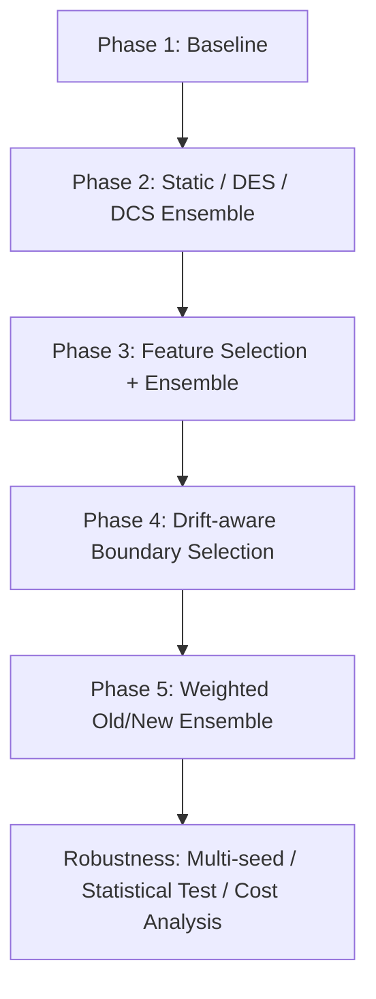

# 後續深入探究規劃

本文件承接 [研究方向.md](./研究方向.md) 的主線，整理在已完成「破產資料集、年份切割 a、基線實驗、Old/New 集成、先特徵選取再集成」之後，仍可繼續深入探究的研究項目。

目前建議不要單純增加更多模型，而是聚焦在非平穩環境下更核心的問題：**Old/New 資料如何切分、如何加權、如何選特徵，以及動態集成是否真的能適應分佈變化**。

---

## 1. 研究主線延伸

目前已完成或已有雛形的研究流程可延伸如下：



建議後續研究主軸可描述為：

> 在非平穩且類別不平衡的破產預測中，除了固定 Old/New 切割與等權集成外，進一步探討「漂移邊界選擇」、「Old/New 自適應權重」與「特徵選擇穩定性」是否能提升模型在未來期間的穩健性。

---

## 2. 優先研究項目

### 2.1 漂移邊界選擇：固定 2012 是否合理？

#### 研究動機

目前主要年份切割以 `1999-2011` 作為 historical data、`2012-2014` 作為 new operating data、`2015-2018` 作為 testing data。這符合原始研究設定，但也隱含一個假設：**2012 是合理的 Old/New 分界點**。

若資料分佈在更早或更晚的年份已經改變，固定 2012 可能不是最佳切割。因此可進一步研究：

> Old/New 的邊界如果不是人工指定，而是由驗證資料或漂移偵測結果決定，模型是否更穩定？

#### 可比較方法

- 固定邊界：`Fixed_2012`
- 驗證集選邊界：例如使用 `2012-2014` 作為 boundary validation，選出較合理的 drift start year
- ROSS 類型邊界：用舊訓練期間內的候選邊界評估 Old/New 模型差異
- Oracle 邊界僅作分析參考，不應用於正式主結果，避免使用 test period 造成資料洩漏

#### 實驗設計

- 候選邊界只在訓練期間內搜尋，例如 `1999-2011`
- 使用 `2012-2014` 作為 validation period 選出邊界
- 最終測試只使用 `2015-2018`
- 比較固定邊界與 validation-selected boundary 在 AUC、F1、G-Mean、Recall、Precision 上的差異

#### 對應程式與結果

- `experiments/phase4_drift/bankruptcy_ross_validation.py`
- `experiments/phase4_drift/bankruptcy_ross.py`
- `experiments/phase4_drift/bankruptcy_ross_static_ensemble.py`
- `results/phase4_drift/`

#### 預期貢獻

- 讓 Old/New 切割從人工假設延伸為資料驅動設定
- 強化本研究與 non-stationary / concept drift 主題的連結
- 可說明固定年份切割是否會低估或高估集成方法的效果

---

### 2.2 Old/New 加權集成：等權平均是否合理？

#### 研究動機

目前集成方法多以 Old models 與 New models 的機率平均作為 soft voting。但在非平穩資料中，舊資料與新資料的重要性不一定相同。

若測試資料更接近新分佈，New models 應有較高權重；若新資料量少或不穩定，Old models 仍可能提供穩定資訊。因此可研究：

> 在非平穩且類別不平衡的資料中，Old/New 模型池應該如何加權？

#### 可比較方法

- 等權平均：`w_old = 0.5`、`w_new = 0.5`
- New-dominant weighted ensemble：提高 `w_new`
- Old-dominant weighted ensemble：提高 `w_old`
- 搭配固定邊界與 validation-selected boundary 分別比較
- 搭配 no-FS 與 FS 分別比較

#### 實驗設計

- 權重掃描：`w_new = 0.0, 0.05, ..., 1.0`
- 預測機率：

```text
p = (1 - w_new) * mean(Old3) + w_new * mean(New3)
```

- 閾值在 validation 上依 F1 搜尋
- final test 上比較 AUC、F1、G-Mean、Recall、Precision、Type1_Error、Type2_Error

#### 對應程式與結果

- `experiments/phase5_weighted/bankruptcy_ross_weight_sweep.py`
- `experiments/phase4_drift/bankruptcy_ross_validation.py`
- `results/phase5_weighted/bk_validation_ross_weight_summary.csv`
- `results/phase5_weighted/bk_validation_ross_weight_sweep.csv`

#### 目前觀察

從目前 `bk_validation_ross_weight_summary.csv` 可觀察到，validation-selected ROSS 邊界搭配 feature selection 時，最佳權重可能偏向 New models，例如 `w_new` 接近 `0.95`。這表示在破產資料的未來測試期間，新分佈模型可能更重要。

#### 預期貢獻

- 補強「非平穩環境下模型更新」的討論
- 說明 Old knowledge 與 New knowledge 的 trade-off
- 比等權 ensemble 更符合 continual learning 的設定

---

### 2.3 特徵選擇穩定性：FS 不只看效能，也看穩定性

#### 研究動機

目前 Study II 已經探討 feature selection 對 ensemble performance 的影響。後續可以進一步分析：

> 特徵選擇在非平穩資料中，是提升效能，還是提升穩定性？

若不同年份切割下選出的特徵高度一致，代表這些財務特徵可能較穩定；若特徵集合差異很大，代表資料分佈變化會影響模型依賴的資訊。

#### 可分析項目

- Old-only 選出的特徵
- New-only 選出的特徵
- Old+New 選出的特徵
- 不同 drift boundary 下選出的特徵
- 不同 feature selection 方法選出的特徵

#### 指標設計

- 特徵集合重疊率
- Jaccard similarity
- Top-k selected feature frequency
- FS 前後的 AUC / F1 / Precision / Recall 差異
- FS 是否降低不同年份切割下的結果變異

#### 對應程式與結果

- `experiments/phase3_feature/`
- `experiments/phase3_feature/fs_study.py`
- `experiments/phase3_feature/fs_sweep.py`
- `experiments/phase3_feature/mutual_info/`
- `experiments/phase3_feature/rfe/`
- `experiments/phase3_feature/shap/`
- `results/phase3_feature/`

#### 預期貢獻

- 將 Study II 從「FS 是否提升效能」深化為「FS 是否提升非平穩環境下的穩健性」
- 可解釋哪些財務特徵在跨年份預測中較穩定
- 補強模型可解釋性與論文討論深度

---

## 3. 次優先研究項目

### 3.1 DES / DCS 的適用條件分析

#### 研究問題

目前已經有 static ensemble、DES、DCS 結果。後續可深入分析：

> 動態選模方法在什麼情境下勝過靜態集成？

#### 可分析方向

- DES / DCS 在哪些年份切割勝過 static ensemble
- DES / DCS 是否對少數類樣本更有效
- DCS 最常選到 Old models 還是 New models
- 不同 neighborhood size 對結果的影響
- 動態方法是否提升 Recall，但犧牲 Precision

#### 對應程式

- `experiments/phase2_ensemble/dynamic/des/`
- `experiments/phase2_ensemble/dynamic/dcs/`
- `experiments/_shared/common_des.py`
- `experiments/_shared/common_dcs.py`

#### 預期貢獻

- 避免 DES / DCS 只停留在結果比較
- 可解釋動態集成是否真的能適應 local distribution
- 補強方法章與實驗分析章的連結

---

### 3.2 閾值與成本敏感分析

#### 研究問題

破產預測中，Type I Error 與 Type II Error 的實務成本不同。若只使用 AUC 或固定 threshold，可能無法反映實務需求。

可進一步研究：

> 在不同錯誤成本設定下，最佳模型是否改變？

#### 可分析方向

- threshold sweep
- cost-sensitive threshold
- Precision-Recall trade-off
- Type1_Error / Type2_Error 的成本函數
- 高 Recall 情境與高 Precision 情境的模型選擇差異

#### 對應結果欄位

- `Type1_Error`
- `Type2_Error`
- `Recall`
- `Precision`
- `F1`
- `G_Mean`

#### 預期貢獻

- 強化破產預測的實務應用意義
- 避免只用單一 threshold 或單一 metric 下結論
- 可作為論文補充實驗或討論章節

---

### 3.3 多 seed 與統計檢定

#### 研究問題

若目前結果多為單次實驗，容易被質疑是否受 random seed、sampling 或模型初始化影響。

可補強：

> 各方法的提升是否具有統計穩定性？

#### 可分析方向

- multi-seed mean / std
- bootstrap confidence interval
- Wilcoxon signed-rank test
- 方法排名穩定性
- 不同年份切割下的平均排名

#### 對應程式

- `scripts/run/run_multi_seed.py`
- `scripts/analysis/statistical_test.py`
- `scripts/plots/visualize_results.py`

#### 預期貢獻

- 提高實驗可信度
- 支援論文中「顯著優於 baseline」的說法
- 可作為 final report 的穩健性分析

---

## 4. 建議執行順序

若時間有限，建議優先完成以下三個項目：

1. **漂移邊界選擇**
   - 比較 `Fixed_2012` 與 validation-selected boundary
   - 確認不使用 test set 進行邊界選擇

2. **Old/New 加權集成**
   - 在固定邊界與漂移邊界下分別做 weight sweep
   - 比較 no-FS 與 FS

3. **特徵選擇穩定性分析**
   - 分析不同切割下 selected features 是否穩定
   - 補強 Study II 的解釋性

若時間充足，再補：

4. DES / DCS 適用條件分析
5. threshold / cost-sensitive analysis
6. multi-seed 與統計檢定

---

## 5. 可形成的論文章節架構

### Study I：固定切割下的基線與集成比較

- Old / New / Retrain / Finetune
- Static ensemble
- DES / DCS
- 主要回答：集成是否優於單一模型？

### Study II：特徵選擇對集成的影響

- no-FS vs FS
- 不同 FS 方法或比例
- 主要回答：FS 是否提升效能與穩定性？

### Study III：漂移邊界選擇

- Fixed boundary vs validation-selected boundary
- ROSS-style boundary selection
- 主要回答：人工切割是否限制模型表現？

### Study IV：Old/New 加權集成

- Equal voting vs weighted voting
- Fixed boundary vs drift-aware boundary
- no-FS vs FS
- 主要回答：非平穩資料中，新舊模型應如何分配權重？

### Robustness Analysis：穩健性與實務設定

- multi-seed
- statistical test
- cost-sensitive threshold
- Type I / Type II error trade-off
- 主要回答：結果是否穩定，且是否符合破產預測實務需求？

---

## 6. 建議最終收斂題目

若需要將後續研究收斂成一個清楚題目，可使用：

> 非平穩且類別不平衡環境下，結合漂移邊界選擇、特徵選擇與 Old/New 加權集成之持續學習破產預測框架。

或較精簡地寫成：

> Drift-aware Weighted Ensemble Learning for Imbalanced Bankruptcy Prediction in Non-stationary Environments.

