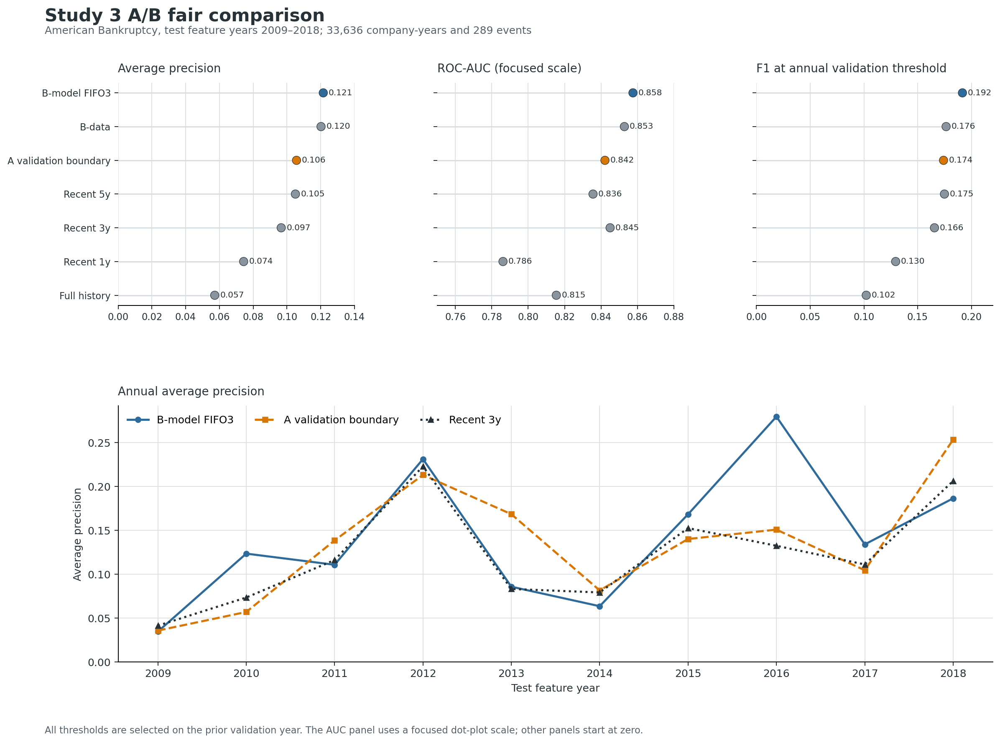

# 非平穩類別不平衡持續集成研究：成果、結論與後續規劃

報告日期：2026-09-15
用途：指導教授研究進度報告

> **目前判斷：研究已形成可重現的回溯原型，可向老師報告方法與結果；尚未完成到可以宣稱前瞻部署、純集成機制已證明或主設定全域最佳。** 2026-09-15 已完成 Old 與 New 同步逐年滑動的 16 輪 Study 3B 回測、模型老化追蹤及公司群集 bootstrap。原始資料、結果與原流程圖均保留。

完整研究審查：[論文與實作完整性審查](論文與實作完整性審查_20260911.md)。B 路線協定與生命週期：[B 提案、實作狀態與資料查核](Study3_B路線_重疊窗口持續集成提案.md)。

## 一、研究成果摘要

本研究探討企業破產預測中同時存在的兩項困難：破產樣本比例偏低，以及資料
分布會隨年度改變。實驗依時間建立 Old、New 與未來 Test 資料，系統比較
單模型、重訓練、靜態集成、動態選擇、特徵選擇、ROSS 邊界選擇及 DAWCE
加權策略。

目前結果得到六項重點：

1. **近期資料模型是目前最可靠的基準。** 主要 rolling 實驗中，
   `New_under` 的 pooled AUC/F1 為 **0.8403/0.3287**，是目前整體最穩健的
   方法。
2. **近期資料比大量歷史資料更重要。** 15-split 實驗中，New 系列 AUC 約
   0.8003–0.8438，Old 系列只有約 0.6536–0.6945，顯示過舊資料可能因概念
   漂移降低預測能力。
3. **自動選擇優於無差別平均，但尚未超越強單模型。** AdaptiveChoice_AUC
   相對 Equal6 的年度 AUC 差異經 Holm 校正後達顯著（`p=0.03125`），但
   相對 `New_under` 沒有顯著優勢。
4. **特徵選擇可改善 AUC，但不保證同步改善 F1。** Mutual Information
   保留 80% 特徵時，New3 AUC 從 0.8490 上升至 0.8537，F1 則由 0.1893
   降至 0.1861。
5. **現階段不能宣稱 DAWCE/ROSS 全面優於既有方法。** 證據支持驗證集導向
   的選擇可避免弱集成，但尚不足以支持提出方法全面勝過近期單模型。
6. **B 路線已完成持續更新原型，但少數類辨識仍有明顯代價。** B-model
   pooled AP/AUC/F1 為 **0.1215/0.8576/0.1917**；F1 閾值只找出
   62/289 個事件。提高至 validation-FPR 預算閾值後找出 116 個，但伴隨
   1,405 個誤報。
7. **Old 與 New 同步滑動的延伸實驗支持保留模型池。** 2003–2018 的 16 輪
   回測中，FIFO3 相對當輪最新模型的 pooled AP 為 **0.0860 vs 0.0730**，
   Recall 為 **0.1923 vs 0.1416**；成對公司群集 bootstrap 的 AP 與 Recall
   差異區間均未跨 0，但 Precision 較低且差異區間跨 0。

目前最合理的研究定位，是建立具備時間順序、驗證集選擇、少數類評估及完整
結果追溯的年度批次持續學習框架，並研究近期資料、歷史涵蓋與模型保留間的
效益／警報／成本取捨；不是把所有元件包裝成全面優於基準的新演算法。

### 目前進度總覽

| 工作項目 | 狀態 | 可以對老師怎麼說 |
|---|---|---|
| Study 1：Old/New 與基準模型 | 已完成；相依切割限制 | 近期模型方向性較好，舊結果不是 15 次獨立證據 |
| Study 2：FS 與穩定性 | 已完成探索分析 | MI-r80 有 AUC／穩定性線索，尚非確認性結論 |
| Study 3A：ROSS／DAWCE／rolling | 已完成回溯實驗 | 可改善 Equal6，但未證明超越 `New_under` |
| Study 3B：重疊窗口 FIFO | batch、16 輪全滑動、消融及 runtime 原型完成 | Old/New 均逐年移動；每年新增一模型、活躍池最多三個 |
| B 的 A-inspired／近期／歷史基準 | 已完成 | B 點估計較高，但對 A-inspired 的差異區間跨零 |
| Sampling／Pool／Window 消融 | 已完成 | Tomek、三年、Pool3 均不能稱已證明最佳 |
| 年度少數類與警報負擔 | 已完成 | 能明確報 TP／FP／FN、年度 AP、Recall 與 Test FPR |
| 標籤真實可用時間 | 未完成 | 現階段只能稱回溯事件重建 |
| 同資訊範圍的純集成機制對照 | 未完成 | 目前 Pool size 同時改變歷史涵蓋 |
| 凍結模型跨年老化追蹤 | 已完成描述性分析 | 年齡越大整體 AP 越低，但受模型出生年度 cohort 混雜 |
| 外部資料／真正未來年度驗證 | 未完成 | 不宣稱跨資料集或前瞻泛化 |

## 二、研究問題與可能貢獻

本研究主要回答：

1. 資料分布改變時，近期資料模型是否優於歷史資料模型？
2. 靜態或動態集成是否能穩定超越單模型與重訓練？
3. 特徵選擇能否同時提升預測效能與跨年度穩定度？
4. ROSS 與 DAWCE 能否只依據 Validation，自動決定時間邊界與模型權重？

目前可主張的研究工作包括：

- 建立避免未來資訊洩漏的 Old/New/Validation/Test 時間式評估流程；
- 系統比較不平衡取樣、單模型、靜態集成及動態選擇；
- 將特徵穩定性納入非平穩資料評估；
- 實作以 Validation 選擇邊界與權重的 ROSS/DAWCE 原型；
- 建立 rolling walk-forward、逐年指標、pooled prediction 與多重比較校正
  的可重現管線。

## 三、資料與實驗規範

主要資料為 American Corporate Bankruptcy Dataset，期間涵蓋 1999–2018，
共有 78,682 筆 company-year、8,971 家公司。原始 `status_label` 有 5,220
個 failed company-year（6.63%），但同一公司跨年度固定，因此這是公司最終
狀態標籤，不是逐年事件率。Study 3B 另重建 609 個一年期事件（0.774%）；
其 2009–2018 Test feature years 共 33,636 列、289 個事件。兩種 target 的
分數不得直接排名或合併解讀。

共同規範：

- 補值、縮放、特徵選擇、取樣、權重及 threshold 只能在 Train 或
  Validation 擬合。
- 最終 Test 不得用來選模型、權重或超參數。
- ROC-AUC 評估排序能力；F1、Recall、Precision 與 G-Mean 評估少數類辨識。
- 年度比較以年度為 paired unit，多項比較使用 Holm 校正。
- 從 Test 事後挑出的最佳組合只能標示為 oracle，不能視為可部署方法。

## 四、整體研究流程

每輪先依時間建立訓練、驗證與測試區段，再於 Old 與 New 各建立 under、
over、hybrid 三類模型。各 Study 分別評估模型池、特徵、漂移邊界與集成
權重，最後只在未見 Test 計算績效。下一批標籤取得後，資料才加入歷史資料
進入下一輪更新。

可編輯流程來源：

- [Study 1 baseline](../assets/research/diagrams/phase1-baseline-flow.puml)
- [Study 1 static/DES/DCS](../assets/research/diagrams/phase2-ensemble-flow.puml)
- [Study 2 feature selection](../assets/research/diagrams/phase3-fs-ensemble-flow.puml)
- [Study 3 ROSS/DAWCE/rolling](../assets/research/diagrams/phase4-batch-adaptive-flow.puml)

## 五、Study 1：近期資料模型明顯優於歷史資料模型

流程為建立 Old-only、New-only、Old+New retraining 與 fine-tuning，並分別
比較 none、under、over、hybrid 四種不平衡處理。

| 模型 | Sampling | AUC | F1 | Recall | Precision |
|---|---|---:|---:|---:|---:|
| New | none | **0.8438** | **0.2473** | 0.4348 | **0.1843** |
| New | under | 0.8397 | 0.2430 | 0.4230 | 0.1762 |
| Retrain | under | 0.8002 | 0.1891 | 0.4007 | 0.1238 |
| Old | under | 0.6628 | 0.1046 | 0.3064 | 0.0637 |

**結果解讀：** New 明顯高於 Old，也高於直接合併歷史資料的 Retrain。這
支持核心假設：非平穩環境中，資料時間相關性可能比資料量更重要。

**限制：** 15 個切割彼此重疊，不能當成 15 次獨立實驗，因此此處是方向性
證據，最終主張仍以不重疊年度 rolling 為準。

證據：[Phase 1 summary](../results/phase1_baseline/xgb/bk_xgb_compact_summary.csv)

## 六、Study 1 延伸：集成存在潛力，但必須公平選模

以 Old/New 的 under、over、hybrid 建立六模型池，再比較靜態平均、DES 與
DCS。靜態候選中，事後最佳平均 AUC/F1 為 **0.8499/0.2523**，但這是從
Test 結果挑出的最佳組合，只能視為 oracle 上界。

**結果解讀：** 模型池包含可能優於單模型的組合，但如何在不看 Test 的前提
下選到該組合才是研究難點，也是後續 ROSS、DAWCE 與 AdaptiveChoice 的
研究動機。

證據：[Static ensemble summary](../results/phase2_ensemble/static/xgb_oldnew_ensemble_static_professor_summary_bankruptcy.csv)

## 七、Study 2：特徵保留比例影響穩定性與指標取捨

本 Study 比較 Mutual Information、RFE、SHAP，以及保留 20%、50%、80%
特徵與不選特徵，並計算不同時間切割間的 Jaccard stability。

| 設定 | AUC | F1 | Recall | Jaccard stability |
|---|---:|---:|---:|---:|
| New3，無 FS | 0.8490 | **0.1893** | 0.6016 | — |
| New3，MI-r80 | **0.8537** | 0.1861 | **0.6283** | 0.8187 |
| New-under，無 FS | 0.8397 | **0.2048** | 0.5380 | — |
| New-under，MI-r80 | **0.8451** | 0.2043 | **0.5563** | 0.8187 |

**結果解讀：** MI-r80 小幅改善 AUC 與 Recall，且 New-side 穩定度 0.8187
高於 MI-r50 的 0.6677；但 F1 沒有同步改善。特徵選擇較可能提高排序能力
與穩定性，不代表固定 threshold 下的分類必然更好。

**限制：** 105 個 pair 來自相同 15 個切割，pair 並非互相獨立。

證據：

- [MI feature selection](../results/phase3_feature/mutual_info/xgb_bankruptcy_fs_advanced_summary.csv)
- [Feature stability](../results/phase3_feature/stability/bankruptcy_feature_stability_summary.csv)

## 八、Study 3：自適應方法改善 Equal6，但 New-under 仍領先

### 漂移與 ROSS

固定漂移比較中，`Fixed_New` AUC/F1 為 **0.8514/0.2998**。ROSS 將手動
2012 邊界改為資料導向的 2008 邊界後，AUC 從 0.8164 增至 0.8239，F1
則從 0.2030 降至 0.1860。

這表示自動邊界可能改善 ranking，但未必改善少數類決策；ROSS 的目標函數、
threshold 與下游指標仍需聯合設計。

證據：[Drift](../results/phase4_drift/bk_drift_summary.csv)、[ROSS](../results/phase4_drift/bk_ross_static_ensemble_summary.csv)

### 公平加權消融

| 方法 | AUC | F1 | Recall | Precision |
|---|---:|---:|---:|---:|
| New_under | **0.8498** | **0.2143** | 0.5422 | **0.1354** |
| AdaptiveChoice_AUC | 0.8481 | 0.2028 | **0.5573** | 0.1248 |
| DAWCE_AUC | 0.8361 | 0.1878 | 0.5447 | 0.1144 |
| Equal6 | 0.8086 | 0.1611 | 0.5092 | 0.0966 |

DAWCE 與 AdaptiveChoice 均高於 Equal6，證明驗證集導向的加權或選擇比
六模型無差別平均合理；但 `New_under` 仍是最強基準。

證據：[Fair ablation](../results/phase5_weighted/bk_fair_ablation_summary.csv)

### Rolling walk-forward 主結果

十個不重疊年度共有 33,636 筆 pooled out-of-time predictions。

| 方法 | Pooled AUC | Pooled F1 | Recall | Precision |
|---|---:|---:|---:|---:|
| New_under | **0.8403** | **0.3287** | **0.3673** | 0.2975 |
| DAWCE_AUC | 0.8237 | 0.3275 | 0.3392 | **0.3165** |
| AdaptiveChoice_AUC | 0.8221 | 0.3283 | 0.3652 | 0.2982 |
| Retrain_under | 0.8116 | 0.2943 | 0.3146 | 0.2764 |
| Equal6 | 0.7971 | 0.2830 | 0.3553 | 0.2351 |

`New_under` 在 AUC 與 F1 維持領先；AdaptiveChoice 與 DAWCE 的 F1 接近，
但沒有一致的 AUC 優勢。

以十個年度為 paired unit、16 項比較採 Holm 校正後，只有
AdaptiveChoice_AUC 相對 Equal6 的 AUC 顯著：平均差 +0.0327，校正後
`p=0.03125`。AdaptiveChoice 相對 `New_under` 的 AUC、F1、Recall、
Precision 均不顯著。

**本 Study 結論：** 自適應選擇可以避免 Equal6 的效能損失，但尚未證明比
只使用近期資料的強單模型更好。

證據：[Pooled](../results/phase_flexible/rolling_bankruptcy/rolling_pooled_summary.csv)、[Annual](../results/phase_flexible/rolling_bankruptcy/rolling_by_year.csv)、[Statistics](../results/phase_flexible/rolling_bankruptcy/rolling_wilcoxon_holm.csv)

### B 路線：三年重疊窗口與 FIFO 模型池

B 路線改採一年期事件 target，並在相同 protocol 下比較三種方法：

| 方法 | Pooled AP | Pooled AUC | F1 | Recall | Precision |
|---|---:|---:|---:|---:|---:|
| B-model FIFO3 equal | **0.1215** | **0.8576** | **0.1917** | **0.2145** | 0.1732 |
| B-data equal | 0.1202 | 0.8529 | 0.1765 | 0.1661 | 0.1882 |
| Recent3y | 0.0966 | 0.8450 | 0.1656 | 0.1384 | **0.2062** |

B-model 在 pooled ranking 與少數類 recall 上較好，AUC 在 10 年中有 8 年
高於 Recent3y；但 precision 較低。10 seeds 的結果完全相同，顯示目前
pipeline 是決定性的，不能據此宣稱結果對資料擾動或未來年度很穩定。

**B 路線暫定結論：** 三個重疊窗口模型的整體設計具有值得繼續驗證的方向性訊號。
協定對齊比較已補做：所有方法使用相同事件 target、X1–X18、Tomek、XGBoost、
年度邊界與 Validation-only threshold；A-inspired baseline 僅由 Validation
AP/AUC 選 Old/New 切點並採等權，不搜尋 Test 或權重。它不是完整 DAWCE
六模型池與群組權重的重製。

這裡對齊的是資料可用性、模型族、sampling、等權與評估契約，不是完整 A 方法或相同
計算預算。A-inspired baseline 在十年共訓練 210 個 boundary 候選模型；B-model 的 FIFO pool
實際新增 12 個模型。後續仍需補 equal-compute ablation。

| 協定對齊方法 | Pooled AP | Pooled AUC | F1 | Recall | Precision |
|---|---:|---:|---:|---:|---:|
| B-model FIFO3 equal | **0.1215** | **0.8576** | **0.1917** | **0.2145** | 0.1732 |
| B-data equal | 0.1202 | 0.8529 | 0.1765 | 0.1661 | 0.1882 |
| A validation-boundary equal | 0.1056 | 0.8422 | 0.1741 | 0.1765 | 0.1717 |
| Recent5y | 0.1050 | 0.8356 | 0.1749 | 0.1834 | 0.1672 |
| Recent3y | 0.0966 | 0.8450 | 0.1656 | 0.1384 | **0.2062** |
| Recent1y | 0.0743 | 0.7861 | 0.1295 | 0.1176 | 0.1441 |
| FullHistory | 0.0572 | 0.8154 | 0.1022 | 0.1557 | 0.0760 |

以 5,512 家 Test 公司為 cluster 做 1,000 次配對 bootstrap：B-model 相對 A
的 AP 差為 0.0158（95% CI -0.0095–0.0401）、AUC 差 0.0154
（-0.0036–0.0337）、F1 差 0.0176（-0.0240–0.0580），區間均跨 0，故尚不能
宣稱顯著優於 A。相對 Recent3y，AP 差 0.0249（0.0045–0.0449）與 AUC 差
0.0126（0.0002–0.0248）的 cluster-bootstrap 區間不跨 0，但 F1 差的區間仍跨 0。

圖中 pooled 排名以 B-model 較高，但年度 AP 並非每年都勝出：B-model 有四年
最高，A 有三年、B-data 兩年、Recent5y 一年。這也是 B-A bootstrap 區間仍跨
0 的直接原因，不應只報 pooled 平均而省略年度變化。

#### B-model 少數類辨識與警報負擔

| Validation 選閾值規則 | TP | FP | FN | TN | Recall | Precision | 實現 Test FPR | 警報數 |
|---|---:|---:|---:|---:|---:|---:|---:|---:|
| 最大 F1 | 62 | 296 | 227 | 33,051 | 0.2145 | 0.1732 | 0.0089 | 358 |
| FPR ≤ 5% 下最大 Recall | 116 | 1,405 | 173 | 31,942 | 0.4014 | 0.0763 | 0.0421 | 1,521 |

年度 AP 介於 0.0346–0.2796，F1 閾值 Recall 介於 0.0714–0.3636；每年只有
21–36 個正例。這表示 pooled AUC 0.8576 不能解讀為每年都能穩定找出多數事件。

5% 是 Validation 上的選擇限制，不是 Test 保證；2012、2015、2018 的實現
Test FPR 分別為 5.84%、5.99%、5.02%。若教授的主要目標是少數類辨識，下一步
需要共同決定可接受的年度警報量或漏報／誤報成本，而不是只比較 AUC。

證據：[年度操作表](../results/phase_flexible/study3b_minority_analysis/analysis/20260914T025025467597Z/study3b_bmodel_operating_by_year.csv)、[Pooled 操作表](../results/phase_flexible/study3b_minority_analysis/analysis/20260914T025025467597Z/study3b_bmodel_operating_pooled.csv)、[分析 manifest](../results/phase_flexible/study3b_minority_analysis/analysis/20260914T025025467597Z/analysis_manifest.json)

A 與 B 回答的問題並不相同：A 在研究者已知的封閉歷史範圍中設定候選區間，
再選 Old/New 切點或比例；B 則預先固定更新規則，在每輪不知道下一年資料
內容及資料流終點時，保留兩個舊模型、加入一個新模型並淘汰最舊模型。
2009–2018 僅是回測範圍，不是模型可使用的未來資訊。

#### B 路線全滑動實驗：Old 與 New 一起逐年推移

依最新研究設計，每個凍結模型 `M_e` 使用 `e−2、e−1` 兩個 Old 年度與 `e`
這一個 New 年度訓練；`e+1` 只用於選該輪門檻，`e+2` 才是 Test。下一輪三年
窗口整體向前一年，前一輪 New 會成為下一輪 Old。FIFO 在暖機後只保留最近
三個凍結模型並等權平均，Test 從未參與訓練、門檻或模型淘汰決策。

| 輪次 | Old 年 | New | Val | Test 特徵→事件年 | FIFO 活躍模型 | FIFO AP | 最新模型 AP | FIFO Recall | 最新模型 Recall |
|---:|---|---:|---:|---|---|---:|---:|---:|---:|
| 1 | 1999,2000 | 2001 | 2002 | 2003→2004 | M2001 | 0.0235 | 0.0235 | 0.0000 | 0.0000 |
| 2 | 2000,2001 | 2002 | 2003 | 2004→2005 | M2001,M2002 | 0.0266 | 0.0296 | 0.0217 | 0.0217 |
| 3 | 2001,2002 | 2003 | 2004 | 2005→2006 | M2001,M2002,M2003 | 0.0240 | 0.0299 | 0.0000 | 0.0000 |
| 4 | 2002,2003 | 2004 | 2005 | 2006→2007 | M2002,M2003,M2004 | 0.0427 | 0.0338 | 0.0980 | 0.0392 |
| 5 | 2003,2004 | 2005 | 2006 | 2007→2008 | M2003,M2004,M2005 | 0.0685 | 0.0580 | 0.1695 | 0.2203 |
| 6 | 2004,2005 | 2006 | 2007 | 2008→2009 | M2004,M2005,M2006 | 0.1160 | 0.1203 | 0.5517 | 0.4310 |
| 7 | 2005,2006 | 2007 | 2008 | 2009→2010 | M2005,M2006,M2007 | 0.0346 | 0.0413 | 0.1739 | 0.0870 |
| 8 | 2006,2007 | 2008 | 2009 | 2010→2011 | M2006,M2007,M2008 | 0.1235 | 0.0734 | 0.0857 | 0.0571 |
| 9 | 2007,2008 | 2009 | 2010 | 2011→2012 | M2007,M2008,M2009 | 0.1108 | 0.1161 | 0.2400 | 0.0800 |
| 10 | 2008,2009 | 2010 | 2011 | 2012→2013 | M2008,M2009,M2010 | 0.2313 | 0.2229 | 0.3077 | 0.1538 |
| 11 | 2009,2010 | 2011 | 2012 | 2013→2014 | M2009,M2010,M2011 | 0.0858 | 0.0832 | 0.0714 | 0.0714 |
| 12 | 2010,2011 | 2012 | 2013 | 2014→2015 | M2010,M2011,M2012 | 0.0635 | 0.0792 | 0.2121 | 0.1212 |
| 13 | 2011,2012 | 2013 | 2014 | 2015→2016 | M2011,M2012,M2013 | 0.1683 | 0.1526 | 0.3636 | 0.2727 |
| 14 | 2012,2013 | 2014 | 2015 | 2016→2017 | M2012,M2013,M2014 | 0.2796 | 0.1324 | 0.3103 | 0.1724 |
| 15 | 2013,2014 | 2015 | 2016 | 2017→2018 | M2013,M2014,M2015 | 0.1340 | 0.1111 | 0.1905 | 0.0476 |
| 16 | 2014,2015 | 2016 | 2017 | 2018→2019 | M2014,M2015,M2016 | 0.1865 | 0.2063 | 0.1944 | 0.2500 |

16 輪共有 58,600 個 Test company-year、572 個正例。逐筆 pooled 結果如下；
前兩輪分別只有一及兩個可用模型，2005 年起才是完整 FIFO3。

| 方法 | AP | AUC | F1 | Recall | Precision | TP | FP | FN |
|---|---:|---:|---:|---:|---:|---:|---:|---:|
| Sliding FIFO3 | **0.0860** | **0.7733** | **0.1521** | **0.1923** | 0.1259 | **110** | 764 | 462 |
| 當輪最新三年模型 | 0.0730 | 0.7722 | 0.1391 | 0.1416 | **0.1366** | 81 | **512** | 491 |

FIFO 多找出 29 個事件，同時多產生 252 個誤報。以公司為抽樣群集做 1,000 次
成對 bootstrap，FIFO−最新模型的 AP 差為 **+0.0130**（95% CI
0.0019–0.0241），Recall 差 **+0.0507**（0.0284–0.0748）；AUC、F1、
Precision 的區間跨 0。僅看完整三模型池的 2005–2018，AP 差為 +0.0153
（0.0027–0.0280），Recall 差 +0.0584（0.0324–0.0857）。因此可說目前資料
支持「保留最近三個滑動窗口模型可提高少數類召回與 AP」，但不能說全面優於
最新模型，也不能單獨歸因於集成，因 FIFO 同時涵蓋較長的歷史資訊。

逐年度看，FIFO 的 AP 在 16 年中勝 8 年、平 1 年，Recall 勝 10 年、平 4 年；
2018 年兩者都沒有由 FIFO 獲益，顯示方法不是每年必勝。

另將每個 `M_e` 的原始 Validation 門檻凍結，測到所有其後可用年度，共 136 個
模型×未來年度組合。平均 AP 由模型年齡 2 年時的 0.0946，大致降至年齡 10 年
的 0.0374、年齡 17 年的 0.0196，支持定期更新的必要性；但高年齡只剩較早
cohort 模型，這是描述性老化證據，不能當作純粹年齡的因果效果。

證據：[16 輪協定](../results/phase_flexible/study3b_sliding_old_new/runs/20260914T233351370315Z/sliding_protocol.csv)、[逐年結果](../results/phase_flexible/study3b_sliding_old_new/runs/20260914T233351370315Z/sliding_primary_by_year.csv)、[pooled 結果](../results/phase_flexible/study3b_sliding_old_new/runs/20260914T233351370315Z/sliding_primary_pooled.csv)、[公司群集 bootstrap](../results/phase_flexible/study3b_sliding_old_new/runs/20260914T233351370315Z/analysis/20260914T234337062081Z/paired_company_cluster_bootstrap.csv)、[老化摘要](../results/phase_flexible/study3b_sliding_old_new/runs/20260914T233351370315Z/analysis/20260914T234337062081Z/frozen_model_aging_by_age.csv)、[run manifest](../results/phase_flexible/study3b_sliding_old_new/runs/20260914T233351370315Z/run_manifest.json)。

目前 B 已加入可跨程序恢復的模型池：每個模型與前處理獨立保存，registry
記錄加入／保留／淘汰並原子更新；`predict` 不開啟 label ledger，輸出也不含
`y_true`。真實資料已完成 2009 初始化及 2010–2012 跨程序逐年更新 smoke；
2012 active pool 為 M2008/M2009/M2010，M2005–M2007 已退役且仍可由 registry 稽核。

仍需注意，內建 label-maturity gate 使用 `fyear+1` 的年度回溯假設，並非
實際 filing/report timestamp；每輪資源成本及故障恢復也尚未完整量測。因此
對教授可稱為「可恢復的持續更新研究原型」，不能稱為已驗證的永久部署系統。
此外，active pool 的模型數固定為三，但退役 checkpoint 為研究稽核仍會累積；
正式長期運行前還需制定封存或保留年限，才能讓磁碟成本也有界。

證據：[公平 Pooled summary](../results/phase_flexible/study3_ab_fair/runs/20260909T122839561377Z/seed_42/fair_pooled_summary.csv)、[公司 cluster bootstrap](../results/phase_flexible/study3_ab_fair/runs/20260909T122839561377Z/seed_42/paired_company_cluster_bootstrap.csv)、[A 選擇歷史](../results/phase_flexible/study3_ab_fair/runs/20260909T122839561377Z/seed_42/a_selection_history.csv)、[Manifest](../results/phase_flexible/study3_ab_fair/runs/20260909T122839561377Z/run_manifest.json)

#### B-model Sampling 消融

已在其餘設定完全相同、Validation/Test 不採樣的條件下，比較 None、
TomekLinks 與 `scale_pos_weight`：

| Training 不平衡處理 | AP | AUC | F1 | Recall | Precision | Recall@5% FPR |
|---|---:|---:|---:|---:|---:|---:|
| None | 0.1176 | 0.8576 | **0.1921** | 0.1938 | **0.1905** | **0.4291** |
| TomekLinks | **0.1215** | **0.8576** | 0.1917 | **0.2145** | 0.1732 | 0.4014 |
| `scale_pos_weight` | 0.1094 | 0.8428 | 0.1725 | 0.2042 | 0.1494 | 0.3875 |

Tomek 的 AP 比 None 高 0.0039，但 AUC 幾乎相同，F1 略低；公司成對
bootstrap 的五項差異區間都跨 0。它在 12 個 B-model fit 中只移除 353 個
多數類列。因此目前不能宣稱 Tomek 是有效貢獻，只能說它在 pooled AP 上有
輕微方向性訊號；若採 5% FPR 告警預算，反而是 None 的 Recall 較高。

證據：[Sampling pooled summary](../results/phase_flexible/study3b_sampling_ablation/analysis/20260910T175100152579Z/sampling_ablation_pooled_summary.csv)、[公司成對 bootstrap](../results/phase_flexible/study3b_sampling_ablation/analysis/20260910T175100152579Z/sampling_ablation_bmodel_company_bootstrap.csv)、[分析 manifest](../results/phase_flexible/study3b_sampling_ablation/analysis/20260910T175100152579Z/analysis_manifest.json)

#### B-model 模型池容量消融

| Pool size | AP | AUC | F1 | Recall | Precision | Recall@5% FPR |
|---:|---:|---:|---:|---:|---:|---:|
| 1 | 0.0966 | 0.8450 | 0.1656 | 0.1384 | **0.2062** | 0.3910 |
| 2 | 0.1178 | 0.8529 | **0.2003** | 0.2076 | 0.1935 | 0.3772 |
| 3 | 0.1215 | 0.8576 | 0.1917 | **0.2145** | 0.1732 | 0.4014 |
| 5 | **0.1248** | **0.8626** | 0.1646 | 0.1799 | 0.1516 | **0.4221** |

Pool3 相對 Pool1 的 AP、AUC 與 Recall 公司成對 bootstrap 區間未跨 0。
不過，三年窗口下 Pool1／Pool3／Pool5 的歷史聯集同時由三／五／七年增加，
因此這項比較不能把提升全部歸因於模型保留。作為同五年資訊範圍參考，
B-model 相對 Recent5y 的 AP 差區間跨 0，AUC 差區間未跨 0。Pool3 也未一致優於 Pool2 或 Pool5：
Pool5 的 ranking 指標最高、Pool2 的 F1 最高、Pool3 的一般 Recall 最高。
這比較像容量增加後的效益飽和與 precision–recall 取捨，不是「模型越多全面
越好」。Pool3 是事前主設定，不能因 Pool5 在本次 Test 的 AP 較高就改選。

證據：[Pool pooled summary](../results/phase_flexible/study3b_pool_ablation/analysis/20260910T181408321502Z/pool_ablation_pooled_summary.csv)、[公司成對 bootstrap](../results/phase_flexible/study3b_pool_ablation/analysis/20260910T181408321502Z/pool_ablation_company_bootstrap.csv)、[訓練稽核](../results/phase_flexible/study3b_pool_ablation/analysis/20260910T181408321502Z/pool_ablation_training_audit.csv)

#### B-model 訓練窗口消融

| Window | AP | AUC | F1 | Recall | Precision | Recall@5% FPR |
|---:|---:|---:|---:|---:|---:|---:|
| 1 年 | 0.1142 | 0.8536 | **0.2010** | 0.2007 | **0.2014** | 0.3633 |
| 3 年 | **0.1215** | **0.8576** | 0.1917 | 0.2145 | 0.1732 | 0.4014 |
| 5 年 | 0.1106 | 0.8571 | 0.1672 | **0.2664** | 0.1218 | **0.4152** |

三年相對一年與五年的 AP/AUC 公司成對 bootstrap intervals 均跨 0，故不能
宣稱三年最佳。五年提高 Recall 但降低 Precision；一年具有較高 F1/Precision
與最低 fitting 成本。三年保留為事前主設定，只能說是 AP 點估計最高的折衷點。

證據：[Window pooled summary](../results/phase_flexible/study3b_window_ablation/analysis/20260911T021739729683Z/window_ablation_pooled_summary.csv)、[公司成對 bootstrap](../results/phase_flexible/study3b_window_ablation/analysis/20260911T021739729683Z/window_ablation_company_bootstrap.csv)、[訓練稽核](../results/phase_flexible/study3b_window_ablation/analysis/20260911T021739729683Z/window_ablation_training_audit.csv)

## 九、目前研究結論

### 已有證據支持

- 資料新鮮度對非平穩破產預測非常重要。
- 簡單納入更多歷史資料可能造成負遷移。
- New-side 模型是複雜方法必須超越的必要基準。
- 驗證集導向的模型選擇／加權比 Equal6 更合理。
- MI-r80 有小幅改善 AUC 與特徵穩定度的探索性線索。
- Rolling walk-forward 比重疊切割更接近部署情境。
- B-model 已形成可跨程序恢復、每年只新增一模型的年度更新原型。
- B-model 對 Recent3y 的 pooled AP/AUC 較高，但這是模型數與歷史涵蓋共同改變的整體設計差異。

### 目前證據不支持

- DAWCE 或 ROSS 全面優於 `New_under`。
- 固定設定下重複 seed 相同可代表未來年度穩定性。
- Bankruptcy 結果可直接泛化至醫療或金融市場資料。
- ROC-AUC 改善必然產生更佳實務成本效益。
- Tomek／三年窗口／Pool3 已被證明是最佳組合。
- Pool3 相對 Pool1 的全部提升可單獨歸因於集成保留。
- B 已具備經真實 filing／破產日期驗證的前瞻部署能力。

## 十、研究限制

1. B 的事件年與 `label_available_year` 是由資料規則重建，缺少 filing、公告或法律事件的實際時間戳。
2. Rolling 只有十個 Test 年度，每年僅 21–36 個正例；公司 bootstrap 沒有涵蓋共同年度衝擊與重新訓練變異。
3. Pool size 消融同時改變歷史資料聯集，尚未完全分離歷史長度與集成機制。
4. A-inspired baseline 與 B 對齊 target、特徵及評估契約，但不是完整 DAWCE 重製，也沒有相同計算預算。
5. 假陰性、假陽性與人工審查成本尚未由領域專家定義；現行 5% 僅是 validation FPR 限制。
6. B 尚未報告 probability calibration；XGBoost 分數只能先解讀為排序分數，不是已校準的破產機率。
7. 活躍模型池固定為三個，但歷史 raw 讀取、退役 checkpoint 與 registry 紀錄仍會累積。
8. Medical 與 Stock 尚未以相同事件定義與 rolling protocol 重現，不能支持跨域泛化。

## 十一、未來研究方向與優先序

### P0：投稿或口試前必要

1. **標籤成熟時間與尾端追蹤敏感度**：確認或明確假設財報、事件及負類成熟時間；比較延遲一年／兩年與排除尾端年度後的結果。
2. **同資訊範圍的機制對照**：使用相同五年歷史、相近模型數與 fitting rows，比較單一模型、一般多模型平均與重疊年度專家。
3. **固定實務操作目標**：由老師／領域知識決定優先 AP、Recall@固定警報數或可接受 FP/FN 成本，之後才決定門檻。
4. **論文與方法契約定稿**：每個 Study 列出 target、features、sampling、模型數、selection、Test 與 run ID，舊 final-status 結果和 B-event 結果分開。
5. **修正可靠性邊界**：處理 FPR 門檻極端案例、runtime 配置指紋、部分成熟標籤與多 seed 彙整防護，再升 protocol 版本。

### P1：提高論文說服力

1. 報告 B 的 calibration／Brier score；若只做排序則清楚排除機率解讀。
2. 加入 pool diversity、error correlation 與 disagreement，說明年度專家是否真的互補。
3. 對十個年度做透明的時間敏感度；因年度數少，將低檢定力一併報告。
4. 實測年度 update 的 fit time、總 time、峰值 RAM、活躍與封存儲存量。
5. 加入 logistic regression 與一個適合年度延遲標籤的既有集成基準。

### P2：延伸議題

1. 在另一個有真實事件與可用時間欄位的資料集重現完整 rolling protocol。
2. 比較 validation-based retirement、online bagging 或 adaptive random forest。
3. 加入不確定性估計、拒絕預測與隨時間更新的 calibration。
4. 區分既有公司與新進公司的泛化效果。

## 十二、下一階段最建議的實驗

> **相同五年資訊範圍下的「單模型 vs 一般集成 vs 重疊年度專家」機制對照**

這項實驗優先於再做大量 seed 或權重搜尋，因為它直接回答目前最大問題：
Pool3 的提升究竟來自多看歷史資料、一般平均降低變異，或保留不同年份專家。
設計需在執行前固定方法、主要 AP、次要 Recall／Precision、資料範圍、模型數、
fitting rows 與門檻規則；Test 只做一次比較，不依結果再選組合。

完成後應產出逐年／pooled AP、操作 confusion matrix、公司配對差異區間、
unique training rows、累積 fitting rows、模型數及 wall time。若差異仍跨零，
論文仍可收斂為「可稽核生命週期與實務取捨」的系統／實證貢獻。

## 十三、希望與老師確認的問題

1. 論文是否同意聚焦 Study 3B 的「年度重疊窗口、少數類辨識與持續更新生命週期」，將 Study 1–3A 作研究演進及對照？
2. 實務優先目標是 AP、固定年度警報數下的 Recall，還是明確 FN/FP 成本？
3. 對目前 289 個 Test 事件，F1 閾值只抓到 62 個；增加到 116 個會產生 1,405 個誤報，哪個操作點較符合研究情境？
4. 無法取得 filing／法律事件時間戳時，是否接受論文明確定位為回溯性事件重建？
5. 完成同資訊範圍機制對照後，是否先收斂論文，再將外部驗證列為後續研究？

## 十四、向老師報告的五分鐘順序

1. **研究問題：** 未知未來年度到來時，能否保留有限歷史模型並改善極少數破產事件辨識？
2. **方法：** t−2 前訓練、t−1 Validation、t Test；三年窗口、Pool3、FIFO、等權 XGBoost，每年只新增一模型。
3. **主要結果：** 33,636 筆 Test、289 事件；B AP/AUC/F1 為 0.1215/0.8576/0.1917，高於 Recent3y 點估計，但未顯著超越 A-inspired baseline。
4. **少數類實況：** F1 閾值找出 62 個、誤報 296 個；提高 Recall 後找出 116 個、誤報 1,405 個，年度差異很大。
5. **消融結論：** Tomek、三年、Pool3 都不能稱最佳；Pool size 與歷史涵蓋混合，是目前最重要的機制缺口。
6. **工程成果：** batch backtest、逐筆結果、manifest 與跨程序 runtime 已完成；47 tests 通過，保存預測與 batch 機率一致。
7. **限制與決策：** 標籤可用時間仍是假設；請老師決定主要操作目標及是否以 Study 3B 為論文主線。
8. **下一步：** 只補一個同五年資訊範圍機制對照，完成後收斂論文。

## 十五、結語

本研究已完成從基準模型、集成、特徵選擇、漂移邊界、加權到 rolling 評估的
研究鏈，並完成 Study 3B 的年度更新原型、三類消融、逐筆預測與少數類警報
分析。現有證據清楚顯示近期資料的重要性，也顯示無差別集成不可靠；B 的
整體設計值得保留，但尚不能分離純集成效益或宣稱三年／Pool3／Tomek 最佳。
研究現在不是「沒有成果」，而是進入收斂：先固定有限且可信的主張，補唯一
必要的機制對照與標籤敏感度，再完成論文，而不是繼續擴張搜尋空間。

詳細研究規格、文獻與主張來源台帳請見 [研究方向.md](研究方向.md)。
