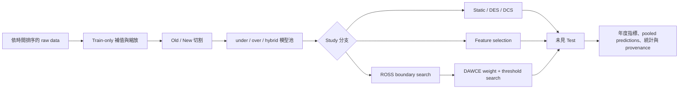

# 非平穩類別不平衡持續集成：研究方向、實驗流程與目前結果

最後更新：2026-09-08
文件狀態：研究規格主文件；整合 Study 流程、結果、證據限制與待辦。

## 1. 研究摘要

本專案研究在資料分布隨時間改變、正類事件稀少的情境下，如何維持少數類
辨識能力。主要問題是企業破產預測；正類為 `failed`，觀測單位為
company-year。核心方法比較歷史資料模型（Old）、近期資料模型（New）、
重訓練、靜態集成、動態分類器／集成選擇（DCS/DES）、特徵選擇，以及本
專案提出的批次式 ROSS 與 DAWCE 流程。

目前最穩健的結論是：**近期資料訓練的 `New_under` 是最強基準；
validation-guided weighting 能改善 Equal6，但 DAWCE/ROSS 尚未穩定超越
強單模型。** 因此目前研究價值主要在「可重現的時間邊界與模型選擇流程」
及其適用限制，而不是宣稱新方法全面勝出。

## 2. 資料與研究問題

| 資料集 | 時間／規模 | 正類 | 目前用途 | 證據狀態 |
|---|---|---|---|---|
| American Corporate Bankruptcy | 1999–2018；78,682 company-year；8,971 firms | failed；5,220 列（6.63%） | 主要 Study 1–4 與 rolling | 主證據 |
| Diabetes 130-US Hospitals | 1999–2008；專案另有轉換版 | mortality／readmission 衍生目標 | 模型與流程輔助驗證 | 尚未對齊主 rolling protocol |
| Stock SPX | 專案衍生時間序列 | `Crash_Event` | 輔助驗證 | 原始供應者與標籤公式仍需補齊 |

Bankruptcy 固定切割為 Old 1999–2011、New 2012–2014、Test 2015–2018；
另使用不同 Old/New 年份邊界及 2009–2018 年度 rolling walk-forward。所有
需要學習的補值、縮放、特徵、權重與 threshold，原則上只能在 Train 或
Validation 擬合，final Test 不可參與選擇。

研究問題：

1. New-side 模型是否比 Old-side 模型更適合未來期間？
2. 靜態集成、DES/DCS 是否優於重訓練或強單模型？
3. 特徵選擇能否改善效能及跨時間穩定度？
4. ROSS 能否以 Validation 自動選擇 Old/New 邊界？
5. DAWCE 能否以 Validation 選出的 New-side 權重改善 Equal6？
6. 上述結論能否在 rolling、多 seed、公司層級及外部資料集重現？

## 3. 共用實驗規範

### 3.1 模型池

每個時間區段以三種不平衡處理建立模型：

- under：Tomek Links；
- over：ADASYN；
- hybrid：SMOTE + Edited Nearest Neighbours；
- 主線基學習器：XGBoost；部分輔助流程使用 LightGBM。

形成 `Old_under/over/hybrid` 與 `New_under/over/hybrid` 六個候選模型。
靜態方法平均指定模型的正類機率；DCS 選一個局部分類器；DES 選局部模型
子集；DAWCE 則調整 Old3 與 New3 兩個群組的權重。

### 3.2 指標與統計

主要報告 ROC-AUC、F1、G-Mean、Recall、Precision、FPR 與 FNR。投稿前
還應一致補上 PR-AUC、校準指標與 95% confidence interval。threshold 必須
由 Validation 選擇。年度方法比較使用 paired Wilcoxon，現行確認性表對
16 項比較採 Holm family-wise correction。

### 3.3 全流程



### 3.4 原始流程圖

原有流程圖沒有被內容整併取代；可編輯的 PlantUML 原始碼與簡報用圖片保存於
`assets/research/diagrams/`：

- [Study 1／Phase 1 baseline 流程](../assets/research/diagrams/phase1-baseline-flow.puml)
- [Study 1 延伸／Phase 2 ensemble 流程](../assets/research/diagrams/phase2-ensemble-flow.puml)
- [Study 2／Phase 3 feature-selection 流程](../assets/research/diagrams/phase3-fs-ensemble-flow.puml)
- [Study 3／Phase 4 batch-adaptive 流程](../assets/research/diagrams/phase4-batch-adaptive-flow.puml)


## 4. Study 1：基準模型與 Old/New 模型池

### 流程

1. 依時間建立 Old、New、Test。
2. 比較 Old-only、New-only、Old+New retraining 與 fine-tuning。
3. 每種訓練策略比較 none、under、over、hybrid。
4. 只以未見 Test 計算指標。

主要程式：[`experiments/phase1_baseline/`](../experiments/phase1_baseline/)。

### 結果

Bankruptcy XGBoost 15-split 摘要中，New-none AUC/F1 為
0.8438/0.2473，New-under 為 0.8397/0.2430；Old 系列 AUC 約
0.6536–0.6945，F1 約 0.0846–0.1046。這支持近期資料的重要性，但 15 個
切割互相重疊，不能視為 15 次獨立重複。

證據：[`bk_xgb_compact_summary.csv`](../results/phase1_baseline/xgb/bk_xgb_compact_summary.csv)。

判定：**方向性支持 New-side 模型；最終主張以 Study 3 rolling 結果為準。**

## 5. Study 1 延伸：靜態集成、DES 與 DCS

### 流程

1. 以六模型池建立 2–6 模型的靜態組合。
2. DES 以局部 competence 選模型子集；DCS 選單一模型。
3. 比較年度 AUC、F1、Recall。
4. `Static oracle best` 只作候選上界，不視為可部署方法。

主要程式：[`experiments/phase2_ensemble/`](../experiments/phase2_ensemble/)。

### 結果

七個摘要切割的最佳靜態組合平均 AUC/F1 為 0.8499/0.2523；不同切割的
最佳模型組合不完全一致。15-split 比較中，多數 static oracle 點高於 DES
與 DCS，但它依 Test 指標事後選模，因此不能用來宣稱某個預先指定的靜態
方法無偏地顯著優於 DES/DCS。

證據：

- [`xgb_oldnew_ensemble_static_professor_summary_bankruptcy.csv`](../results/phase2_ensemble/static/xgb_oldnew_ensemble_static_professor_summary_bankruptcy.csv)
- [`bankruptcy_phase2_xgb_static_des_dcs_points.csv`](../results/phase2_ensemble/model_comparison/plots/bankruptcy_phase2_xgb_static_des_dcs_points.csv)

判定：**動態選擇目前沒有穩定優勢；公平結論仍需獨立 Validation DSEL 與
validation-selected static baseline。**

## 6. Study 2：特徵選擇與穩定度

### 流程

1. 僅在允許的 fitting data 上執行 MI、SHAP、RFE、CART 等方法。
2. 比較 no-FS、保留 50%（r50）及 80%（r80）特徵。
3. 將相同欄位套用至 New、Validation、Test。
4. 以不同年份邊界的 Jaccard overlap 描述穩定度。

主要程式：[`experiments/phase3_feature/`](../experiments/phase3_feature/)。

### 結果

在進階 15-split 摘要中：

- no-FS New3：AUC/F1 = 0.8490/0.1893；
- MI-r80 New3：0.8537/0.1861；
- MI-r80 New-under：0.8451/0.2043；
- no-FS New-under：0.8397/0.2048。

FS 對 AUC 有局部提升，但沒有在 F1 上一致勝出。穩定度方面，多數 Old 或
New scope 的 r80 高於 r50，例如 New-MI Jaccard 0.8187 對 0.6677。
`old_new` 在不同邊界下實際使用相同 1999–2014 合併資料，其接近 1 的結果
是設計所致，不能當成額外穩定性證據。105 個 pair 也彼此相依，不可直接
當成 105 個獨立樣本做確認性檢定。

證據：

- [`xgb_bankruptcy_fs_advanced_summary.csv`](../results/phase3_feature/combined/xgb_bankruptcy_fs_advanced_summary.csv)
- [`bankruptcy_feature_stability_summary.csv`](../results/phase3_feature/stability/bankruptcy_feature_stability_summary.csv)

判定：**r80 通常較穩，但 FS 的預測增益不一致。**

## 7. Study 3：漂移偵測、ROSS、DAWCE 與 rolling

### 7.1 漂移偵測

比較 DDM、ADWIN、Page–Hinkley-style signal 與固定模型。當前摘要中
Fixed-New AUC/F1 為 0.8514/0.2998，高於列出的 detector variants；因此
「偵測到漂移」本身尚未轉化為較佳預測。

證據：[`bk_drift_summary.csv`](../results/phase4_drift/bk_drift_summary.csv)。

### 7.2 ROSS

ROSS（Retrospective Optimal Split Selection）是本專案命名的離線批次流程：
列舉 Old/New boundary，以 Validation 指標選擇邊界，再固定至 Test。它不是
外部既有方法，也不是逐筆 online learner。

validation-selected 版本選出 2009；no-FS `ValROSS_2009` AUC/F1 為
0.8418/0.1947，固定 2012 對照為 0.8409/0.2039。ROSS 改善 AUC 很小，
Test F1 反而較低，故不能宣稱 ROSS 普遍優於固定邊界。

證據：[`bk_validation_ross_weight_summary.csv`](../results/phase5_weighted/bk_validation_ross_weight_summary.csv)。

### 7.3 DAWCE

DAWCE（Drift-Aware Weighted Continual Ensemble）也是本專案命名。對
Old3 與 New3 的平均機率搜尋 `w_new`：

\[
p(x)=(1-w_{new})p_{old}(x)+w_{new}p_{new}(x)
\]

權重與 threshold 都由 Validation 選擇。公平消融的 no-FS Test 結果：

| 方法 | AUC | F1 | Recall | Precision |
|---|---:|---:|---:|---:|
| New_under | 0.8498 | 0.2143 | 0.5422 | 0.1354 |
| AdaptiveChoice_AUC | 0.8481 | 0.2028 | 0.5573 | 0.1248 |
| DAWCE_AUC | 0.8361 | 0.1878 | 0.5447 | 0.1144 |
| Equal6 | 0.8086 | 0.1611 | 0.5092 | 0.0966 |

證據：[`bk_fair_ablation_summary.csv`](../results/phase5_weighted/bk_fair_ablation_summary.csv)。

判定：**DAWCE/AdaptiveChoice 改善 Equal6，但沒有超越 `New_under`。**

### 7.4 Rolling walk-forward（目前主結果）

對 2009–2018 十個互不重疊的年度 Test batch，以截至前一期可用的資料進行
expanding-window 選擇；每個方法共有 33,636 筆 pooled out-of-time 預測。

| 方法 | pooled AUC | pooled F1 | Recall | Precision |
|---|---:|---:|---:|---:|
| New_under | **0.8403** | **0.3287** | **0.3673** | 0.2975 |
| DAWCE_AUC | 0.8237 | 0.3275 | 0.3392 | **0.3165** |
| AdaptiveChoice_AUC | 0.8221 | 0.3283 | 0.3652 | 0.2982 |
| Retrain_under | 0.8116 | 0.2943 | 0.3146 | 0.2764 |
| Equal6 | 0.7971 | 0.2830 | 0.3553 | 0.2351 |

以年度為 paired unit、16 項比較採 Holm 校正後，只有
AdaptiveChoice_AUC 相對 Equal6 的 AUC 通過校正（平均差 +0.0327，raw
`p=0.001953`，Holm `p=0.031250`）。AdaptiveChoice 相對 `New_under`
的 AUC、F1、Recall、Precision 都不顯著。

證據：

- [`rolling_pooled_summary.csv`](../results/phase_flexible/rolling_bankruptcy/rolling_pooled_summary.csv)
- [`rolling_by_year.csv`](../results/phase_flexible/rolling_bankruptcy/rolling_by_year.csv)
- [`rolling_predictions.csv`](../results/phase_flexible/rolling_bankruptcy/rolling_predictions.csv)
- [`rolling_wilcoxon_holm.csv`](../results/phase_flexible/rolling_bankruptcy/rolling_wilcoxon_holm.csv)

判定：**確認 validation-guided selection 可避免 Equal6 的 AUC 損失，但沒有
確認其優於強近期單模型。**

### 7.5 已生成的結果圖

以下圖表由已保存的結果檔產生，原圖保存在 `results/report_figures/`，不因
`docs/` 的文字文件整併而刪除。


## 8. Study 4：多種子與成本敏感度

### 流程與結果

既有 10-seed 檔案使用 LightGBM/block-CV，並非主 XGBoost rolling
protocol。產生舊結果時 DES 未接收外部 seed，因此 DES 標準差為 0。程式
已修正 seed 傳遞，但舊結果尚未重跑，不能用來確認主結論的多種子重現性。

證據：[`bankruptcy_multi_seed.csv`](../results/multi_seed/bankruptcy_multi_seed.csv)。

目前成本表使用 `FPR + r × FNR`，它是盛行率中性的條件錯誤分數，不是每家
公司的 expected cost。真正部署成本至少應寫為：

\[
(1-\pi)c_{FP}\,FPR+\pi c_{FN}\,FNR
\]

其中 `π` 是部署族群正類盛行率，`c_FP`、`c_FN` 是實際成本。

判定：**Study 4 目前只能作探索性敏感度診斷。**

## 9. 整體結論與可信度

| 主張 | 判定 | 可使用的措辭 |
|---|---|---|
| New-side 模型通常比 Old-side 好 | 支持，限 Bankruptcy | 近期資料模型是重要強基準 |
| AdaptiveChoice 優於 Equal6 | 部分支持 | 年度 AUC 經 Holm 校正顯著 |
| DAWCE 優於所有單模型 | 不支持 | DAWCE 改善等權集成，但未勝 New-under |
| ROSS 優於固定邊界 | 不支持普遍性 | Validation 可自動選邊界，但 Test 增益不一致 |
| FS 一定提升效能 | 不支持 | r80 較穩，效能提升依方法與指標而異 |
| Static 顯著優於 DES/DCS | 僅探索 | static oracle 是事後上界，不是公平部署比較 |
| 主結論跨 seed 重現 | 未完成 | 舊 multi-seed 與主 protocol 不一致 |
| 方法可跨領域泛化 | 未完成 | 主要統計證據只有 Bankruptcy |

整體研究狀態：**Share with caveats／論文仍需修訂**。數值與流程可向指導
教授報告，但正式投稿前必須保留上述限制，不可把非顯著結果寫成等效，也
不可把 Test-selected oracle 寫成可部署方法。

## 10. 待做清單

### P0：投稿前必要

- [ ] 用修正後的 YAML sampling 與 seed 傳遞重新產生主要結果。
- [ ] 以同一 XGBoost rolling protocol 執行完整 10+ seeds，保存逐 seed、
  逐年度 predictions、失敗紀錄與 experiment ID。
- [ ] 修正所有舊 Phase 4/5 路徑，使 imputation/scaling/FS 僅以 fitting data
  擬合，並重跑受影響結果。
- [ ] 以獨立 Validation DSEL 重做 DES/DCS，並加入 validation-selected
  static baseline，取代 Test-selected oracle 的確認性比較。
- [ ] 對 rolling predictions 執行 company-cluster bootstrap，提供 AUC、
  PR-AUC、F1 的 95% confidence interval 與 effect size。
- [ ] 完成 entity-holdout 與 seen/unseen-company 分層分析。
- [ ] 一致補報 PR-AUC、Balanced Accuracy、calibration/Brier score。

### P1：提高論文強度

- [ ] 用相同 protocol 完成 Medical 與 Stock 外部驗證。
- [ ] 補齊 Stock 的原始來源、授權、下載日期、`Crash_Event` 與
  `Future_Returns_20` 公式。
- [ ] Medical 採 patient/group-safe 時序切割，避免同一病人跨集合。
- [ ] 特徵穩定性改用 split-level permutation、temporal bootstrap 或
  Nogueira stability，不把 105 個重疊 pair 當獨立樣本。
- [ ] 將 SHAP 選出特徵與 Altman/Ohlson 財務理論連結。
- [ ] 加入 prevalence 與可辯護金額成本，重做部署情境分析。

### P2：工程品質

- [ ] 修正 TabM 腳本的未定義 `args` 與其餘 Ruff 歷史問題。
- [ ] 將 `FeatureSelector` 的 seed、模型與 GA 參數完整接至 YAML。
- [ ] 為每個新結果保存 command、seed、commit、data hash 與 package versions。
- [ ] 確認 GitHub Actions 在 Python 3.11–3.14 的乾淨環境全部通過。

## 11. 安裝、執行與重現

標準環境鎖定於 `requirements.txt`，支援 CPython 3.11–3.14。建議 3.11 或
3.12，以取得跨平台 wheel 與第三方套件的最大相容性。

```powershell
py -3.11 -m venv .venv
.\.venv\Scripts\Activate.ps1
python -m pip install --upgrade pip
python -m pip install -r requirements.txt
python -m pip check
python -m pytest -q
python scripts/run/run_all_experiments.py --list
```

標準 requirement 保證目前維護的 CPU 主線；舊 FT-Transformer 的 `rtdl`
要求 Torch `<2`，而 TabM 等現代路徑使用 Torch 2.x，無法在不犧牲相容性的
情況下合併為同一標準 venv。這些深度模型應視為選用 baseline，依實際模型
另建環境，並在結果中記錄 backend、checkpoint、Torch/CUDA 版本。

結果完整性檢查：

```powershell
python scripts/analysis/validate_result_artifacts.py results --strict
python scripts/analysis/generate_result_manifest.py
```

目前 manifest：[`RESULT_MANIFEST.json`](../results/RESULT_MANIFEST.json)。

## 12. 主張來源台帳

| ID | 主張 | 來源 | 狀態 |
|---|---|---|---|
| C1 | Rolling New-under AUC/F1 0.8403/0.3287 | `rolling_pooled_summary.csv` | verified |
| C2 | AdaptiveChoice 對 Equal6 年度 AUC Holm p=0.03125 | `rolling_wilcoxon_holm.csv` | verified |
| C3 | AdaptiveChoice 未顯著優於 New-under | 同上 | verified |
| C4 | Fair ablation 中 New-under 高於 DAWCE 與 Equal6 | `bk_fair_ablation_summary.csv` | verified；相依 splits |
| C5 | r80 多數比 r50 穩定 | `bankruptcy_feature_stability_summary.csv` | qualified；pair 非獨立 |
| C6 | 985 個 CSV、199,972 列通過 strict audit | `RESULT_MANIFEST.json` 與 audit script | verified at 2026-09-08 |
| C7 | 主流程已完成多種子重現 | 無 | missing；不得主張 |
| C8 | 方法可跨資料集泛化 | 無對齊 protocol | missing；不得主張 |

## 13. 核心文獻

- Lombardo et al. (2022), American bankruptcy dataset and benchmarks. DOI:
  [10.3390/fi14080244](https://doi.org/10.3390/fi14080244)
- He and Garcia (2009), learning from imbalanced data. DOI:
  [10.1109/TKDE.2008.239](https://doi.org/10.1109/TKDE.2008.239)
- Chawla et al. (2002), SMOTE. DOI:
  [10.1613/jair.953](https://doi.org/10.1613/jair.953)
- He et al. (2008), ADASYN. DOI:
  [10.1109/IJCNN.2008.4633969](https://doi.org/10.1109/IJCNN.2008.4633969)
- Gama et al. (2014), concept drift adaptation survey. DOI:
  [10.1145/2523813](https://doi.org/10.1145/2523813)
- Lu et al. (2019), learning under concept drift. DOI:
  [10.1109/TKDE.2018.2876857](https://doi.org/10.1109/TKDE.2018.2876857)
- Ko et al. (2008), KNORA-E/U. DOI:
  [10.1016/j.patcog.2007.10.015](https://doi.org/10.1016/j.patcog.2007.10.015)
- Cruz et al. (2018), DCS/DES review. DOI:
  [10.1016/j.inffus.2017.09.010](https://doi.org/10.1016/j.inffus.2017.09.010)
- Chen and Guestrin (2016), XGBoost. DOI:
  [10.1145/2939672.2939785](https://doi.org/10.1145/2939672.2939785)
- Lundberg and Lee (2017), SHAP:
  [NeurIPS paper](https://proceedings.neurips.cc/paper/7062-a-unified-approach-to-interpreting-model-predictions)
- Nogueira et al. (2018), feature-selection stability:
  [JMLR paper](https://www.jmlr.org/papers/v18/17-514.html)
- Saito and Rehmsmeier (2015), PR curves under imbalance. DOI:
  [10.1371/journal.pone.0118432](https://doi.org/10.1371/journal.pone.0118432)
- Demšar (2006), statistical comparison of classifiers:
  [JMLR paper](https://www.jmlr.org/papers/v7/demsar06a.html)

## 14. 最有價值的下一步

先完成「**修正版 XGBoost rolling protocol × 10 seeds × company-cluster
bootstrap**」。這一項同時補足環境改版後重跑、亂數重現、年度相依性、
confidence interval 與主要假設驗證，是目前最能提升論文可信度的工作。
