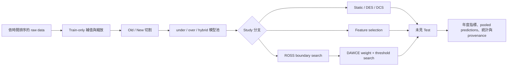
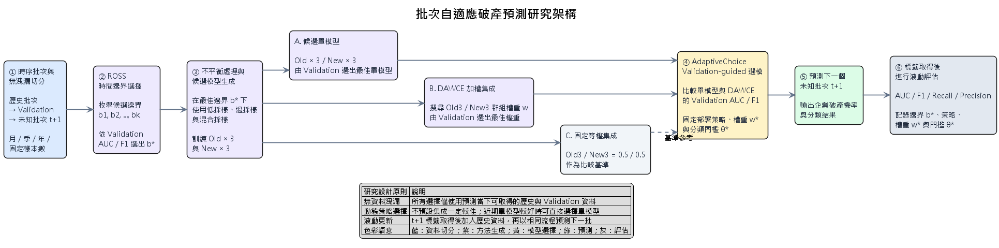
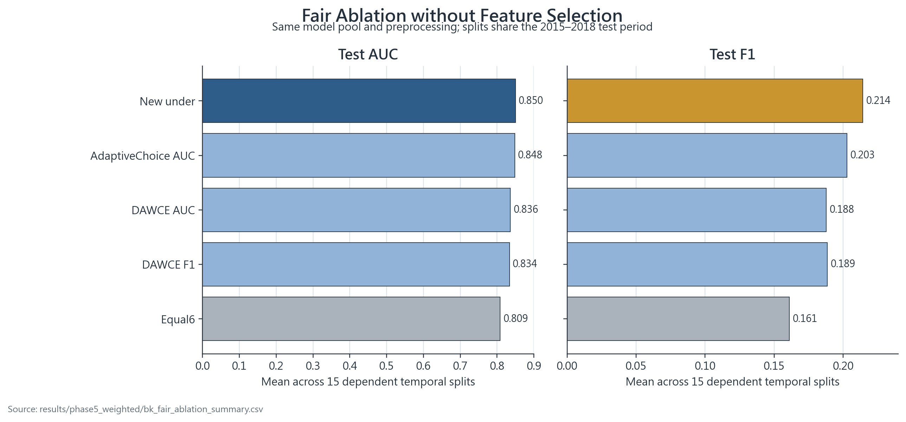
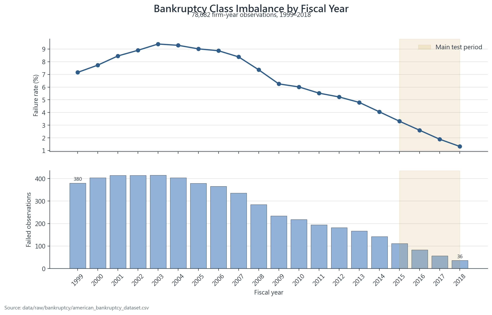

# 非平穩類別不平衡持續集成：研究方向、實驗流程與目前結果

最後更新：2026-09-09
文件狀態：研究規格主文件；整合 Study 流程、結果、證據限制與待辦。

### 2026-09-08 破產主線修正狀態

目前唯一主線為 **American Bankruptcy**；醫療、股票保留作歷史／未來延伸，不列入本輪修正與必要實驗。完整差異與執行方式見[研究審查報告的修正進度](研究正確性與程式碼審查報告.md#破產主線修正進度2026-09-08)。

本輪修正 advanced FS core 的 fit/validation 隔離，限制舊 Test-oracle ROSS 的使用，將兩模型平均正名為 OldNewMean、動態集成正名為自訂變體，取消預設隱式 tuning。新版 rolling 支援完整 seed 傳遞、獨立 1/3/5 年窗口、AP、採樣稽核與版本化輸出。**尚未重跑正式主實驗；以下舊數字與圖表保留為歷史探索性結果，不是修正版成效。**

2026-09-09 標籤查核更新：已確認本地 CSV 與原作者 commit `8bcd8db3b432b1fa6d65e26753b5c9fc6567438d` 逐位元一致，故來源版本對應這一項已釐清。原始 `status_label` 仍對公司歷年固定；診斷性地只計 failed 公司的最後觀測列、按 fyear+1 對齊事件年，可得 609 個候選正例，20 年計數均符合原論文 Table 1，但不等於逐公司事件日期或標籤成熟時間已驗證。詳細來源、信心界線與 notebook 見 [B 路線第 11 節](Study3_B路線_重疊窗口持續集成提案.md#11-原始資料的年份與標籤查核2026-09-09)。未重建或改寫 raw labels；原先直接使用的 5,220 個 failed 列，不可與候選一年期事件 target 混為一談。

因此現階段定位是「破產資料的回溯性時間適應與不平衡集成」，前瞻年度預測及記憶受限 CL 的主張待 protocol 證據成立後才恢復。

## 1. 研究摘要

本專案研究在資料分布隨時間改變、正類事件稀少的情境下，如何維持少數類
辨識能力。主要問題是企業破產預測；正類為 `failed`，觀測單位為
company-year。核心方法比較歷史資料模型（Old）、近期資料模型（New）、
重訓練、靜態集成、動態分類器／集成選擇（DCS/DES）、特徵選擇，以及本
專案提出的批次式 ROSS 與 DAWCE 流程。

目前最穩健的結論是：**近期資料訓練的 `New_under` 是最強基準；
validation-guided weighting 能改善 Equal6，但 DAWCE/ROSS 尚未穩定超越
強單模型。** 因此目前研究價值主要在「可重現的時間邊界與模型選擇流程」
及其適用限制，而不是宣稱新方法全面勝出。

## 2. 資料與研究問題

| 資料集 | 時間／規模 | 正類 | 目前用途 | 證據狀態 |
|---|---|---|---|---|
| American Corporate Bankruptcy | 1999–2018；78,682 company-year；8,971 firms | failed；5,220 列（6.63%） | 主要 Study 1–4 與 rolling | 主證據 |
| Diabetes 130-US Hospitals | 1999–2008；專案另有轉換版 | mortality／readmission 衍生目標 | 模型與流程輔助驗證 | 尚未對齊主 rolling protocol |
| Stock SPX | 專案衍生時間序列 | `Crash_Event` | 輔助驗證 | 原始供應者與標籤公式仍需補齊 |

Bankruptcy 固定切割為 Old 1999–2011、New 2012–2014、Test 2015–2018；
另使用不同 Old/New 年份邊界及 2009–2018 年度 rolling walk-forward。所有
需要學習的補值、縮放、特徵、權重與 threshold，原則上只能在 Train 或
Validation 擬合，final Test 不可參與選擇。

研究問題：

1. New-side 模型是否比 Old-side 模型更適合未來期間？
2. 靜態集成、DES/DCS 是否優於重訓練或強單模型？
3. 特徵選擇能否改善效能及跨時間穩定度？
4. ROSS 能否以 Validation 自動選擇 Old/New 邊界？
5. DAWCE 能否以 Validation 選出的 New-side 權重改善 Equal6？
6. 上述結論能否在破產資料的 rolling、多 seed 與公司層級評估重現？外部資料集列為未來延伸。

## 3. 共用實驗規範

### 3.1 模型池

每個時間區段以三種不平衡處理建立模型：

- under：Tomek Links；
- over：ADASYN；
- hybrid：SMOTE + Edited Nearest Neighbours；
- 主線基學習器：XGBoost；部分輔助流程使用 LightGBM。

形成 `Old_under/over/hybrid` 與 `New_under/over/hybrid` 六個候選模型。
靜態方法平均指定模型的正類機率；DCS 選一個局部分類器；DES 選局部模型
子集；DAWCE 則調整 Old3 與 New3 兩個群組的權重。

### 3.2 指標與統計

主要報告 ROC-AUC、F1、G-Mean、Recall、Precision、FPR 與 FNR。投稿前
還應一致補上 PR-AUC、校準指標與 95% confidence interval。threshold 必須
由 Validation 選擇。年度方法比較使用 paired Wilcoxon，現行確認性表對
16 項比較採 Holm family-wise correction。

### 3.3 全流程



### 3.4 原始流程圖

原有流程圖沒有被內容整併取代；可編輯的 PlantUML 原始碼與簡報用圖片保存於
`assets/research/diagrams/`：

- [Study 1／Phase 1 baseline 流程](../assets/research/diagrams/phase1-baseline-flow.puml)
- [Study 1 延伸／Phase 2 ensemble 流程](../assets/research/diagrams/phase2-ensemble-flow.puml)
- [Study 2／Phase 3 feature-selection 流程](../assets/research/diagrams/phase3-fs-ensemble-flow.puml)
- [Study 3／Phase 4 batch-adaptive 流程](../assets/research/diagrams/phase4-batch-adaptive-flow.puml)



## 4. Study 1：基準模型與 Old/New 模型池

### 流程

1. 依時間建立 Old、New、Test。
2. 比較 Old-only、New-only、Old+New retraining 與 fine-tuning。
3. 每種訓練策略比較 none、under、over、hybrid。
4. 只以未見 Test 計算指標。

主要程式：[`experiments/phase1_baseline/`](../experiments/phase1_baseline/)。

### 結果

Bankruptcy XGBoost 15-split 摘要中，New-none AUC/F1 為
0.8438/0.2473，New-under 為 0.8397/0.2430；Old 系列 AUC 約
0.6536–0.6945，F1 約 0.0846–0.1046。這支持近期資料的重要性，但 15 個
切割互相重疊，不能視為 15 次獨立重複。

證據：[`bk_xgb_compact_summary.csv`](../results/phase1_baseline/xgb/bk_xgb_compact_summary.csv)。

判定：**方向性支持 New-side 模型；最終主張以 Study 3 rolling 結果為準。**

## 5. Study 1 延伸：靜態集成、DES 與 DCS

### 流程

1. 以六模型池建立 2–6 模型的靜態組合。
2. DES 以局部 competence 選模型子集；DCS 選單一模型。
3. 比較年度 AUC、F1、Recall。
4. `Static oracle best` 只作候選上界，不視為可部署方法。

主要程式：[`experiments/phase2_ensemble/`](../experiments/phase2_ensemble/)。

### 結果

七個摘要切割的最佳靜態組合平均 AUC/F1 為 0.8499/0.2523；不同切割的
最佳模型組合不完全一致。15-split 比較中，多數 static oracle 點高於 DES
與 DCS，但它依 Test 指標事後選模，因此不能用來宣稱某個預先指定的靜態
方法無偏地顯著優於 DES/DCS。

證據：

- [`xgb_oldnew_ensemble_static_professor_summary_bankruptcy.csv`](../results/phase2_ensemble/static/xgb_oldnew_ensemble_static_professor_summary_bankruptcy.csv)
- [`bankruptcy_phase2_xgb_static_des_dcs_points.csv`](../results/phase2_ensemble/model_comparison/plots/bankruptcy_phase2_xgb_static_des_dcs_points.csv)

判定：**動態選擇目前沒有穩定優勢；公平結論仍需獨立 Validation DSEL 與
validation-selected static baseline。**

## 6. Study 2：特徵選擇與穩定度

### 流程

1. 僅在允許的 fitting data 上執行 MI、SHAP、RFE、CART 等方法。
2. 比較 no-FS、保留 50%（r50）及 80%（r80）特徵。
3. 將相同欄位套用至 New、Validation、Test。
4. 以不同年份邊界的 Jaccard overlap 描述穩定度。

主要程式：[`experiments/phase3_feature/`](../experiments/phase3_feature/)。

### 結果

在進階 15-split 摘要中：

- no-FS New3：AUC/F1 = 0.8490/0.1893；
- MI-r80 New3：0.8537/0.1861；
- MI-r80 New-under：0.8451/0.2043；
- no-FS New-under：0.8397/0.2048。

FS 對 AUC 有局部提升，但沒有在 F1 上一致勝出。穩定度方面，多數 Old 或
New scope 的 r80 高於 r50，例如 New-MI Jaccard 0.8187 對 0.6677。
`old_new` 在不同邊界下實際使用相同 1999–2014 合併資料，其接近 1 的結果
是設計所致，不能當成額外穩定性證據。105 個 pair 也彼此相依，不可直接
當成 105 個獨立樣本做確認性檢定。

證據：

- [`xgb_bankruptcy_fs_advanced_summary.csv`](../results/phase3_feature/combined/xgb_bankruptcy_fs_advanced_summary.csv)
- [`bankruptcy_feature_stability_summary.csv`](../results/phase3_feature/stability/bankruptcy_feature_stability_summary.csv)

判定：**r80 通常較穩，但 FS 的預測增益不一致。**

## 7. Study 3：漂移偵測、ROSS、DAWCE 與 rolling

新增並已實作：[Study 3 B 路線：重疊窗口持續集成](Study3_B路線_重疊窗口持續集成提案.md)。A 路線是在已知、封閉的歷史年度範圍內人工界定候選空間，再由 Validation 搜尋 Old/New 切點；B 路線則預先固定更新規則，不需要知道未來資料內容或資料流終點，研究模型能否逐年演進。B 第一版採三年 fit 窗口、每年新增一模型、最多三模型、FIFO、固定等權，比較 B-data/B-model。2009–2018 × 10 seeds 已執行完成，且已用同一事件 target、特徵、sampling、XGBoost 與年度契約完成公平 A/B 比較及 1,000 次 company-cluster bootstrap。另已加入可跨程序恢復的 `initialize/update/predict` runtime、模型與前處理 checkpoint、原子 registry、年度 label-maturity gate 及 label-blind prediction。因精確標籤可用時間仍無來源，定位仍是可恢復的年度研究 replay，而非已驗證的正式服務。

### 7.1 漂移偵測

比較 DDM、ADWIN、Page–Hinkley-style signal 與固定模型。當前摘要中
Fixed-New AUC/F1 為 0.8514/0.2998，高於列出的 detector variants；因此
「偵測到漂移」本身尚未轉化為較佳預測。

證據：[`bk_drift_summary.csv`](../results/phase4_drift/bk_drift_summary.csv)。

### 7.2 ROSS

ROSS（Retrospective Optimal Split Selection）是本專案命名的離線批次流程：
列舉 Old/New boundary，以 Validation 指標選擇邊界，再固定至 Test。它不是
外部既有方法，也不是逐筆 online learner。

validation-selected 版本選出 2009；no-FS `ValROSS_2009` AUC/F1 為
0.8418/0.1947，固定 2012 對照為 0.8409/0.2039。ROSS 改善 AUC 很小，
Test F1 反而較低，故不能宣稱 ROSS 普遍優於固定邊界。

證據：[`bk_validation_ross_weight_summary.csv`](../results/phase5_weighted/bk_validation_ross_weight_summary.csv)。

### 7.3 DAWCE

DAWCE（Drift-Aware Weighted Continual Ensemble）也是本專案命名。對
Old3 與 New3 的平均機率搜尋 `w_new`：

\[
p(x)=(1-w_{new})p_{old}(x)+w_{new}p_{new}(x)
\]

權重與 threshold 都由 Validation 選擇。公平消融的 no-FS Test 結果：

| 方法 | AUC | F1 | Recall | Precision |
|---|---:|---:|---:|---:|
| New_under | 0.8498 | 0.2143 | 0.5422 | 0.1354 |
| AdaptiveChoice_AUC | 0.8481 | 0.2028 | 0.5573 | 0.1248 |
| DAWCE_AUC | 0.8361 | 0.1878 | 0.5447 | 0.1144 |
| Equal6 | 0.8086 | 0.1611 | 0.5092 | 0.0966 |

證據：[`bk_fair_ablation_summary.csv`](../results/phase5_weighted/bk_fair_ablation_summary.csv)。

判定：**DAWCE/AdaptiveChoice 改善 Equal6，但沒有超越 `New_under`。**

### 7.4 Rolling walk-forward（目前主結果）

對 2009–2018 十個互不重疊的年度 Test batch，以截至前一期可用的資料進行
expanding-window 選擇；每個方法共有 33,636 筆 pooled out-of-time 預測。

| 方法 | pooled AUC | pooled F1 | Recall | Precision |
|---|---:|---:|---:|---:|
| New_under | **0.8403** | **0.3287** | **0.3673** | 0.2975 |
| DAWCE_AUC | 0.8237 | 0.3275 | 0.3392 | **0.3165** |
| AdaptiveChoice_AUC | 0.8221 | 0.3283 | 0.3652 | 0.2982 |
| Retrain_under | 0.8116 | 0.2943 | 0.3146 | 0.2764 |
| Equal6 | 0.7971 | 0.2830 | 0.3553 | 0.2351 |

以年度為 paired unit、16 項比較採 Holm 校正後，只有
AdaptiveChoice_AUC 相對 Equal6 的 AUC 通過校正（平均差 +0.0327，raw
`p=0.001953`，Holm `p=0.031250`）。AdaptiveChoice 相對 `New_under`
的 AUC、F1、Recall、Precision 都不顯著。

證據：

- [`rolling_pooled_summary.csv`](../results/phase_flexible/rolling_bankruptcy/rolling_pooled_summary.csv)
- [`rolling_by_year.csv`](../results/phase_flexible/rolling_bankruptcy/rolling_by_year.csv)
- [`rolling_predictions.csv`](../results/phase_flexible/rolling_bankruptcy/rolling_predictions.csv)
- [`rolling_wilcoxon_holm.csv`](../results/phase_flexible/rolling_bankruptcy/rolling_wilcoxon_holm.csv)

判定：**確認 validation-guided selection 可避免 Equal6 的 AUC 損失，但沒有
確認其優於強近期單模型。**

### 7.5 B 路線：重疊窗口持續集成（新事件 target）

新 B protocol 只使用 `X1`–`X18`，把 failed 公司最後觀測年當作次年事件
target；2009–2018 共 33,636 個不重複 company-year Test 列、289 個正例。
每個 seed 的 pooled 結果如下：

| 方法 | AP | AUC | F1 | Recall | Precision |
|---|---:|---:|---:|---:|---:|
| B-model FIFO3 equal | **0.1215** | **0.8576** | **0.1917** | **0.2145** | 0.1732 |
| B-data equal | 0.1202 | 0.8529 | 0.1765 | 0.1661 | 0.1882 |
| Recent3y | 0.0966 | 0.8450 | 0.1656 | 0.1384 | **0.2062** |

B-model 的 pooled AP 比 Recent3y 高 0.0249、AUC 高 0.0126；以年度等權平均
則 AP 差 +0.0199，10 年中 6 年較高，AUC 10 年中 8 年較高。這是方向性
結果，不是已確認優勢：年度彼此相依、尚無 company-cluster CI，且五項年度
paired 檢查若考慮多重比較，不能只挑未校正的單一 p-value 下結論。

10 個 configured seeds 的所有指標標準差均為 0，原因是 TomekLinks 與目前
XGBoost 未使用會隨 seed 改變的 subsampling；這證明設定可重現，但**不是**
演算法不確定性或外部穩定性的證據。

這裡的 2009–2018 是回測人員用來評估的範圍，不是 B 演算法在 2009 年已知
的未來邊界。每輪只依當時允許的資料建立／保留模型；`LAST_TEST_YEAR` 僅
控制實驗停止點，不參與預測或模型更新。B 的永續性應以「不重新搜尋全部
歷史、模型池與每輪新增成本有界、可接收下一個未知年度」來定義，而不是
宣稱未來準確率永久不衰退。

證據：[`study3b_seed_summary.csv`](../results/phase_flexible/study3b_overlap/runs/20260908T170653753411Z/study3b_seed_summary.csv)、
[`seed_42/study3b_by_year.csv`](../results/phase_flexible/study3b_overlap/runs/20260908T170653753411Z/seed_42/study3b_by_year.csv)、
[`run_manifest.json`](../results/phase_flexible/study3b_overlap/runs/20260908T170653753411Z/run_manifest.json)。

#### Old/New 同步滑動延伸（2026-09-15）

為符合「Old 也必須由最舊逐步推移到最新」的研究設計，已完成 16 輪固定
rolling-origin：模型 `M_e` 以 Old=`e−2,e−1`、New=`e` 訓練，以 `e+1`
Validation 選門檻，再以 `e+2` Test；下一輪整個窗口前移一年。FIFO 暖機後
保留最近三個 `M_e`，舊模型淘汰與否、權重及窗口寬度均不看 Test。

2003–2018 共 58,600 個 Test company-year、572 個正例。FIFO3 與當輪最新
三年模型的 pooled AP 分別為 0.0860/0.0730，Recall 為 0.1923/0.1416，
Precision 為 0.1259/0.1366。FIFO 多找到 29 個正例，也多產生 252 個假陽性。
1,000 次 paired company-cluster bootstrap 的 FIFO−最新模型 AP 差為 +0.0130
（95% CI [0.0019, 0.0241]），Recall 差 +0.0507（[0.0284, 0.0748]）；
AUC、F1 與 Precision 的 intervals 跨 0。只分析完整 Pool3 的 2005–2018，
AP 與 Recall 的 intervals 仍未跨 0。

這支持整體 rolling FIFO 設計在目前資料中提高少數類排序與召回，但不是每年
必勝，也不能單獨歸因於 ensemble：Pool3 同時把有效歷史涵蓋由三年擴成五年。
凍結模型在所有後續年度共形成 136 個 model-year 老化組合；平均 AP 從年齡
2 年的 0.0946 大致降至 10 年的 0.0374。此結果受出生年度 cohort 混雜，僅
支持需要持續更新的描述性論點，不是模型年齡的因果估計。


證據：[`sliding_protocol.csv`](../results/phase_flexible/study3b_sliding_old_new/runs/20260914T233351370315Z/sliding_protocol.csv)、[`sliding_primary_pooled.csv`](../results/phase_flexible/study3b_sliding_old_new/runs/20260914T233351370315Z/sliding_primary_pooled.csv)、[`paired_company_cluster_bootstrap.csv`](../results/phase_flexible/study3b_sliding_old_new/runs/20260914T233351370315Z/analysis/20260914T234337062081Z/paired_company_cluster_bootstrap.csv)、[`run_manifest.json`](../results/phase_flexible/study3b_sliding_old_new/runs/20260914T233351370315Z/run_manifest.json)。

#### B-model Sampling 消融（2026-09-11）

在相同事件 target、2009–2018 Test 年、三年窗口、FIFO3、等權集成、
X1–X18、XGBoost 與 Validation threshold 規則下，以 seed 42 比較 Training-only
的不平衡處理；Validation/Test 均保留自然分布：

| 處理 | AP | AUC | F1 | Recall | Precision | Recall@5% FPR |
|---|---:|---:|---:|---:|---:|---:|
| None | 0.1176 | 0.8576 | **0.1921** | 0.1938 | **0.1905** | **0.4291** |
| TomekLinks | **0.1215** | **0.8576** | 0.1917 | **0.2145** | 0.1732 | 0.4014 |
| `scale_pos_weight` | 0.1094 | 0.8428 | 0.1725 | 0.2042 | 0.1494 | 0.3875 |

相對 None，Tomek 的 pooled AP 為 +0.0039、AUC 約 +0.00001、F1 為
-0.00046；它提高由逐年 Validation 選 F1 threshold 後的 Recall，但降低
Precision，而且在 5% FPR 預算下的 Recall 反而較低。Tomek 在 12 個實際新增
B-model fit 中只移除 353 / 134,321 個多數類訓練列，沒有移除或合成正例。

以 5,512 家公司做 1,000 次 paired company-cluster bootstrap，Tomek−None
的 AP 95% interval 為 [-0.0084, 0.0175]，AUC 為 [-0.0091, 0.0077]，其餘
F1／Recall／Precision 差異區間也都跨 0。因此目前只能說 **Tomek 在 pooled
AP 上方向性最佳，尚未證明優於不採樣**。Tomek 相對未調參的
`scale_pos_weight`，只有 AUC 差的 interval 未跨 0；這不能推論成本敏感學習
普遍較差，因本輪固定其他 XGBoost 參數，正類權重亦未經 Validation 選擇。

證據：[`sampling_ablation_pooled_summary.csv`](../results/phase_flexible/study3b_sampling_ablation/analysis/20260910T175100152579Z/sampling_ablation_pooled_summary.csv)、
[`sampling_ablation_bmodel_company_bootstrap.csv`](../results/phase_flexible/study3b_sampling_ablation/analysis/20260910T175100152579Z/sampling_ablation_bmodel_company_bootstrap.csv)、
[`analysis_manifest.json`](../results/phase_flexible/study3b_sampling_ablation/analysis/20260910T175100152579Z/analysis_manifest.json)。

#### B-model Pool size 消融（2026-09-11）

固定三年窗口、TomekLinks、XGBoost、等權及相同 Validation/Test 契約，比較
FIFO 模型池容量 1／2／3／5；Pool3 是事前既定主設定，其餘是探索性敏感度：

| Pool size | AP | AUC | F1 | Recall | Precision | Recall@5% FPR |
|---:|---:|---:|---:|---:|---:|---:|
| 1 | 0.0966 | 0.8450 | 0.1656 | 0.1384 | **0.2062** | 0.3910 |
| 2 | 0.1178 | 0.8529 | **0.2003** | 0.2076 | 0.1935 | 0.3772 |
| 3 | 0.1215 | 0.8576 | 0.1917 | **0.2145** | 0.1732 | 0.4014 |
| 5 | **0.1248** | **0.8626** | 0.1646 | 0.1799 | 0.1516 | **0.4221** |

Pool3 相對 Pool1 的 pooled AP/AUC/Recall 差為 +0.0249／+0.0126／+0.0761；
5,512-company、1,000 次 paired cluster bootstrap 的 95% intervals 分別為
[0.0061, 0.0450]、[0.0007, 0.0260]、[0.0397, 0.1133]，均未跨 0。這支持
「加入歷史窗口模型」的機制，而 F1 與 Precision 差仍跨 0。

Pool3 相對 Pool2 的全部五項差異區間皆跨 0。Pool5 的 pooled AP/AUC 雖最高，
相對 Pool3 的差異區間仍跨 0；Pool3 的 thresholded Recall 則高於 Pool5，差
0.0346，interval [0.0034, 0.0680]。因此 **Pool3 不是已證明的最佳容量**；
目前較合理的判讀是 Pool1→2 有明顯增益，2–5 間呈現 ranking、Recall、
Precision 的取捨及效益飽和。

初始化需訓練的模型數隨容量增加，但之後九次年度更新在四種容量下都只新增
九個模型，符合每輪新增成本有界的設計。此處尚未納入 wall time、記憶體、
磁碟成本及未來年度變異，不能只依 pooled Test 排名把 Pool5 改成主設定。

證據：[`pool_ablation_pooled_summary.csv`](../results/phase_flexible/study3b_pool_ablation/analysis/20260910T181408321502Z/pool_ablation_pooled_summary.csv)、
[`pool_ablation_company_bootstrap.csv`](../results/phase_flexible/study3b_pool_ablation/analysis/20260910T181408321502Z/pool_ablation_company_bootstrap.csv)、
[`pool_ablation_training_audit.csv`](../results/phase_flexible/study3b_pool_ablation/analysis/20260910T181408321502Z/pool_ablation_training_audit.csv)、
[`analysis_manifest.json`](../results/phase_flexible/study3b_pool_ablation/analysis/20260910T181408321502Z/analysis_manifest.json)。

#### B-model Window width 消融（2026-09-11）

固定 Pool3、TomekLinks、XGBoost、等權及相同 Validation/Test 契約，比較每個
凍結基模型使用 1／3／5 個財政年度：

| Window | AP | AUC | F1 | Recall | Precision | Recall@5% FPR |
|---:|---:|---:|---:|---:|---:|---:|
| 1 年 | 0.1142 | 0.8536 | **0.2010** | 0.2007 | **0.2014** | 0.3633 |
| 3 年 | **0.1215** | **0.8576** | 0.1917 | 0.2145 | 0.1732 | 0.4014 |
| 5 年 | 0.1106 | 0.8571 | 0.1672 | **0.2664** | 0.1218 | **0.4152** |

Window3 相對 Window1/5 的 AP 與 AUC paired company-bootstrap intervals 均跨
0。Window5 Recall 高於 Window3 0.0519，但 Precision 低 0.0513，兩者區間
未跨 0；累積 fitting rows 則為 44,098／135,671／232,014。因此三年只是主
設定，不是已證明最佳；不同窗口對少數類 Recall、Precision 與更新成本形成取捨。


證據：[`window_ablation_pooled_summary.csv`](../results/phase_flexible/study3b_window_ablation/analysis/20260911T021739729683Z/window_ablation_pooled_summary.csv)、
[`window_ablation_company_bootstrap.csv`](../results/phase_flexible/study3b_window_ablation/analysis/20260911T021739729683Z/window_ablation_company_bootstrap.csv)、
[`window_ablation_training_audit.csv`](../results/phase_flexible/study3b_window_ablation/analysis/20260911T021739729683Z/window_ablation_training_audit.csv)。

### 7.6 已生成的結果圖

以下圖表由已保存的結果檔產生，原圖保存在 `results/report_figures/`，不因
`docs/` 的文字文件整併而刪除。







## 8. Study 4：多種子與成本敏感度

### 流程與結果

既有 10-seed 檔案使用 LightGBM/block-CV，並非主 XGBoost rolling
protocol。產生舊結果時 DES 未接收外部 seed，因此 DES 標準差為 0。程式
已修正 seed 傳遞，但舊結果尚未重跑，不能用來確認主結論的多種子重現性。

證據：[`bankruptcy_multi_seed.csv`](../results/multi_seed/bankruptcy_multi_seed.csv)。

目前成本表使用 `FPR + r × FNR`，它是盛行率中性的條件錯誤分數，不是每家
公司的 expected cost。真正部署成本至少應寫為：

\[
(1-\pi)c_{FP}\,FPR+\pi c_{FN}\,FNR
\]

其中 `π` 是部署族群正類盛行率，`c_FP`、`c_FN` 是實際成本。

判定：**Study 4 目前只能作探索性敏感度診斷。**

## 9. 整體結論與可信度

| 主張 | 判定 | 可使用的措辭 |
|---|---|---|
| New-side 模型通常比 Old-side 好 | 支持，限 Bankruptcy | 近期資料模型是重要強基準 |
| AdaptiveChoice 優於 Equal6 | 部分支持 | 年度 AUC 經 Holm 校正顯著 |
| DAWCE 優於所有單模型 | 不支持 | DAWCE 改善等權集成，但未勝 New-under |
| ROSS 優於固定邊界 | 不支持普遍性 | Validation 可自動選邊界，但 Test 增益不一致 |
| FS 一定提升效能 | 不支持 | r80 較穩，效能提升依方法與指標而異 |
| Static 顯著優於 DES/DCS | 僅探索 | static oracle 是事後上界，不是公平部署比較 |
| 主結論跨 seed 重現 | 未完成 | 舊 multi-seed 與主 protocol 不一致 |
| 方法可跨領域泛化 | 未完成 | 主要統計證據只有 Bankruptcy |

整體研究狀態：**Share with caveats／論文仍需修訂**。數值與流程可向指導
教授報告，但正式投稿前必須保留上述限制，不可把非顯著結果寫成等效，也
不可把 Test-selected oracle 寫成可部署方法。

## 10. 待做清單

### P0：投稿前必要

- [ ] 用修正後的 YAML sampling 與 seed 傳遞重新產生主要結果。
- [x] 完成 Study 3 B 的 2009–2018 × configured seeds 執行；結果顯示目前
  pipeline 為決定性，後續不以重複相同 seed run 取代統計不確定性分析。
- [x] 完成 Old/New 同步逐年滑動的 2003–2018 共 16 輪回測、FIFO 暖機、
  凍結模型跨年老化矩陣及公司群集 bootstrap；AP／Recall 支持 FIFO 整體
  設計，但 AUC／F1／Precision 差異區間跨 0。
- [x] 在相同事件 target、年度、特徵、sampling 與固定等權設定下重跑
  Validation-selected A 路線；舊 status-label A 結果仍不得拼接為主比較。
- [x] 將 B 擴充為可恢復的 `initialize/update/predict` 流程，保存模型與前處理、
  原子 pool registry、年度 maturity gate 與 label-blind predictions。
- [ ] 以具真實 filing/report availability timestamp 的權威標籤來源取代年度
  重建 gate；目前只能支持 retrospective annual replay。
- [ ] 量測 B 每輪訓練時間、模型檔大小、峰值記憶與 raw-buffer 用量，確認
  「永續」不只是概念，而是具備有界更新成本的實證。
- [ ] 以同一 XGBoost rolling protocol 執行完整 10+ seeds，保存逐 seed、
  逐年度 predictions、失敗紀錄與 experiment ID。
- [ ] 修正所有舊 Phase 4/5 路徑，使 imputation/scaling/FS 僅以 fitting data
  擬合，並重跑受影響結果。
- [ ] 以獨立 Validation DSEL 重做 DES/DCS，並加入 validation-selected
  static baseline，取代 Test-selected oracle 的確認性比較。
- [x] 對公平 A/B rolling predictions 執行 1,000 次 company-cluster bootstrap，
  提供 AP、AUC、F1、Recall、Precision 方法差與 95% percentile interval。
- [ ] 補時間 block uncertainty；company bootstrap 不能單獨代表未來年度變異。
- [x] 完成 B-model 的 None／TomekLinks／`scale_pos_weight` Training-only 初步
  Sampling 消融；Tomek 的 pooled AP 方向性最高，但相對 None 的 company
  bootstrap intervals 全部跨 0，不能宣稱採樣貢獻已確認。
- [ ] 對 Sampling 消融補時間 block uncertainty；若繼續比較 RandomUnderSampler
  或 SMOTE，需先預註冊主要指標與比較順序，避免在 Test 上挑最佳方法。
- [x] 完成 Pool size 1／2／3／5 消融與 company-cluster bootstrap；確認 Pool3
  相對 Pool1 的 AP/AUC/Recall 增益，但未確認 Pool3 優於 Pool2 或 Pool5。
- [ ] 補 Pool size 的時間 block uncertainty 與每輪 wall time／RAM／模型大小；
  在獨立 Validation 規則確立前維持 Pool3，不以本次 Test 排名改選 Pool5。
- [x] 完成 Window width 1／3／5 消融與 company-cluster bootstrap；三年 AP
  點估計最高，但相對一年／五年的 AP/AUC intervals 跨 0，且五年 Recall
  較高、一年 F1/Precision 與 fitting 成本較佳。
- [ ] 補 Window width 的時間 block uncertainty；維持事前三年主設定，不依
  本次 Test 事後改選窗口。
- [ ] 完成 entity-holdout 與 seen/unseen-company 分層分析。
- [ ] 一致補報 PR-AUC、Balanced Accuracy、calibration/Brier score。

### P1：提高論文強度

- [ ] 用相同 protocol 完成 Medical 與 Stock 外部驗證。
- [ ] 補齊 Stock 的原始來源、授權、下載日期、`Crash_Event` 與
  `Future_Returns_20` 公式。
- [ ] Medical 採 patient/group-safe 時序切割，避免同一病人跨集合。
- [ ] 特徵穩定性改用 split-level permutation、temporal bootstrap 或
  Nogueira stability，不把 105 個重疊 pair 當獨立樣本。
- [ ] 將 SHAP 選出特徵與 Altman/Ohlson 財務理論連結。
- [ ] 加入 prevalence 與可辯護金額成本，重做部署情境分析。

### P2：工程品質

- [ ] 修正 TabM 腳本的未定義 `args` 與其餘 Ruff 歷史問題。
- [ ] 將 `FeatureSelector` 的 seed、模型與 GA 參數完整接至 YAML。
- [ ] 為每個新結果保存 command、seed、commit、data hash 與 package versions。
- [ ] 確認 GitHub Actions 在 Python 3.11–3.14 的乾淨環境全部通過。

## 11. 安裝、執行與重現

標準環境鎖定於 `requirements.txt`，支援 CPython 3.11–3.14。建議 3.11 或
3.12，以取得跨平台 wheel 與第三方套件的最大相容性。

```powershell
py -3.11 -m venv .venv
.\.venv\Scripts\Activate.ps1
python -m pip install --upgrade pip
python -m pip install -r requirements.txt
python -m pip check
python -m pytest -q
python scripts/run/run_all_experiments.py --list
```

標準 requirement 保證目前維護的 CPU 主線；舊 FT-Transformer 的 `rtdl`
要求 Torch `<2`，而 TabM 等現代路徑使用 Torch 2.x，無法在不犧牲相容性的
情況下合併為同一標準 venv。這些深度模型應視為選用 baseline，依實際模型
另建環境，並在結果中記錄 backend、checkpoint、Torch/CUDA 版本。

結果完整性檢查：

```powershell
python scripts/analysis/validate_result_artifacts.py results --strict
python scripts/analysis/generate_result_manifest.py
```

目前 manifest：[`RESULT_MANIFEST.json`](../results/RESULT_MANIFEST.json)。

## 12. 主張來源台帳

| ID | 主張 | 來源 | 狀態 |
|---|---|---|---|
| C1 | Rolling New-under AUC/F1 0.8403/0.3287 | `rolling_pooled_summary.csv` | verified |
| C2 | AdaptiveChoice 對 Equal6 年度 AUC Holm p=0.03125 | `rolling_wilcoxon_holm.csv` | verified |
| C3 | AdaptiveChoice 未顯著優於 New-under | 同上 | verified |
| C4 | Fair ablation 中 New-under 高於 DAWCE 與 Equal6 | `bk_fair_ablation_summary.csv` | verified；相依 splits |
| C5 | r80 多數比 r50 穩定 | `bankruptcy_feature_stability_summary.csv` | qualified；pair 非獨立 |
| C6 | 既有 audit 記錄 1,171 個 CSV、2,508,016 列且 strict issues=0 | `RESULT_MANIFEST.json` 與 audit script | qualified at 2026-09-11；只支持該次可讀性檢查，不證明無跨檔重複 artifact、無 leakage 或指標語義正確；manifest 共索引 1,249 個 result files |
| C7 | 主流程已完成多種子重現 | 無 | missing；不得主張 |
| C8 | 方法可跨資料集泛化 | 無對齊 protocol | missing；不得主張 |
| C9 | 本地 failed 列已符合逐年事件與當時可用性 | B 提案第 11 節；上游 bytes 一致、候選最後年度事件計數吻合 | 來源一致已驗證；逐公司事件與 label availability 仍 unresolved |
| C10 | 已修正 advanced core 的 FS 隔離並增加主 rolling 多 seed 執行能力 | core、rolling 及 `tests/test_bankruptcy_research_protocol.py` | implementation tested；非正式實驗完成 |
| C11 | 舊 New_under 是固定近期窗口 | 舊 rolling `_run_year` 從 ROSS pool 取出模型 | 不成立；新版名為 ROSS_New_under，固定窗口另列 |
| C12 | B 第一版採等權、三年窗口、FIFO、B-data/B-model 比較 | 使用者回覆、B 提案與 B 入口 | implementation verified；目標為少數類辨識 |
| C13 | B 路線已具備持久 FIFO pool、獨立前處理、衍生事件 target、Test 隔離與版本化輸出 | `rolling_bankruptcy_overlap_ensemble.py`、研究協定測試、正式 run manifest | implementation verified |
| C14 | 新 target 的 B-model pooled AP/AUC 0.1215/0.8576，高於 Recent3y 0.0966/0.8450 | fair run pooled summary 與 company bootstrap | verified；AP 差 CI 0.0045–0.0449、AUC 差 0.0002–0.0248，F1 差 CI 跨 0 |
| C15 | B 的 10 seeds 完全相同 | 同一 run 的 seed summary 與逐 seed outputs | verified；pipeline 決定性，不代表外部穩定 |
| C16 | A 是已知封閉範圍內的離線選擇，B 是不預知未來內容與終點的持續更新研究 | 使用者／教授定位與 B protocol | framing confirmed |
| C17 | B runtime 可跨程序恢復、逐年只新增一模型，且 predict 不讀事件 label | runtime source、tests、2009–2012 smoke manifests | implementation verified；年度回溯 replay |
| C18 | B 已符合真實世界標籤可用時間 | 無 filing/report timestamp | missing；不得宣稱正式部署有效 |
| C19 | 公平設定下 B-model pooled AP/AUC/F1 高於 A validation-boundary equal | `20260909T122839561377Z` pooled summary 與 company bootstrap | verified descriptive；AP/AUC/F1 方法差 CI 均跨 0，不得宣稱顯著優於 A |
| C20 | A/B 公平比較已具有相同計算預算 | sampling audit：A 210 個 boundary 候選模型，B-model 12 次實際新增 | 不成立；目前只控制資料／模型／評估契約，equal-compute ablation 待補 |
| C21 | TomekLinks 對 B-model 的貢獻已確認 | Sampling 消融 pooled summary 與 company bootstrap | 不支持；AP 方向性高於 None，但 AP/AUC/F1/Recall/Precision 差異區間均跨 0 |
| C22 | Pool3 整體設計相對 Pool1 的 AP/AUC/Recall 較高 | Pool size 消融與 company bootstrap | qualified；K 改變同時增加歷史聯集 L+K−1，不能單獨歸因於模型保留；對同五年資訊範圍 Recent5y 的 AP 差 CI 跨零；不代表 Pool3 最佳 |
| C23 | 三年窗口是 B-model 的最佳窗口 | Window width 消融與 company bootstrap | 不支持；三年 AP 點估計最高但 ranking 區間跨 0，1/3/5 年在 Recall、Precision、成本間取捨 |
| C24 | B 主門檻抓出 62/289 正例；validation-FPR 門檻抓出 116/289，伴隨 1,405 誤報 | `results/phase_flexible/study3b_minority_analysis/analysis/20260914T025025467597Z/` 的 pooled／by-year CSV，由 fair predictions 重算 | verified at 2026-09-14；三個測試年度實現 FPR 超過 5%，不可將 validation 限制當作 test 保證 |
| C25 | 論文章節齊全不等於研究可定稿 | 論文、實作、逐筆結果與原始文獻交叉核對 | Needs revision；詳見完整性審查文件，須修目標／特徵／A 比較範圍與引註 |
| C26 | Old/New 同步滑動的 FIFO3 比每輪最新三年模型具有較高 AP 與 Recall | `study3b_sliding_old_new` 16 輪 predictions、pooled summary 與 company-cluster bootstrap | qualified；AP 差 CI [0.0019, 0.0241]、Recall [0.0284, 0.0748]，但 AUC/F1/Precision 跨 0，且歷史涵蓋同時改變，不得宣稱純集成或全面優勢 |

## 13. 核心文獻

- Lombardo et al. (2022), American bankruptcy dataset and benchmarks. DOI:
  [10.3390/fi14080244](https://doi.org/10.3390/fi14080244)
- He and Garcia (2009), learning from imbalanced data. DOI:
  [10.1109/TKDE.2008.239](https://doi.org/10.1109/TKDE.2008.239)
- Chawla et al. (2002), SMOTE. DOI:
  [10.1613/jair.953](https://doi.org/10.1613/jair.953)
- He et al. (2008), ADASYN. DOI:
  [10.1109/IJCNN.2008.4633969](https://doi.org/10.1109/IJCNN.2008.4633969)
- Gama et al. (2014), concept drift adaptation survey. DOI:
  [10.1145/2523813](https://doi.org/10.1145/2523813)
- Lu et al. (2019), learning under concept drift. DOI:
  [10.1109/TKDE.2018.2876857](https://doi.org/10.1109/TKDE.2018.2876857)
- Ko et al. (2008), KNORA-E/U. DOI:
  [10.1016/j.patcog.2007.10.015](https://doi.org/10.1016/j.patcog.2007.10.015)
- Cruz et al. (2018), DCS/DES review. DOI:
  [10.1016/j.inffus.2017.09.010](https://doi.org/10.1016/j.inffus.2017.09.010)
- Chen and Guestrin (2016), XGBoost. DOI:
  [10.1145/2939672.2939785](https://doi.org/10.1145/2939672.2939785)
- Lundberg and Lee (2017), SHAP:
  [NeurIPS paper](https://proceedings.neurips.cc/paper/7062-a-unified-approach-to-interpreting-model-predictions)
- Nogueira et al. (2018), feature-selection stability:
  [JMLR paper](https://www.jmlr.org/papers/v18/17-514.html)
- Saito and Rehmsmeier (2015), PR curves under imbalance. DOI:
  [10.1371/journal.pone.0118432](https://doi.org/10.1371/journal.pone.0118432)
- Demšar (2006), statistical comparison of classifiers:
  [JMLR paper](https://www.jmlr.org/papers/v7/demsar06a.html)

## 14. 最有價值的下一步

2026-09-11 完整性審查：[論文與實作完整性審查](論文與實作完整性審查_20260911.md)。

Sampling、window 與 ensemble-size 單因子消融已完成，不再一概列為待做。
目前優先修正論文與實作不一致、補年度少數類辨識與警報負擔、以同資訊範圍對照釐清模型池效益，
再處理事件／財報可用時間、時間敏感度與每輪實測成本。
公司 bootstrap 只能支持限定的回溯推論，不能解除標籤疑問，也不能取代時間相依或重新訓練變異分析。
