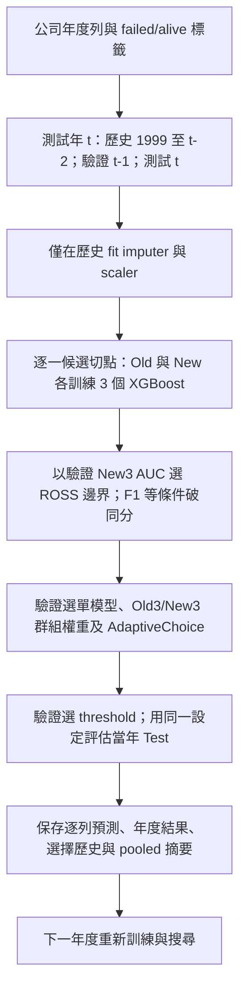

# 研究正確性、實驗設計與程式碼審查

原始審查日期：2026-09-08。原始審查基準：Git `7ca8716` 與當時來源、設定及結果。下方 C01–C16 保留原始診斷；使用者其後授權破產主線修正，進度另列於下節。既有研究方向、教授報告、流程圖、raw data 與 results 均保留，未重跑正式實驗或覆寫原結果。

## 破產主線修正進度（2026-09-08）

2026-09-09 C01 補充：本地 raw 與原作者 commit `8bcd8db3b432b1fa6d65e26753b5c9fc6567438d` 逐位元一致，已排除本地版本改寫假說。failed 公司最後觀測列依 fyear+1 對齊後，609 個候選事件的 20 年計數均符合原論文 Table 1；這強力支持进一步核對年度 target construction，但尚未驗證逐公司事件日、公開日與陰性追蹤。下文「上游 byte-identical 未證明」為原審查時點的歷史狀態，現已由本次查核更新。詳見 [B 路線第 11 節及 notebook](Study3_B路線_重疊窗口持續集成提案.md#11-原始資料的年份與標籤查核2026-09-09)；未改寫 raw 或重跑模型。

範圍已收斂為 **破產資料的研究主線**。醫療與股票問題 C05/C06 保留作歷史審查，不是本輪修正、驗收或必要實驗。跨領域泛化亦不是目前主線必做項。

| 問題／工作 | 本輪處理 | 尚未完成 |
|---|---|---|
| C01 標籤時點 | 查核原作者 README 與原論文 §3；未擅自重建標籤 | 本地資料與来源的版本／事件日期對應 |
| C02 舊 ROSS | Test-oracle boundary 預設拒絕使用；需明確 `--allow-test-oracle`；依賴它的 FS／weight sweep 移出一鍵維護清單 | 舊結果仍為 oracle，不能因加防護就當作已校正 |
| C03 drift 摘要 | 新產生的 best-on-Test 摘要改名 `bk_drift_test_oracle_summary.csv`，附 selection/evidence 標記 | 正式 Validation-selected drift 摘要尚未新增 |
| C04 advanced FS | `_core/advanced_bankruptcy.py` 先分 fit/validation；imputer 與 supervised FS 只 fit Old-fit；新輸出寫入 `fit_only_runs/<timestamp>` | 其他重複／舊 FS 入口未全部移植；正式 FS 結果尚未重跑 |
| C07/C08 方法身分 | 共用 year-split 的兩模型平均改名 OldNewMean；DES 輸出改為 FixedK／LocalAccuracy 自訂變體名稱 | 真正 Retrain 已存在 phase1/rolling，但未補入此靜態表；官方 DES 對照仍待做 |
| C09 implicit tuning | 共用 trainer 預設 `use_tuned_params=False` | 顯式 opt-in 的 legacy tuning map 仍需 dataset-aware 重設 |
| C10/C11 rolling | 新增獨立 Recent1y/3y/5y_under；舊 ROSS window 模型正名 ROSS_New_under；CLI 支援多 seeds 且同時覆寫 XGBoost seed/random_state | 完整多 seed 與核心消融未執行；Study 3 B 路線尚在討論，不是目前程式已完成的功能 |
| C12/C13 provenance | rolling 每次建立新 run／每 seed 子目錄；記錄來源／資料 hash、環境、設定、entity-row keys、採樣前後計數；採樣失敗不再偷偷退回未採樣 | 舊結果 producer 未追溯完成；全部其他入口尚未統一 run contract |
| C14 metrics | 新版 rolling 增加年度／Validation AP、Balanced Accuracy、正例數；輸出 seed mean/std/count | 正式新數字、cluster/time uncertainty 與校準尚未產生 |
| C15 缺失值 | shared bankruptcy loader 不再各自 fit Test imputer；legacy 缺失資料 fail-fast，advanced core 用 raw_features + fit-only imputer | 其他舊 callers 如需支援缺失資料，仍要在內層 split 後接 imputer |

驗證：`python -m pytest -q -p no:cacheprovider` → **33 passed**（原 22 項＋新增 11 項）；包括真實 XGBoost 小型 seed 驗證、兩 seed mock rolling 全輸出、Test-label selection isolation、FS isolation、legacy-oracle guard。未執行正式破產重訓；mock／合成資料測試不當成研究效能。

來源查核：原作者 [README](https://github.com/sowide/bankruptcy_dataset) 與 [Lombardo et al. (2022), §3、Table 1](https://air.unipr.it/bitstream/11381/2933563/5/futureinternet-14-00244-v2.pdf) 描述前一財政年度對應次年破產；本地 8,971 公司之歷年 status 全固定，且原文公司數為 8,262。這是需釐清的來源差異，**不是允許自動以每家公司最後一列作 event 的依據**。查核日期 2026-09-08；搜尋詞為 `american bankruptcy dataset status_label original paper` 與原論文 DOI；取原作者庫與作者機構典藏全文，不以其他論文轉述驗證本地標籤。

本地 raw SHA-256：`d64ed85ae786d75113455ae238feb24015d19716c10ec1de3a90a52eddc7b04a`。failed 公司數 609；company-year 重複鍵為 0；此 hash 只指本地版本，尚未證明與上游 CSV byte-identical。

以下命令供後續**明確接受回溯性探索限制或完成標籤契約後**執行，本輪未執行正式訓練：

```powershell
# 單年度、單 seed：正式資料小範圍執行，仍會訓練多個候選模型
python experiments/phase_flexible/rolling_bankruptcy_adaptive.py --seeds 42 --test-years 2009

# 完整年度 × config/base_config.yaml 的 seeds（高耗時）
python experiments/phase_flexible/rolling_bankruptcy_adaptive.py --configured-seeds
```

新版結果位於 `results/phase_flexible/rolling_bankruptcy/runs/<UTC timestamp>/`，包含 `run_manifest.json`、`seed_<n>/` 各表及 `rolling_seed_summary.csv`。單 seed 的 std 留空，不假造變異。舊 analysis／教授繪圖腳本仍讀舊固定路徑，**尚未改為自動讀新版 run**，不可混為已更新主表。請勿用舊 `run_all_experiments.py` 的完整清單取代正式研究 protocol；本輪只移除兩個 oracle 依賴入口，未完成全部來源依賴重整。

## Executive Summary

目前是**具備實驗架構與可追查結果的研究原型，尚不足以視為已完成研究有效性驗證或可直接投稿的證據鏈**。主 rolling 流程比舊版固定 Test 搜尋嚴謹：前處理只 fit 歷史訓練資料，邊界、權重、模型與閾值由前一年 Validation 決定。已保存預測也能重算出摘要數字。然而，「程式跑得通」與「符合所宣稱的預測問題」仍有明顯落差。

最優先的四個問題是：破產標籤的時間可用性未證實、舊 ROSS 使用 Test 成績選邊界、特徵選擇提前看過 Validation labels，以及醫療／股票分支的目標或時間契約問題。這些問題影響的路徑不同，**不能把所有 results 一概判定無效，也不能因 rolling 選模未使用 Test labels 就認定整個 repo leakage-free**。

### Architecture 與實際流程

| 層級／Study | 主要入口 | 實際工作 |
|---|---|---|
| 設定與共用模組 | `config/*.yaml`、`src/data/`、`src/models/`、`src/ensemble/`、`src/evaluation/` | 資料讀取、切割、補值、標準化、採樣、模型包裝、集成、指標 |
| Study 1：基準與集成 | `experiments/phase1_baseline/bankruptcy_year_splits_xgb.py`、`experiments/phase2_ensemble/xgb_year_split_shared.py` | 固定 2015–2018 Test，改變 Old/New 年份邊界；訓練不同採樣模型，比较單模型、靜態與動態集成 |
| Study 2：特徵選擇 | `experiments/phase3_feature/_core/advanced_bankruptcy.py` 及 MI/RFE/SHAP 包裝入口 | 在不同特徵子集與比例下重建 Old/New pool、比較效能；另有穩定性分析路徑 |
| Study 3／4：漂移、邊界與權重 | `experiments/phase4_drift/`、`experiments/phase_flexible/` | 包含 detector、Test-derived 舊 ROSS、Validation-based ROSS、特徵／權重延伸與 flexible 路徑，不能當成同一 protocol |
| 主 rolling 證據 | `experiments/phase_flexible/rolling_bankruptcy_adaptive.py` | 2009–2018 年度 walk-forward；每年重新搜尋歷史切點、訓練模型池、選權重並評估 |
| 分析與證據保存 | `scripts/analysis/`、`results/`、`tests/` | 年度／pooled 摘要、配對檢定、圖表、manifest、資料與輸出契約測試 |

主 rolling 的實際 training/evaluation flow：



具體方法不是單純延續上一年的模型：

- `_run_year()` 每個切點重新建立 Old×3、New×3 模型；三種採樣為 TomekLinks、ADASYN、SMOTEENN。`under` 指 TomekLinks 清理邊界樣本，**不是固定比例隨機欠採樣，也不保證類別平衡**。
- ROSS 以 Validation 上 New3 平均機率的 AUC 選切點；DAWCE 搜尋 `w=0,0.05,…,1`，機率為 `(1-w)×mean(Old3) + w×mean(New3)`，不是六個模型各自獨立學習權重。
- AdaptiveChoice 比較 Validation 選出的最佳單模型與 DAWCE；各方法的 F1 threshold 也由 Validation 選。主 rolling 沒有直接用漂移偵測器輸出決定權重；不能把其他腳本的 detector 機制移植到此流程的文字描述。
- 主線是二元標籤的時間批次／domain shift 評估，不是 class-incremental task；沒有需推論的 task ID、類別新增映射或明確的固定容量 replay buffer。可取得的全部歷史仍被保留並反覆訓練。

### 本轮實證檢查與界線

- 執行 `python -m pytest -q -p no:cacheprovider`：**22 passed**。這些測試不涵蓋以下所有研究契約。
- 讀取破產 raw：78,682 列、8,971 公司；`alive=73,462`、`failed=5,220`；缺失值總數為 0；公司內標籤有變化的公司數為 0。
- 2018 年 2,723 家測試公司中，2,610 家也出現在截至 2016 年的訓練歷史。**已知公司未來預測可以允許這種重疊**；新公司泛化則不行。即使移除 company ID，也不會自動解決標籤時間與公司相關性問題。
- 由 `rolling_predictions.csv` 重算 ROC-AUC、F1；與保存摘要最大 AUC 差異小於 `4e-8`，符合機率小數截斷影響。`(test_year, method, row_id)` 無重複鍵。這只證明算術／輸出一致，不證明訓練標籤合法。
- 主線 `compute_metrics()` 的二元 G-Mean、FPR/FNR 與 pooled 使用既有 `y_pred` 的方式未發現明確算術錯誤；不同年度不同 threshold 沒有被錯誤替換成共同 0.5。
- 未發現主 rolling 的 optimizer/scheduler 延續錯誤，因它是重新 fit XGBoost，並非持續更新同一 optimizer。抽查深度模型 wrapper 有 train/eval、no-grad 與最佳狀態複製機制；**未執行 GPU 訓練或證明所有選用模型均可重現**。
- 主呼叫鏈做深入審查；其他實驗入口、模型與輸出做靜態交叉核對。沒有完整重跑數小時實驗、全平台安裝矩陣或逐一重現每個歷史 artifact。

以下數字直接重算自保存的逐列預測，不是新訓練結果。每方法均為 33,636 筆：

| 方法 | Pooled ROC-AUC | Pooled F1 | Average Precision（AP） |
|---|---:|---:|---:|
| New_under | 0.840291 | 0.328724 | 0.294603 |
| DAWCE_AUC | 0.823717 | 0.327458 | 0.285676 |
| AdaptiveChoice_AUC | 0.822067 | 0.328283 | 0.265555 |
| Retrain_under | 0.811588 | 0.294253 | 0.235722 |
| Equal6 | 0.797090 | 0.282998 | 0.231042 |

來源：`results/phase_flexible/rolling_bankruptcy/rolling_predictions.csv`；AP 使用 `sklearn.metrics.average_precision_score`，不是梯形積分 PR 曲線面積。這些結果暫支持「近期模型值得作為強基準」，不支持複雜方法普遍勝過它；且仍受下述標籤契約限制。

## Critical Issues

P0：可能使特定實驗或其宣稱無效；P1：明顯影響論文可信度／完整性；P2：可重現性或次要實作缺陷。每項均標示「已確認」或「待證實風險」，不將推測當作已重現的 bug。

### C01 — 破產標籤的可用時點與預測 horizon 未建立

- **Priority:** P0（研究契約阻斷；未證實所有列均有未來標籤洩漏）
- **File:** `experiments/phase4_drift/bankruptcy_drift_stream.py:89`；`src/data/loader.py`；`data/raw/bankruptcy/american_bankruptcy_dataset.csv`
- **Function / Class:** `load_bankruptcy_with_year()`、`load_bankruptcy()`、rolling `_run_year()`
- **Problem:** 直接將 `status_label == 'failed'` 當成每列年度 target。raw 中所有公司在其歷年列上的標籤都不變，沒有 `event_date`、`label_available_at` 或明確的一年期 target。時間切割使用的是 feature year，不是 label availability。
- **Why it matters:** 若 failed 是公司後來的最終狀態，則早年 train/validation 已取得當時尚不可知的結果；即使 Test labels 完全沒參與選模，仍可能違反時序預測契約。公司年度重複使此風險尤其重要。現有資料本身不足以證明每個 failed 標籤何時已知，也不能把所有 alive 當成具有完整追蹤的一年期陰性。
- **Recommended fix:** 先核對原資料定義與事件日期，寫明預測時點、horizon、財報公開延遲及追蹤／設限規則；若可建立年度事件 target，按 `label_available_at < decision_time` 建 train/validation。若不能，將研究明確定位為回溯性公司狀態分類，停止宣稱前瞻年度破產預測。保留 company ID 作 split／audit metadata，不必納入模型特徵。

### C02 — 舊 ROSS 邊界從 Test 選出，再回到同一 Test 評估

- **Priority:** P0（已確認，限舊路徑）
- **File:** `experiments/phase4_drift/bankruptcy_ross.py:82`、`:133`；`experiments/phase4_drift/bankruptcy_ross_static_ensemble.py:72`
- **Function / Class:** `best_row()`、`build_candidates()`、`build_selected_summary()`、`_read_ross_boundary()`
- **Problem:** 從 `results/phase1_baseline/xgb/bankruptcy_year_splits_xgb_raw.csv` 的 Test AUC/F1 排名選 boundary，保存 `bk_ross_selected_boundary.csv`；static ensemble 隨後讀此 boundary，在同一 2015–2018 Test 評估。
- **Why it matters:** 下游模型即使另外留 Validation 選 threshold，也無法消除上游 Test-derived boundary 的選擇偏差。`bk_ross_static_ensemble_summary.csv` 不能作為可部署 ROSS 對固定切點的無偏證據。
- **Recommended fix:** 保留舊 artifact 並標為 oracle／post-hoc；建立來源依賴清單，檢查 FS／weight sweep 是否承接同一 boundary。所有正式比較改從獨立 Validation 選 boundary，鎖定後再評估。`bankruptcy_ross_validation.py` 與主 rolling 是不同路徑，不應被本項一併判錯。

### C03 — 漂移摘要的「最佳方法」依 Test F1 挑出

- **Priority:** P0（已確認的選模偏差；完整配置表仍可保留作探索）
- **File:** `experiments/phase4_drift/bankruptcy_drift_stream.py:498`、`:519`
- **Function / Class:** `_save_results()`
- **Problem:** 對各群組 `sort_values('F1', ascending=False).iloc[0]`，用最終測試表現決定摘要的最佳 sampling／combo。
- **Why it matters:** `bk_drift_summary.csv` 的最佳 F1 不代表事前可選到的模型。若拿它與固定設定 baseline 比較，搜尋配置較多的方法更容易被高估。
- **Recommended fix:** 分開保存「所有配置」「Validation 選中配置」「Test oracle」三類摘要；正式主表只使用第二類。不要刪除來源與結果，只補 provenance／用途標示並在授權修正階段重跑必要路徑。

### C04 — Supervised feature selection 在 Validation split 之前 fit

- **Priority:** P0（已確認的 Validation label leakage；未發現此處直接使用最終 Test labels）
- **File:** `experiments/phase3_feature/_core/advanced_bankruptcy.py:122`、`:167`
- **Function / Class:** `_apply_feature_selection()`、`_run_one_split_one_fs()`
- **Problem:** 先對完整 `X_old, y_old` 做 `fs.fit_transform()`，之後才切 `X_old_fit/X_old_val`。Old Validation 的標籤已用來選 MI／RFE／SHAP 等監督式特徵。
- **Why it matters:** 用於 threshold／集成選擇的 Validation 不再獨立於 learned feature representation；FS vs no-FS 的比較流程不對等。此問題至少影響呼叫此 core 的 advanced feature study，不能據其 Validation 成績證明 FS 有益。
- **Recommended fix:** 先切 fit/validation，再只以 fit 訓練 imputer、FS、scaler；transform 其他集合。增加 spy／索引測試，確認改動 Validation labels 不會改變 fit 得到的特徵集合。重跑受影響 FS 比較，不必因此重跑未使用此 core 的所有實驗。

### C05 — 醫療 target 是再入院，年份是人工配置

- **Priority:** P0（已確認的資料語義問題；若只稱模擬批次則不等同洩漏）
- **File:** `scripts/data/download_real_medical_data.py:40`、`:79`、`:82`、`:97`；`experiments/_shared/common_dataset.py:198`；`config/base_config.yaml`
- **Function / Class:** `download_and_process()`、`_load_medical()`、`get_medical_year_split()`
- **Problem:** `readmitted == '<30'` 寫入名為 `mortality` 的 target；按列順序均勻分配 120 個月的 pseudo date，再按這些年份切 Old/New/Test。另在切割前對全體資料做 median 補值。
- **Why it matters:** 不能將 30 天再入院當作死亡率，也不能把人工年份當成真實年度漂移證據。全資料補值在存在缺失時還會污染前處理。重複病人與特徵在預測時點是否已知尚未驗證，例如出院資訊不適合入院時預測。
- **Recommended fix:** 正名為再入院分類與「人工有序批次」，或換具真實時間戳／病人 ID 的資料；定義是在入院或出院時预测。保留原始 ID 與可核對的日期來源；補值移入 train-only pipeline。未完成前，不把此分支當真實跨年度 medical drift 證據。

### C06 — 股票未來 20 日 target 跨越切割邊界

- **Priority:** P0（已確認 label horizon 未受切割契約控制）
- **File:** `scripts/data/download_real_stock_data.py:52`；`experiments/_shared/common_dataset.py:263`
- **Function / Class:** `build_stock_features()`、`get_stock_year_split()`
- **Problem:** target 由未來 20 個交易觀測的報酬衍生，切割卻只看當列 year，沒有 `label_end_time` 或 purge。邊界前的訓練列標籤可能依賴下一個 Validation／Test 時段的價格。
- **Why it matters:** 移除 `Future_Returns_20` 特徵是必要且已做的修正，但不能消除 future-label availability leakage。若內層 Validation 還隨機拆列，重疊報酬視窗會使估計進一步不獨立。
- **Recommended fix:** 保存每列 label end timestamp；在每個外層及內層決策時點剔除結果尚不可知的訓練列。使用 purged chronological validation；視 protocol 加 gap／embargo。針對每個邊界測試 `max(train.label_end_time) < validation/test decision_time`，勿把 20 交易列錯寫成 20 日曆日。

### C07 — 集成輸出中的 Retrain 實際沒有 retrain

- **Priority:** P1（已確認的 baseline 身分錯誤）
- **File:** `experiments/phase2_ensemble/xgb_year_split_shared.py:193`、`:235`
- **Function / Class:** `process_one_year_split()`
- **Problem:** `old_new_all` 被命名為 `Retrain`，但傳入的是 Old 與 New 兩組 predictions，由 `ensemble_metrics_with_threshold()` 做集成，沒有對 Old+New 合併樣本訓練單一模型。
- **Why it matters:** 論文會把兩模型平均與全資料重訓誤當同一 baseline；不同 Study 的同名列實際代表不同演算法。phase1 與 rolling 的真正 Retrain 不屬於此 bug。
- **Recommended fix:** 此路徑改名為 `OldNewMean`；另提供真正 pooled-data Retrain，使用相同 Validation、採樣、超參數預算及 threshold 規則。對結果 metadata 加 `training_data_scope`、`aggregation`，禁止只靠顯示名稱辨認方法。

### C08 — DES 名稱與標準方法不一致，legacy DSEL 另有訓練重用

- **Priority:** P1（已確認的實作／比較契約問題）
- **File:** `experiments/phase2_ensemble/xgb_oldnew_ensemble_common.py:385`；`src/ensemble/selector.py:37`；`experiments/_shared/common_des.py:26`
- **Function / Class:** `_dynamic_proba_rows()`、`DynamicEnsembleSelector`、`run_des()`
- **Problem:** 本地 KNORA-E 在固定 k 無全對模型時直接平均全部；`DES_KNN` 是所有模型依 local accuracy 加權，沒有 diversity selection。檔頭卻稱與 DESlib 典型方法對齊。另 legacy `run_des()` 用訓練 pool 的 Old+New 資料再估 local competence。
- **Why it matters:** 這是可研究的自訂變體，但不是標準 baseline 的充分實作；訓練資料上估 competence 又會高估泛化能力。對比標準 DES 的結論因此不可靠。官方說明指出 KNORA-E 會調整鄰域，而 DES-KNN 同時使用 accuracy 與 diversity：[DESlib 鄰域說明](https://deslib.readthedocs.io/en/latest/auto_examples/plot_influence_k_value.html)、[DES-KNN](https://deslib.readthedocs.io/en/latest/modules/des/ds_knn.html)。
- **Recommended fix:** 明確命名 simplified variants，另以固定版本官方實作、相同 pool／DSEL／voting 做對照；對小型人工 prediction matrix 加 reference-equivalence tests。DSEL 用獨立 holdout 或適當 OOF 預測。維護中 year-split 的 Validation／LOO 路徑已有隔離措施，不能與 legacy 一概而論。LCA 的類別條件分母與 KNORA-U 投票規則亦應加入逐例對照，目前不把未完成 reference comparison 的細節另列為確證 bug。

### C09 — 實驗比較會受隱藏的 tuning artifact 影響

- **Priority:** P1（已確認隱式依賴；跨資料集碰撞是否實際發生尚未量化）
- **File:** `experiments/phase2_ensemble/xgb_oldnew_ensemble_common.py:491`、`:534`
- **Function / Class:** `_load_tuned_xgb_params_map()`、`train_one_sampling_xgb()`
- **Problem:** 預設 `use_tuned_params=True`，自動讀固定 bankruptcy tuning CSV，lookup key 只有 `(split, method, sampling)`，不含 dataset。檔案存在與否會改變實際模型；此共用函數又被多資料集流程使用。
- **Why it matters:** 同一命令在不同 results 狀態下不是同一實驗；同名 split 可能取得其他資料集的設定。不同 Study 的 class weighting 與 tuning 預算也不一致，不能直接把跨表分數差歸因於方法。
- **Recommended fix:** 改成顯式 config／tuning-run 參數，key 包含 dataset、split 與資料版本，保存 resolved params。主比較統一調參次數及 class weighting；分開報告固定設定和 tuned 設定。不把這項自動推論成已發生 Test leakage。

### C10 — Continual Learning 宣稱超出主 rolling 的實際證據

- **Priority:** P1（已確認的 protocol／研究定位落差）
- **File:** `experiments/phase_flexible/rolling_bankruptcy_adaptive.py`；`README.md`；`docs/研究方向.md`
- **Function / Class:** `_run_year()`、`_train_model()`
- **Problem:** 每年每切點重新訓練，多次存取全部歷史；沒有固定 memory budget、持續模型狀態或舊 task 評估矩陣。`New_under` 又取自 ROSS 選中的 New window，不是獨立固定長度 recent-window baseline。
- **Why it matters:** 可以支持 expanding-window temporal adaptation，但尚未證明記憶受限 CL、避免 forgetting 或 online update 效率。缺獨立固定窗口時，也無法分離「切點搜尋」與「近期單模型」的效果。
- **Recommended fix:** 先選清楚論文定位。若維持 batch temporal adaptation，正名並報告歷史資料及計算成本；若主張 CL，補 memory／update budget、公平 sequential baselines、experience 定義及舊 experience 保留能力。固定 1／3／5 年 New baseline 應獨立於 ROSS，與 ROSS-New 分開命名。

### C11 — 主結果不是多 seed 複驗，年度檢定也不等於獨立重複實驗

- **Priority:** P1（已確認的證據完整性限制）
- **File:** `experiments/phase_flexible/rolling_bankruptcy_adaptive.py`；`config/base_config.yaml`；`scripts/run/run_multi_seed.py`
- **Function / Class:** `main()`、`_train_model()`、`_paired_tests()`
- **Problem:** rolling 固定 seed 42，未依 YAML 的十個 seeds 重複主實驗；既有 multi-seed runner 不是這條完整 rolling 方法鏈。Wilcoxon 配對單位為十年，但各年共享公司與擴張訓練歷史。
- **Why it matters:** Holm 修正的是多重檢定，不會消除時間／公司依賴。保存表中 AdaptiveChoice 對 Equal6 AUC 的 `p_holm=0.03125` 是指定年度配對分析的結果，不足以單獨宣称跨獨立任務顯著有效。對 New_under 的八年選擇相同，也意味許多差異為零，需報有效非零 pair 數。
- **Recommended fix:** 先固定 protocol，再對主流程跑至少 5 個、建議 10 個完整 seeds，報 mean/std 和年度分布；以公司 cluster／時間 block 做適合目標 estimand 的不確定性敏感度分析。公司 bootstrap 主要反映既有預測的抽樣不確定性，不能冒充重新訓練變異。預先指定主要 metric／comparison，不把年×seed 全當獨立樣本。

### C12 — 原始結果與現行程式的來源契約不一致

- **Priority:** P1（已確認）
- **File:** `experiments/phase1_baseline/bankruptcy_year_splits_xgb.py`；`results/phase1_baseline/xgb/bankruptcy_year_splits_xgb_raw.csv`；`scripts/analysis/generate_result_manifest.py:81`
- **Function / Class:** phase1 執行／匯出流程、`build_manifest()`
- **Problem:** 現行 phase1 入口只產生 Old/New/Retrain；保存 raw 卻有 184 列，其中 Finetune 60 列。現行預期是 15 splits×Old/New×4 sampling + Retrain×4 = 124 列。manifest 記錄產生 manifest 當下的 Git／環境，不等於每個舊 CSV 的生成環境。
- **Why it matters:** artifact hash 能證明檔案未變，不能證明用目前程式重跑會得到它。來源／schema 已漂移的表，不宜不加註直接整合成當前方法效果。
- **Recommended fix:** 為舊結果登記 `legacy/unverified_producer` 而非刪除；新 run 使用獨立 run ID，記錄執行命令、開始時 commit、dirty diff hash、輸入 hash、resolved config、seed、環境及父 artifact。重跑時另建版本，不覆蓋研究歷史。checkpoint 若支援 resume，驗證資料／config／seed signature，不只 split/method 名称。

### C13 — Imbalance 與 fallback 的實際訓練條件沒有進入結構化結果

- **Priority:** P1（已確認設計缺口；未證實保存 rolling 曾觸發 fallback）
- **File:** `src/data/sampler.py`；`config/sampling_config.yaml`；`experiments/phase_flexible/rolling_bankruptcy_adaptive.py:94`
- **Function / Class:** `ImbalanceSampler`、`_train_model()`
- **Problem:** rolling 採樣 `ValueError` 時退回不採樣，僅 logger 警告，輸出仍沿用原方法名；未逐模型保存採樣前後類別數／實際 sampler。主實驗亦未控制 imbalance ratio，而是沿用自然流行率與採樣結果。
- **Why it matters:** 使用者可能以為比較 ADASYN／SMOTEENN，實際比較的是未採樣模型；沒有 post-sampling counts 就無法檢查少數類是否不足或被清理、也無法把 TomekLinks 效果解釋成「固定平衡比例」效果。
- **Recommended fix:** 主論文 run 遇到採樣失敗應 fail-fast，或明確記錄 `effective_sampler/fallback_reason/counts_before/counts_after` 並分層報告。採樣只在 fit partition，維持 Validation/Test 原始分布；類別比例壓力測試另設可重現 protocol。

### C14 — 現行指標與保存主表不同步，欠缺少數類與校準的不確定性

- **Priority:** P1（已確認的主表缺口，不是 AUC/F1 算錯）
- **File:** `src/evaluation/metrics.py`；`experiments/phase_flexible/rolling_bankruptcy_adaptive.py:40`；`results/phase_flexible/rolling_bankruptcy/rolling_pooled_summary.csv`
- **Function / Class:** `compute_metrics()`、`_evaluate_method()`、`_pooled_metrics()`
- **Problem:** `compute_metrics()` 已增加 AP（欄位名 PR_AUC）、Balanced Accuracy 等，但保存主表仍為舊欄位；rolling Validation `METRICS` 也仍是舊清單。缺年度 AP、正例數、區間、calibration 等完整證據。
- **Why it matters:** 保存 selection history 的 Test positive rate 從 2009 約 6.25% 降到 2018 約 1.32%，跨年 F1／precision 與 pooled ranking 不可不加說明地視為同一難度。Pooled AUC 還包含跨年分數排序，不等同年度 AUC 平均；這是 estimand 差異，不是程式 bug。
- **Recommended fix:** 優先由已保存 predictions 另產版本化年度 AP／ROC-AUC／F1／G-Mean、正負例數、固定 FPR 下 recall 與區間；說清楚 AP 定義。加入 Brier／reliability 與 threshold 穩定性。對採樣後機率，校準僅用允許的 validation，不碰 Test。

### C15 — 共用補值 API 會在每個資料分割重新 fit

- **Priority:** P2（已確認 latent leakage；目前 inspected bankruptcy raw 無缺失）
- **File:** `experiments/_shared/common_bankruptcy.py:196`；`src/data/preprocessor.py`
- **Function / Class:** `get_bankruptcy_year_split()`、`DataPreprocessor.handle_missing_values()`
- **Problem:** Old/New/Test 各呼叫 `handle_missing_values()`；該便利函數會重新 fit imputer，不是單純 transform，因此 Test 缺失值會用 Test 自己的均值填補，且內層 Validation 切割前已做補值。
- **Why it matters:** 一旦有缺失或更換資料，pipeline 就違反 train-only preprocessing。本輪 raw 缺失數是 0，**不能用此項宣稱既有 bankruptcy 分數已受補值污染**。主 rolling 自己的 `_fit_transform()` 已正確分離 fit/transform。
- **Recommended fix:** 共用入口先切 partition，fit imputer 一次再 transform；對缺失資料加入測試：改 Test 分布不應改 train 統計量與 imputer state。

### C16 — 選用 TabM 完成路徑引用未在作用域定義的 args

- **Priority:** P2（已確認靜態缺陷；未執行昂貴 TabM run）
- **File:** `experiments/phase1_baseline/bankruptcy_year_splits_tabm.py:599`、`:701`、`:716`
- **Function / Class:** `_run_one_output_dir()`、`main()`
- **Problem:** `_run_one_output_dir()` 內引用 `args.splits`，但 `args` 是 `main()` 的區域變數，未作參數傳入。
- **Why it matters:** 執行到摘要篩選會出現 `NameError`，可能在模型已訓練之後中斷；不能僅靠主 CPU 測試全過就認定所有附加基準可跑完。
- **Recommended fix:** 明確傳入 `filter_labels` 或 boolean，不以全域 args 補洞；用 mocked 模型對最小 split 跑到匯出結尾。此項不影響主 rolling 已保存數字。

## Missing Experiments

### Must Have

1. **先驗證 target／label availability，再重跑合法主線。** 這是 gate，不是增加一張表：C01 無法成立時應更改研究問題；C02–C06 的結果只能按各自適用範圍保留為探索性證據。
2. **公平且獨立的 recent-window baseline。** 加固定最近 1／3／5 年 XGBoost、全歷史真正 Retrain、無採樣／class-weight-only；與 ROSS-New 使用相同 Validation、threshold 和 tuning budget。這能判斷改善是否只是丟棄舊資料，而非自適應方法本身。
3. **完整主流程多 seed 與區間。** 至少 5、建議 10 seeds；每次重做 sampler、模型、boundary／weight／threshold selection，不只对固定 prediction 重採樣。報年度與 seed 分布、missing/fallback runs；時間抽樣變異與演算法隨機變異分開。
4. **核心因子 ablation。** 固定窗口 vs ROSS；單一 sampler vs 三模型；Equal6 vs 群組權重；best-single-only vs DAWCE-only vs AdaptiveChoice。採同一套有效 protocol，避免把不同 Test 或不同 tuned params 混在一張消融表。
5. **少數類完整評估。** 每年正例數／prevalence、AP、ROC-AUC、F1、G-Mean、recall at fixed FPR、區間及失敗年份。AP 定義與 threshold 決策規則預先固定。
6. **限制為破產 case study。** 本輪不要求補醫療、股票或跨領域結果；在論文明确限制外推。破產內部仍需固定窗口、不同起始年與標籤時點的合理性檢查。
7. **若保留強 CL 主張：有預算的 sequential comparison。** 無 replay sequential baseline、固定容量 replay／近期窗口、全歷史 oracle budget，以及適合 tabular stream 的更新基準；相同記憶與計算預算。報後續學習對舊 experiences 的表現矩陣；不必為了名稱機械加入所有神經 CL 方法。

### Recommended

- **Memory／history size：** 固定列數預算與 1／3／5／全歷史窗口，記錄峰值 RAM、訓練時間、存取樣本總量；回應方法是否以更大資源換分數。
- **Ensemble size：** 1／2／3／6 模型，固定每模型訓練／調參預算；報 diversity 與邊際收益，避免 best-on-Test 搜尋子集合。
- **Imbalance ratio：** 在合法 train 上預先控制不同正例比例，另有維持自然 test prevalence 的主設定；明確區分 training imbalance 和 evaluation prevalence 的敏感度。
- **搜尋敏感度：** ROSS 最小 Old/New 年數、候選切點範圍、weight step 0.05 vs 更粗網格、threshold 搜尋範圍；統一搜尋預算。當年 Validation 同時承擔多項選擇，可補跨歷史年度 inner validation。
- **Entity 泛化：** 已知公司未來與未見公司未來分開；公司／病人群組避免洩漏的 split，同時保持時間先後。不可把 group-disjoint 當作所有部署情境唯一正解。
- **漂移與退化診斷：** prior shift、covariate shift 與 conditional change 分開分析；detector 出警本身不證明方法找到真實概念漂移。用事先已知 drift 的模擬資料測偵測延遲／誤報，再看真實資料。
- **校準與決策：** 比較未校準、Validation-only 校準、固定代價 threshold；檢查採樣導致機率偏移及 late-year 少數類不穩定。
- **標準 DES 參考對照：** 官方實作與本地變體在相同 pool/DSEL 的小型一致性測試及正式效能對照。

### Optional

- Task order permutation 適合作為**人工 experiences 的壓力測試**；不可把打乱真實年份的結果當成時序部署證據。若主線是自然時間流，優先不同起始年／不同 drift 路徑。
- 真正 temporal deep baseline、TabM／FT-Transformer／TabICL 等選用模型，在 target 與 CPU baseline 契約穩定後才擴充；記錄實際 backend、依賴與計算預算。
- 特徵歸因跨年穩定性、案例分析、成本效益或決策曲線；不可用解釋圖取代核心有效性驗證。

## Reviewer Perspective

### Strengths

- raw、results、選擇歷史與逐列 predictions 都保留，可追查而非只有手填主表。
- 主 rolling 實作已有明確時間隔離、train-only imputer/scaler、Validation-only 邊界／權重／threshold selection；相較舊版確實進步。
- 有近期模型、重訓、等權、加權及自適應選擇的可比較組件，適合做有說服力的因子消融。
- 現有文件承認複雜方法未優於強近期單模型；保留 negative/null findings 是優點。
- 核心 metric 算術與保存 pooled AUC/F1 可核對，22 項現有測試通過。

### Weaknesses

- target 語義、label availability 與 CL 定位尚未形成一致的研究契約。
- 多條新舊 pipeline 並存，相同方法名可能代表不同訓練與選模行為；results 和 source generation contract 漂移。
- 主結果主要是單一破產資料、單 seed、十個相依年度，缺少足以分離方法成分的主線消融。
- DAWCE／AdaptiveChoice 的複雜度未換得對 New_under 的清楚優勢，方法的新穎性與必要性需更精準論述。

### Major concerns

1. **問題是否真的是前瞻預測？** 如果早期 failed labels 來自未來終局，公司年度 chronological split 不能挽救此契約。
2. **哪些表是可部署方法，哪些是 oracle？** 必須沿 boundary／tuning artifact 追溯來源，不能只看最後一支腳本是否碰 Test。
3. **贏過的是哪個 baseline？** `Retrain` 誤名、非標準 DES、ROSS-derived New window 與 unequal tuning budget 都會削弱比較。
4. **這是 CL 還是多次 batch retraining？** 若沒有 memory budget 或 retention 評估，較合理的主張是時間適應式集成，而不是已解決 catastrophic forgetting。
5. **顯著性是否被過度解讀？** 年度相依、單 seed 與 repeated model selection 下，單一 Holm 結果不足以建立普遍優勢；年度 mean 與 pooled AUC 的差異亦須解釋。

最可能被問的具體問題：「1999 年如何知道某公司未來會 failed？」「醫療年份是真實的嗎？」「股票訓練列是否用了下一年的價格作 label？」「你稱 Retrain 的列為何是平均兩個模型？」「比最近三年單模型多花多少時間和記憶？」「若權重大多靠向 New，為何需要 Old pool？」

`rolling_selection_history.csv` 顯示 DAWCE 的 New weight 在十年中有八年是 1.0，AdaptiveChoice 八年選 New_under、兩年選 DAWCE。這不是 bug，但使「保留歷史模型帶來主要收益」成為尚未被證實的主張。

### 證據帳本與處置界線

| Claim ID | 審查主張 | 證據／定位 | 狀態 |
|---|---|---|---|
| C01 | 公司歷年 target 固定，年度可用時點未證实 | bankruptcy raw；按 company_name 分組 status_label.nunique | 固定標籤已驗證；實際事件時點缺失 |
| C02–C03 | 舊 ROSS／drift 摘要依 Test 成績選擇 | `best_row/build_selected_summary/_save_results` | 已確認；不可推及所有 rolling |
| C04 | FS fit 先於 Old Validation split | advanced core 的呼叫順序 | 已確認 |
| C05–C06 | 醫療人工日期／target 誤名；股票 horizon 未 purge | 下載處理器與 shared split | 已確認；影響既有表的 producer 仍需逐表登記 |
| C07–C09 | baseline／DES 命名與隱式 tuning 依賴 | shared ensemble code；DESlib 官方文件 | 指定差異已確認；跨 dataset 參數碰撞待量化 |
| C10–C11 | 主線批次重訓、單 seed、相依年度 | rolling `_run_year/main/_paired_tests` | 已確認 |
| C12 | 現行 phase1 與保存 raw 方法集合不同 | source vs raw 184 列、Finetune 60 列 | 已確認；舊生成 commit 未驗證 |
| C13 | fallback 未入結構化輸出 | rolling `_train_model` | 程式行為已確認；歷史是否觸發未知 |
| C14 | pooled AUC/F1 一致但正式主表缺 AP | predictions 重算與 pooled CSV | 已驗證；不是重新訓練 |
| C15 | 共用補值每次 refit | preprocessor/shared split；raw missing=0 | latent defect；目前 bankruptcy 數值影響未成立 |
| C16 | TabM helper 的 args 作用域錯誤 | `_run_one_output_dir` vs `main` | 靜態確認；未跑 GPU |

處置原則：保留所有來源及原始結果；後續若授權修正，先為受影響 artifacts 加適用範圍與版本，不覆寫歷史，再產生修正後的新 run。既有 `研究方向.md` 與教授成果報告本輪未改；引用其結論時，應一併閱讀本審查的限制，不能把它們視為已通過本輪驗證。

## Top 5 Actions

1. **建立破產 label-time contract。** 優先釐清 bankruptcy 來源版本、事件／標籤時點。未通過前不要擴大量跑或宣稱前瞻有效；醫療與股票不在本輪範圍。
2. **隔離並修正受污染的選模鏈。** 標示舊 ROSS／drift oracle；將 supervised FS 移到 fit partition 內，只重跑受影響流程，保留原結果。
3. **統一方法身分與公平 baseline。** 修正假 Retrain 名稱、區分 DES 變體與官方實作、取消隱式 tuned artifact，加入獨立固定窗口 New 與真正 Retrain。
4. **補足論文主證據。** 鎖定修正後 protocol，跑完整主線多 seeds、核心因子消融、年度 AP／少數類區間；根據 CL 或 batch adaptation 定位補相應 memory／update-budget 比較。
5. **讓每個結果可回溯到一次執行。** 使用 run ID、producer commit／config／data hashes、entity-time prediction keys、實際 sampler 與失敗紀錄；加 label-time、selection isolation、FS split 與 baseline identity 測試，再產生新版教授／論文主表。
