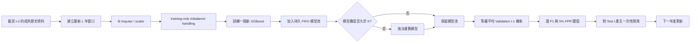
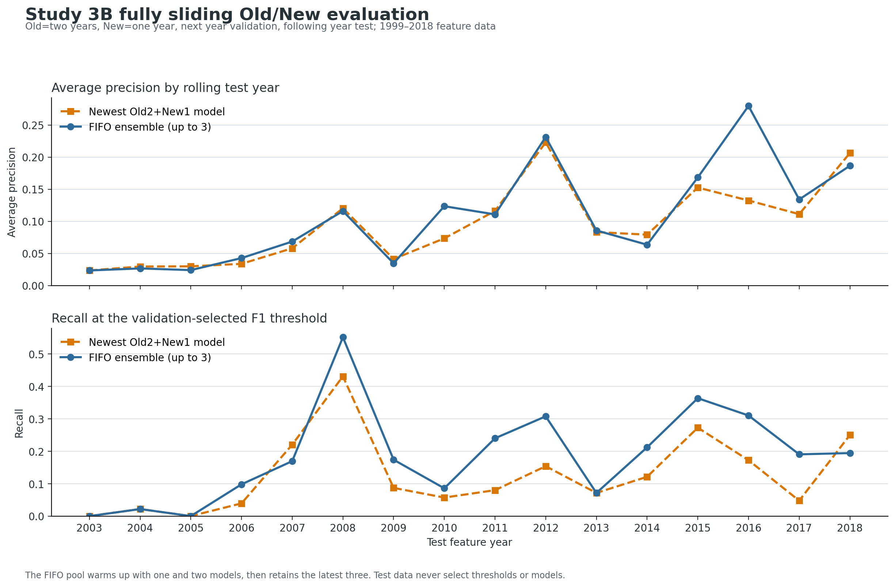
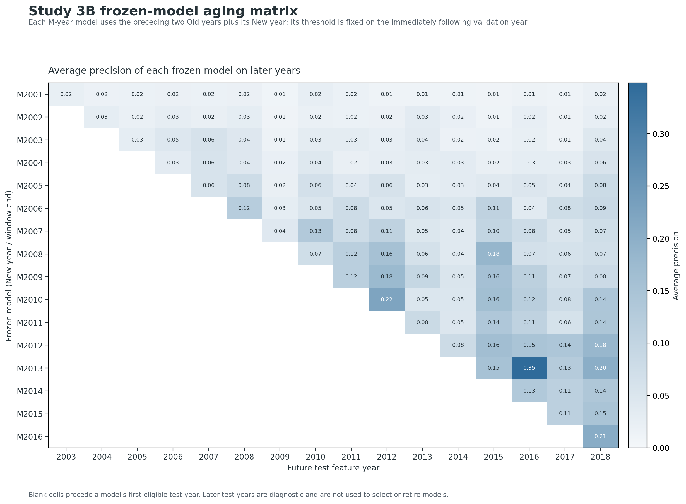
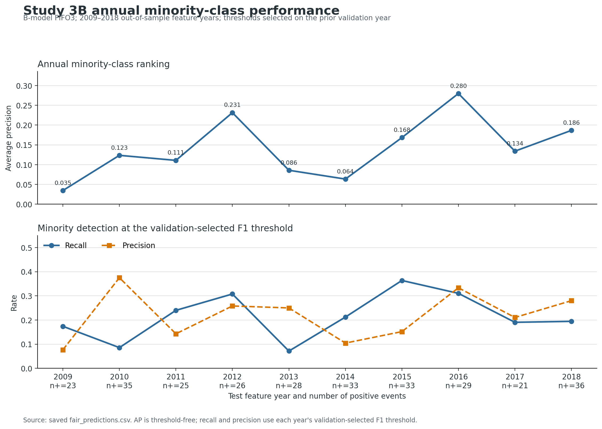
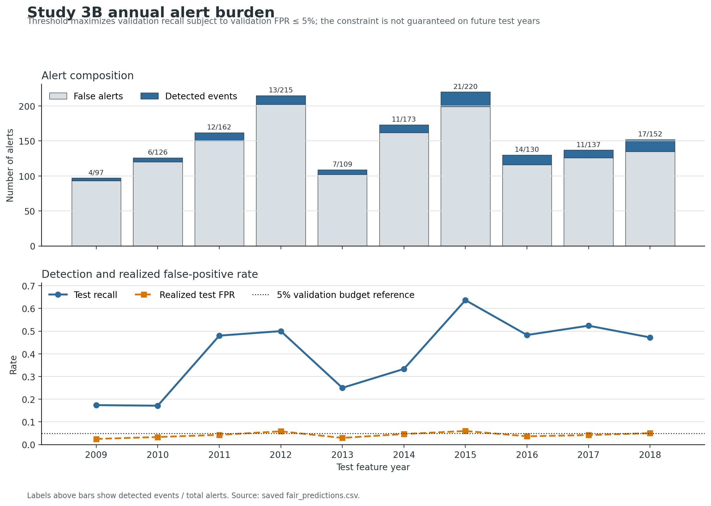
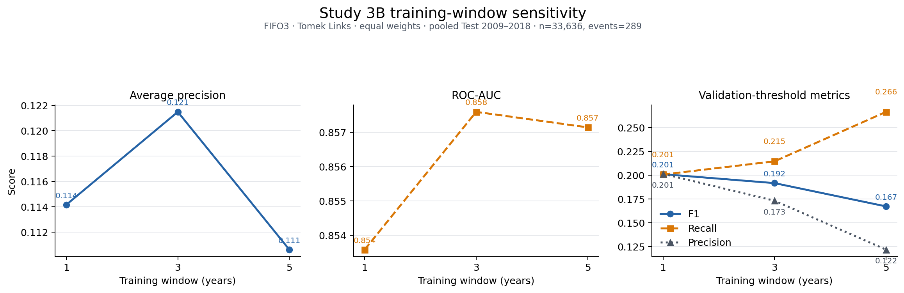

# 類別不平衡與概念漂移下之持續集成學習：以企業破產預測為例

**（碩士論文完整稿）**

---

## 使用說明

- 本稿為依專案實際實驗成果整理之碩士論文架構，已納入現有統計數字與 APA 第七版文獻引用；惟部分檢定仍有相依樣本、偽重複與跨種子驗證未完成等限制，應先完成 §5.3 所列補強再作正式投稿或繳交。
- 若為**國立中央大學資管所**，請依學校「研究生畢業論文格式條例」及系所公告為準；格式對照表見同目錄 `NCU_IM_FORMAT.md`。
- 本稿已納入中英文摘要、正文、表格與參考文獻；封面、授權書、審定書、謝辭、正式目次頁碼與圖表目錄仍須於排版成 Word/PDF 後，依學校規定及個人資料補入。

---

## 摘要

企業破產預測同時受到概念漂移與類別不平衡影響：歷史財務規律可能隨總體環境改變，而真正發生破產的公司僅占少數。若將所有歷史資料不加區分地合併，過時分布可能稀釋近期少數類訊號；若只使用最新資料，又可能因正例稀少而產生高變異。為處理此矛盾，本研究以美國公司 1999–2018 年共 78,682 筆公司年度資料為主，依「靜態比較、特徵選取、離線 Old/New 選擇、可持續更新」的順序進行研究。

Study 1 比較再訓練、微調、Old/New 靜態集成、動態集成選擇與動態分類器選擇；Study 2 比較 MI、CART、SHAP 與 RFE，並分析跨時期特徵穩定性。Study 3A 提出回溯式最佳切點選擇（ROSS）與漂移感知加權持續集成（DAWCE），在已知歷史範圍內以 Validation 選擇 Old/New 邊界及群組權重。結果顯示 DAWCE 可改善固定等權集成，但公平消融與年度 walk-forward 均未證明其優於近期 Tomek 單模型；ROSS 所選 2009 邊界亦未在 Test F1 上優於固定 2012 邊界。

Study 3B 進一步將研究問題改寫為未知未來終點下的年度更新。原始 `status_label` 為公司層級固定狀態，不能直接解讀為每年破產事件，故本研究僅在記憶體中將失敗公司最後觀測年重建為次年事件目標，保留原始檔不變。此探索性目標共有 609 個正例（0.774%）；對每個測試特徵年 $t$，資料截至 $t-2$ 用於訓練、$t-1$ 用於 Validation、$t$ 僅用於 Test。B-model 每年新增一個固定窗口 XGBoost，最多保留三個模型，以 FIFO 淘汰並等權平均。2009–2018 pooled Test 共 33,636 列、289 個事件。主設定（三年窗口、Pool3、Tomek）之 AP/AUC/F1 為 0.1215/0.8576/0.1917；相較單一近期三年模型，AP 與 AUC 的公司群聚 bootstrap 區間未跨零，但相較同目標的 A 路線，主要差異區間仍跨零。進一步將 Old 與 New 三年窗口由資料最舊端同步逐年推移，完成 2003–2018 共 16 輪測試；FIFO3 相對每輪最新模型的 AP 為 0.0860/0.0730、Recall 為 0.1923/0.1416，兩項差異的 95% 公司群聚 bootstrap 區間均未跨零，但 Precision 較低且模型數與歷史涵蓋仍共同改變。

消融結果顯示，Tomek 相較不採樣的 AP 僅方向性增加 0.0039，主要指標信賴區間皆跨零，因此取樣貢獻尚未確認。Pool3 相較 Pool1 的 AP、AUC 與 Recall 差異區間未跨零；但增加模型池亦同步延長歷史資料聯集，因此此結果支持的是整體設計差異，尚不能把提升單獨歸因於模型保留。Pool2、Pool3 與 Pool5 呈現 ranking、Recall 與 Precision 取捨，不能宣稱 Pool3 為最佳容量。訓練窗口 1、3、5 年的 AP 分別為 0.1142、0.1215、0.1106；三年相較一年與五年的 AP/AUC 差異區間均跨零。五年窗口 Recall 較高但 Precision 較低，故三年仍作預先設定的主方案，而非已證明最佳。

本研究的主要貢獻是建立可稽核的雙路線研究框架：A 路線檢驗封閉歷史範圍內的資料驅動切點與權重；B 路線保存模型、前處理器與更新紀錄，使系統可逐年推移且每輪只新增一個模型。現有證據顯示 Pool3 整體設計相較單一近期三年模型具有較高排序與少數類召回，但資料涵蓋與模型保留效益尚待進一步分離；目前亦不足以證明 Tomek、三年窗口與三模型組合具有全域最適性，不能把回溯事件重建等同真實部署。

**關鍵詞**：持續學習、概念漂移、類別不平衡、集成學習、破產預測、特徵選取、ROSS、DAWCE、重疊窗口、FIFO 模型池

---

## Abstract

Financial risk prediction under non-stationary and highly imbalanced data is challenging because historical patterns may become obsolete while minority-class events, such as corporate bankruptcy, remain difficult to identify. This study investigates whether the boundary between historical and recent knowledge, together with their relative ensemble weights, can be selected objectively through validation data rather than fixed by expert judgment.

Using 78,682 U.S. firm-year observations from 1999–2018, this study first evaluates static and validation-guided Old/New strategies and then develops a sustainable annual-update route. Route A uses a closed historical range to select temporal boundaries and group weights. Route B reconstructs an exploratory one-year-ahead event target because the source status label is constant within each firm, and uses a three-year rolling fit window, a three-model FIFO pool, equal probability averaging, and a validation-only threshold. For each test year $t$, training ends at $t-2$, year $t-1$ is reserved for validation, and year $t$ is used only once for testing.

Across 33,636 pooled out-of-sample predictions from 2009–2018 with 289 positive events, the prespecified Route-B setting obtains AP/AUC/F1 of 0.1215/0.8576/0.1917. It improves AP and AUC over a single recent three-year model under paired company-cluster bootstrap, but does not significantly outperform the A-inspired validation-boundary comparator. A fully sliding extension moves both Old and New years forward from the earliest eligible period and evaluates 16 rolling origins from 2003–2018. FIFO3 obtains AP/Recall of 0.0860/0.1923 versus 0.0730/0.1416 for the newest model; paired company-cluster intervals for both differences exclude zero, although precision is lower. Because increasing pool size also lengthens the union of historical years, this contrast does not isolate a pure ensemble-retention effect. Ablations show no confirmed advantage of Tomek Links over no sampling. Pool sizes two to five exhibit ranking, recall, and precision trade-offs. One-, three-, and five-year training windows obtain AP values of 0.1142, 0.1215, and 0.1106, respectively; their paired ranking-metric intervals overlap. Consequently, the three-year, three-model configuration is retained as a prespecified main setting rather than claimed as globally optimal.

The contribution is therefore a reproducible dual-route framework and an auditable persistent model lifecycle, not a claim that one preprocessing combination universally dominates. Route B can resume across processes and adds only one new model per annual update, but the reconstructed event timing and retrospective replay still require external validation before real-time deployment claims are warranted.

**Keywords**: continual learning, concept drift, class imbalance, ensemble learning, bankruptcy prediction, feature selection, ROSS, DAWCE, overlapping windows, FIFO model pool

---

## 目次

1. 第一章 緒論
2. 第二章 文獻探討
   - 2.1 持續學習與概念漂移
   - 2.2 概念漂移偵測器
   - 2.3 飄移適應型集成方法（AWE、DWM、OAUE、DES 等）
   - 2.4 類別不平衡學習
   - 2.5 破產預測與特徵選取
   - 2.6 方法比較表
3. 第三章 研究方法
4. 第四章 實驗設計與結果
   - 4.2 Study 1：基準與集成比較
   - 4.3 Study 2：特徵選取
   - 4.4 Study 3A：ROSS、DAWCE 與 Rolling AdaptiveChoice
   - 4.5 Study 3B：重疊窗口與持續模型池
   - 4.6 Study 4：成本敏感分析
5. 第五章 結論與建議
6. 參考文獻

## 圖目錄

| 圖次 | 圖名 |
|---|---|
| 圖 3-1 | Study 3B 年度持續更新流程 |
| 圖 4-1～4-2 | Study 3B 年度少數類表現與警報負擔 |
| 圖 4-3 | Study 3B 訓練窗口敏感度 |

## 表目錄

| 表次 | 表名 |
|---|---|
| 表 4-1～4-4 | 基準方法、統計檢定與特徵選取結果 |
| 表 4-5～4-12 | Study 3A ROSS、DAWCE、公平消融與 rolling 結果 |
| 表 4-13～4-17 | Study 3B 主結果、協定對齊比較、操作門檻與三組消融 |
| 表 4-18 | 條件錯誤成本敏感度 |

---

# 第一章 緒論

## 1.1 研究背景與動機

### 1.1.1 雙重挑戰的問題本質

在金融風險管理領域，預測模型長期面對**資料非平穩（non-stationarity）**與**類別不平衡（class imbalance）**兩項核心挑戰，且兩者往往同時存在，形成相互強化的困境。

正式地說，設資料生成過程為聯合分布 $P_t(X, y)$，其中 $t$ 代表時間。**概念漂移**意指存在時間點 $t^*$ 使得 $P_{t < t^*}(X, y) \neq P_{t \geq t^*}(X, y)$（Lu et al., 2018）。在破產預測中，2008–2009 年金融危機造成企業財務指標的結構性重組，即為典型的突變型（abrupt）概念漂移——危機後存活企業的財務比率分布已與危機前呈現質性差異，使以危機前資料訓練的模型在危機後的預測力急劇下降。

**類別不平衡**則指 $P(y=1) \ll P(y=0)$，少數類（破產）在訓練集中稀少，模型易以「全預測多數類」達到表面上的高準確率而無實際辨別力（He & Garcia, 2009）。本研究之破產資料整體破產率約 6.63%，測試期（2015–2018）更低至約 2.3%，意謂著即使是零技術的「全預測存活」模型，準確率也高達 97.7%，使準確率完全失去評估意義。

### 1.1.2 現有方法的設計缺口

**當兩項挑戰同時存在時**，現有主流方法均存在可辨識的設計缺口：

- **全量合併重訓（Re-training）**：不加區分地合併所有歷史資料，以期望覆蓋所有時期的規律。然而在漂移發生後，大量舊期「已失效的多數類基準」會稀釋新期的少數類特徵分布，造成 Precision 嚴重下降（本研究實驗：Type 1 Error = 0.245，遠高於 New-only 模型的 0.067）。

- **傳統線上漂移偵測器（ADWIN、DDM、PHT）**：以實例級誤差信號為基礎，隱含「模型從穩定期逐漸惡化」的假設。但在高度不平衡（6.63% 破產率）的批次年度資料中，整體誤差由多數類主導，少數類的分布改變幾乎不影響 0/1 誤差信號；加之本資料的 burn-in 期（1999–2004）本身即為 .com 泡沫的異常環境，初始「穩定基準」從未建立，使三種偵測器在本研究實驗中全部失效（詳見 §4.4.0）。

- **動態集成選擇（DES/KNORA-E）**：透過局部鄰域估計每個測試樣本的最適模型子集，設計上適合因應概念漂移。然而其核心假設——「特徵空間的局部相似性能反映預測能力相似性」——在跨越結構性漂移的資料中難以成立：以金融危機前後混合資料構建的 DSEL 中，K-NN 鄰域可能同時包含「危機前規律」與「危機後規律」的樣本。本研究的 Test-selected static oracle 高於 DES，但此結果僅作探索性機制線索，不作無偏優越性結論。

### 1.1.3 研究定位

上述分析揭示一個在現有文獻中尚未被系統性解決的設計問題：**在批次年度資料、類別高度不平衡、且初始期本身不穩定的情境下，如何自動且客觀地決定 Old/New 模型池的分界點，並以驗證集引導的方式確定最佳的 New-dominant 加權比重？**

本研究以美國破產預測資料（1999–2018）為主要實驗場域，採兩條互補路線。**A 路線**假定研究者已知可分析的完整歷史區間，以 ROSS（Retrospective Optimal Split Selection）與 DAWCE（Drift-Aware Weighted Continual Ensemble）將 Old/New 邊界及相對群組權重轉化為 Validation-guided 最佳化問題。**B 路線**不假定已知未來資料內容或資料流終點，預先固定「窗口寬度、每年新增一模型、FIFO 淘汰、等權集成」規則，研究模型能否隨年度批次持續演進。兩路線不是相加成單一方法：A 回答封閉資料內如何選擇，B 回答開放時間軸上如何維護模型生命週期。

---

## 1.2 研究目的與假設

本研究之具體目的與對應假設如下：

**Study 1 — 建立方法比較基準**

目的：在時序切割設定下，系統性比較 Re-training、Fine-tuning、Old/New 模型池靜態集成（2–6 模型組合）、DES（KNORA-E 風格）與 DCS，以跨年份切割描述方法排序與敏感度，並以 rolling 評估補強時序證據。

- **H₁₁（New vs. Old）**：$H_0$：New-side 模型的跨切割 AUC 中位數 = Old-side 模型；$H_a$：New-side 顯著更高。
- **H₁₂（Static vs. DES）**：$H_0$：最佳靜態集成的跨切割 AUC 中位數 = DES；$H_a$：靜態集成顯著更高。

**Study 2 — 特徵選取對集成的影響**

目的：比較無特徵選取與 MI / CART / SHAP / RFE 四種方法在不同保留比例（r80 / r50）下的集成效能與跨年份特徵穩定性。

- **H₂₁（FS 效益）**：$H_0$：MI r80 對 New\_3 集成 AUC 無顯著提升；$H_a$：有顯著提升。
- **H₂₂（穩定性）**：$H_0$：r80 與 r50 的跨年份 Jaccard 相似度無顯著差異；$H_a$：r80 顯著更高。

**Study 3 — Drift-Aware 加權集成（DAWCE）**

目的：提出 ROSS 邊界選擇流程，自動以驗證集決定最佳 Old/New 邊界；以網格搜尋確定最佳 New-dominant 權重；以多切割與 rolling 分析評估效果方向與適用邊界。

- **H₃₁（加權效益）**：$H_0$：Validation-selected weighting 跨切割 AUC 中位數 = 等權集成；$H_a$：選擇性加權顯著更高。
- **H₃₂（ROSS vs. Fixed）**：ROSS 選出的邊界在測試集效能上不低於人工設定之固定邊界。

**Study 3B — 重疊窗口持續集成**

目的：在未知未來終點下，建立可跨程序保存與逐年更新的 FIFO 模型池，並分離窗口長度、模型池容量與不平衡處理對少數類辨識的影響。

- **H₃₃（多模型保留效益）**：固定三年窗口下，Pool3 相較只保留最新模型的 Pool1，可提高事件目標的 AP 與 Recall。
- **H₃₄（組合最適性）**：Tomek、三年窗口與 Pool3 的組合優於對照設定。此假設需分別經 sampling、window 與 pool ablation 檢驗，不因主設定單次分數較高即視為成立。

**Study 4 — 穩健性與成本敏感分析**

目的：以多種子實驗診斷亂數敏感度，並以 Type2:Type1 條件錯誤分數說明模型排序如何隨權重改變；現有 10-seed 結果尚未對齊主 XGBoost rolling protocol，因此不作確認性重現證據。

- **H₄₁（重現性）**：主 XGBoost 實驗流程的主要比較結論在不同隨機種子下具有一致方向；現有 LightGBM/block-CV 10-seed 結果僅作輔助檢查。

---

## 1.3 研究問題

1. 在持續學習與類別不平衡情境下，Old-side 模型池與 New-side 模型池哪個對測試期更有效？靜態集成是否優於 DES / DCS？
2. 四種特徵選取方法（MI / CART / SHAP / RFE）是否對集成效能有統計顯著提升？在已納入穩定性分析的 MI / SHAP / RFE 中，r80 與 r50 的特徵集合穩定性是否有顯著差異？
3. Data-driven drift boundary selection（ROSS）是否能找到比人工指定邊界更合適的 Old/New 分界點？New-dominant weighted ensemble 是否跨多個年份切割皆顯著優於等權集成？
4. 在未知未來資料內容與終點時，固定窗口、FIFO 模型池是否能以有界更新成本持續演進，並提高破產事件少數類的 AP 或 Recall？
5. Sampling、訓練窗口長度與模型池容量各自帶來何種效益與取捨？三年、Pool3 與 Tomek 是否確有實證優勢？
6. 在不同 Type2:Type1 成本比下，最佳模型設定如何轉換？

---

## 1.4 研究範圍與限制

- **資料集**：以美國破產預測（1999–2018）為主要實驗資料；Medical（UCI Diabetes 130）與 Stock 資料集用於輔助驗證，主要結論以破產資料為準。
- **目標定義**：既有 Study 1–3A 沿用原始公司狀態標籤，屬歷史公司狀態辨識；Study 3B 則以 failed 公司最後觀測年重建次年事件，屬探索性事件預測。兩者盛行率與 estimand 不同，不直接混合比較。
- **切割方式**：破產資料採時序年份切割。Study 3 確認性與 rolling 流程的補值、標準化及特徵選取只以 fitting data 擬合；部分既有 Phase 4/5 路徑仍有各分割自行估計補值平均數的轉導式限制。原始 bankruptcy 資料目前無缺失值，因此該限制不改變本次數值，但不可概括為全專案皆嚴格 inductive。
- **Fine-tuning 定義**：本研究之 Fine-tuning 為「先在歷史資料訓練，再以新資料做第二階段訓練」，未強制使用降低學習率的古典微調形式。
- **泛化限制**：目前主要統計結論來自 Bankruptcy 資料集；模型設計的泛化能力尚待跨市場、跨產業或跨國資料進一步驗證。

---

## 1.5 論文架構

- **第二章**回顧持續學習、概念漂移、類別不平衡學習、集成學習與動態選擇、破產預測及特徵選取等相關文獻。
- **第三章**說明資料與切割設計、Baseline、模型池、特徵選取、ROSS/DAWCE，以及 B 路線的事件目標、重疊窗口與持久 FIFO 更新流程。
- **第四章**依 Study 1、Study 2、Study 3A、Study 3B 與 Study 4 順序呈現結果、消融與統計不確定性，並進行綜合討論。
- **第五章**總結研究結論、貢獻與未來工作方向。

---

# 第二章 文獻探討

本章由五個部分組成：(1) 持續學習與概念漂移的核心定義及分類；(2) 概念漂移偵測器；(3) 飄移適應型集成方法（含 AWE 等動態加權演算法）；(4) 類別不平衡學習；(5) 破產預測與特徵選取。最後以比較表格說明各類方法與本研究的定位差異。

---

## 2.1 持續學習與概念漂移

### 2.1.1 持續學習的定義與核心挑戰

**持續學習（Continual Learning）**泛指在資料依序到達、任務或分布可能隨時間改變的設定下，系統如何持續吸收新知識，同時在穩定性（stability）與可塑性（plasticity）之間取得平衡（Wang et al., 2024）。Wang 等人（2024）在 *IEEE TPAMI* 的綜論中指出，持續學習的主要挑戰包含：

- **災難性遺忘（Catastrophic Forgetting）**：在新任務上更新參數時，舊任務的知識被覆蓋。
- **知識遷移（Knowledge Transfer）**：如何將過去積累的知識有效遷移到新分布。
- **資源限制**：受限的記憶體與計算資源下如何選擇保留哪些歷史資訊。

在本研究的表格型金融資料中，不同年份的公司財務報表反映不同的經濟環境規律。Study 3A 採用「歷史期 Old model pool」與「新營運期 New model pool」並存的顯式知識維護機制，透過群組加權表達新舊知識的相對重要性。Study 3B 則保存有限的活躍模型池，但每年訓練新窗口時仍會讀取重疊的歷史原始資料；因此本文不將其描述為無歷史資料回放，也不據此宣稱已規避原始資料的隱私或總儲存成本。

### 2.1.2 概念漂移的類型

**概念漂移（Concept Drift）**描述資料產生機制或目標函數 $P(X, y)$ 隨時間改變（Lu et al., 2018; Žliobaitė, 2010）。依漂移型態可分為：

| 類型 | 定義 | 破產情境示例 |
|------|------|------------|
| **突變型（Abrupt）** | 分布在短期內急速改變 | 金融危機（2008–2009）後破產特徵急速重組 |
| **漸變型（Gradual）** | 新舊分布在過渡期混合出現 | 利率環境逐步收緊，財務壓力指標緩慢位移 |
| **循環型（Recurrent）** | 舊分布週期性復現 | 景氣循環導致破產率高低交替 |
| **增量型（Incremental）** | 分布以微小幅度持續位移 | 會計準則逐年調整造成財務比率定義微幅漂移 |

Lu 等人（2018）在 *IEEE TKDE* 的綜論中，將適應策略分為三類：**主動重訓（proactive retraining）**、**觸發式重訓（triggered retraining）**與**持續性模型維護（continuous model maintenance）**。本研究屬於觸發式重訓的延伸——以資料驅動的邊界選擇（ROSS）取代人工觸發條件，再以加權集成（DAWCE）取代單一模型重訓，在保有歷史知識的同時突顯新期分布的預測力。

---

## 2.2 概念漂移偵測器

傳統的漂移偵測器以線上串流（online stream）設定為前提，將每筆新樣本的預測誤差作為信號，統計性地判斷是否已出現顯著的分布改變。

### 2.2.1 主流偵測方法

**ADWIN（ADaptive WINdowing; Bifet & Gavalda, 2007）** 維護一個長度可變的滑動視窗，若視窗內任何兩個子視窗的統計均值差異超過 Hoeffding 界限，則判定漂移並截斷舊視窗。優點是對任何子視窗的假陽性機率有嚴格的理論控制；缺點是在高不平衡資料中，子視窗統計量由多數類主導，少數類的分布改變難以被感知。

**DDM（Drift Detection Method; Gama et al., 2004）** 監控在線錯誤率 $p_t$ 及其標準差 $s_t$，當 $p_t + s_t$ 超過特定閾值時觸發警告或漂移訊號。DDM 隱含假設：模型在穩定期應保持低且穩定的錯誤率，而後緩慢上升，才能建立可靠的「正常基準」。

**PHT（Page-Hinkley Test; Page, 1954）** 以累積殘差監控信號的均值上升，適合偵測均值的單調漂移。觸發條件為：

$$\text{PHT}_t = \sum_{i=1}^{t}(x_i - \bar{x} + \delta) > \lambda$$

其中 $\delta$ 為容忍的小幅波動、$\lambda$ 為觸發門檻。

**EDDM（Early Drift Detection Method; Baena-García et al., 2006）** 改良自 DDM，改以相鄰兩次分類錯誤之間的樣本距離作為信號，對尚未明顯惡化的早期漂移更敏感。

**KSWIN（Kolmogorov-Smirnov Windowing; Raab et al., 2020）** 以 KS 雙樣本檢定比較最近視窗與參考視窗的分布差異，不依賴預測標籤，可用於特徵分布的飄移偵測。

### 2.2.2 偵測器在本研究場景的侷限

本研究的破產資料具備三項特性，使上述偵測器在實驗中均未有效觸發（詳見 §4.4.0）：

1. **批次年度切割**：樣本以年份為單位批次到達而非逐筆串流，12 個年批次的低解析度下難以建立統計顯著性。
2. **高度不平衡的公司最終狀態標籤（6.63%）**：Study 3A 沿用的 `status_label` 在公司內跨年固定；此比例不是逐年度破產事件率。整體誤差率仍由多數類主導，使少數類變動在 0/1 誤差信號中不易呈現。
3. **不穩定的初始基準**：burn-in 期（1999–2004）正值 .com 泡沫衰退，初始模型 AUC 僅 0.61；後續正常市場年份 AUC 反升至 0.73，PHT 設計的「性能惡化偵測」因反升信號而無法建立累積量。

這一實證發現直接動機了 ROSS 的設計：不依賴偵測器的即時觸發假設，改以 validation-guided 回顧式搜尋找出最佳 Old/New 分界，對不穩定初始期和批次年度資料更具適應性。

---

## 2.3 飄移適應型集成方法

在概念漂移處理策略中，除了偵測後重訓單一模型，另一類主流方法是維護一組歷史分類器並以動態加權因應分布改變。

### 2.3.1 AWE：準確率加權集成

**AWE（Accuracy Weighted Ensemble; Wang et al., 2003）** 是批次串流環境下具代表性的動態加權集成演算法之一。標準 AWE 以分類器在最新資料批次上的預測誤差相對於隨機分類器誤差設定權重，並保留表現較佳的分類器。Street 與 Kim（2001）提出的 SEA 同樣採批次式維護分類器池，但屬於不同的串流集成方法。

標準 AWE 的核心假設是：越能在最新資料批次上保持低誤差的分類器，在後續預測中越具參考性。其原始權重定義與本研究的驗證集 AUC 權重不同，因此本研究將對照方法明確稱為 **AWE-inspired validation-AUC weighting**，而非標準 AWE 的完全重製。

**本研究與標準 AWE 的差異**：本研究以 Validation period AUC 作為全部六個基分類器的個別權重，並剪除 AUC < 0.5 的模型。此設計保留 AWE「依近期表現逐模型加權」的精神，但將原始誤差權重替換為較適合不平衡資料的 AUC，並與 DAWCE 進行直接對比（見 §4.4.3）：

| 特性 | AWE-inspired baseline | DAWCE（本研究） |
|------|-----|---------------|
| 邊界設定 | 無顯式邊界，自動動態 | ROSS 回顧式搜尋選出明確邊界 |
| 加權粒度 | 每個分類器獨立加權 | Old 群組 / New 群組分別加權 |
| 搜尋依據 | 最新 chunk 準確率 | Validation period F1 最大化 |
| 適合場景 | 線上串流、持續新增 chunk | 離線批次、固定 Old/New 期別 |

### 2.3.2 DWM：動態加權多數投票

**DWM（Dynamic Weighted Majority; Kolter & Maloof, 2007）** 以線上方式逐筆更新各分類器的權重：若某分類器對當前樣本預測錯誤，其權重乘以懲罰因子 $\beta < 1$；若權重降至閾值以下則剪除，並週期性加入以新資料訓練的新分類器。DWM 適合高速串流設定，但在年批次資料（每批數千筆）中，個別樣本的誤差對權重調整影響甚微。

### 2.3.3 OAUE：線上準確率更新集成

**OAUE（Online Accuracy Updated Ensemble; Brzezinski & Stefanowski, 2014）** 將批次式集成的誤差加權機制轉為逐例更新，持續依目前資料流上的分類誤差調整元分類器，並以固定時間與記憶體為設計目標。其原始設定假設標籤可在資料流中陸續取得，與本研究一年一批、標籤延遲的回溯更新協定不同。

### 2.3.4 Learn++：增量集成

**Learn++ 系列（Polikar et al., 2001）** 在每個新批次上訓練新的弱分類器並加入池，最終以依分類器誤差形成的加權多數決整合預測，而非令所有分類器全期等權。舊分類器在新分布上的適用性仍是增量集成需要處理的問題；本研究的 New-side 群組權重是不同的設計選擇，不能視為 Learn++ 權重規則的直接延伸。

### 2.3.5 KNORA-E 與動態集成選擇（DES）

**KNORA-E（Ko et al., 2008）** 在每個測試樣本的 k-NN 鄰域上，只保留對鄰域中所有樣本均預測正確的分類器參與投票，是 DES 的典型代表。然而，在跨越概念漂移的時序切割下，以歷史樣本構建的 DSEL 局部鄰域可能同時包含「漂移前」與「漂移後」樣本，使鄰域相似度的參考性降低（Cruz et al., 2018）。本研究的 test-selected static oracle 高於特定 DES/DCS 實作，僅提供符合此機制的探索性線索；因靜態端為 oracle，且舊版 DSEL 與模型訓練資料重疊，此結果不能證明一般性的靜態集成優勢。

---

## 2.4 類別不平衡學習

### 2.4.1 問題本質與評估策略

**類別不平衡（Class Imbalance）**在破產預測中尤為顯著：存活企業數量遠多於破產企業。He & Garcia（2009）系統性整理了不平衡學習的方法論，指出若直接以原始分布訓練，模型易以「全預測多數類」的方式達到表面上的高準確率，但對少數類的識別能力極差。因此，本研究以 **AUC-ROC**、**F1-score**、**Recall** 與 **Precision** 作為主要評估指標，補充 Type 1 Error（FPR）與 Type 2 Error（FNR）以利成本敏感分析。

### 2.4.2 取樣策略

Chawla 等人（2002）提出的 **SMOTE** 透過少數類樣本間的插值合成新樣本，是過採樣的里程碑。本研究使用三種互補的取樣策略：

- **TomekLinks（Undersampling）**：移除邊界處相互最近但類別不同的樣本對，清理決策邊界的雜訊。
- **ADASYN（Oversampling）**：依照局部密度自適應地在少數類稀少的區域生成更多合成樣本（He et al., 2008）。
- **SMOTEENN（Hybrid）**：先 SMOTE 過採樣再以 Edited Nearest Neighbors 清理邊界樣本，結合兩者優點。

三種策略各自對資料分布施加不同的干預邏輯，使六個基學習器之間具有天然的預測多樣性，是本研究集成多樣性的主要來源。

### 2.4.3 概念漂移與類別不平衡的交互效應

Wang 等人（2013）指出，在資料串流中同時存在類別不平衡與概念漂移時，標準的重採樣策略可能因少數類漂移比多數類更快而失效——舊期合成的少數類樣本在新期分布下成為誤導性雜訊。Brzezinski & Stefanowski（2014）也指出，以模型在最新批次的準確率直接加權（如 AWE）可能因不平衡資料的少數類稀少而不穩定。本研究透過以 AUC（而非準確率）作為 AWE 的加權信號，並以 DAWCE 的群組加權框架提供更穩定的替代方案。

---

## 2.5 破產預測與特徵選取

### 2.5.1 破產預測的機器學習方法

破產預測自 Altman（1968）提出 Z-score 線性判別分析以來，文獻逐步從統計模型演進至機器學習方法。Altman 等人（1977）以 ZETA 模型擴充 Z-score；Ohlson（1980）以 Logistic Regression 引入更多財務比率。近年研究亦廣泛採用梯度提升樹處理表格型財務資料。

本研究主要實驗採用 **XGBoost**（Chen & Guestrin, 2016）作為基學習器。XGBoost 可處理非線性特徵交互作用，並適合本研究的表格型財務資料；為隔離集成、取樣與時序切割的影響，主要比較固定使用同一組基學習器設定。

### 2.5.2 特徵選取方法

在模型訓練前進行特徵選取，可降低雜訊、提升泛化能力，並減少對不穩定特徵的依賴。本研究比較四種方法：

- **Mutual Information（MI）**：以資訊論衡量特徵與標籤之間的相依強度，對非線性關係敏感，計算成本低。
- **CART 重要性**：基於決策樹的基尼增益評估特徵重要性，反映在集成模型結構中實際使用的分裂頻率與效益。
- **SHAP（SHapley Additive exPlanations; Lundberg & Lee, 2017）**：以樹模型的 TreeExplainer 計算每個特徵的平均絕對 Shapley 值，具有理論上的公平性（efficiency, symmetry, dummy properties）。
- **RFE（Recursive Feature Elimination）**：以 LogisticRegression 為估計器，遞迴排除係數絕對值最小的特徵，可作為線性假設下的對比基準。

保留比例設定為 r80（保留 80%）與 r50（保留 50%），以探討壓縮程度對效能與穩定性的影響。

### 2.5.3 特徵穩定性

在時序非平穩資料中，特徵選取不只影響當期效能，更影響被選特徵集的**跨期一致性（Feature Stability）**。Nogueira 等人（2018）系統性討論了特徵選取穩定性的量化方式，指出 Jaccard 相似度是在小樣本與高維度場景下評估集合一致性的可靠指標。本研究以 15 個不同年份切割下的 Jaccard 均值量化各方法的穩定性，並以 paired Wilcoxon 檢定比較 r80 與 r50 的差異。

---

## 2.6 方法比較與本研究定位

### 2.6.1 設計維度比較

下表從六個設計維度系統性比較現有主要概念漂移適應方法與本研究 DAWCE 框架：

| 方法 | 資料到達型態 | 邊界決策機制 | 加權粒度 | 不平衡處理 | 搜尋目標 | 適用場景 |
|------|------------|------------|---------|----------|---------|---------|
| ADWIN / DDM / PHT | 線上逐筆 | 自動偵測觸發 | 重訓單模型 | 無 | 實例誤差信號 | 串流、平衡資料 |
| AWE | 批次 chunk | 無（持續動態） | 每個模型獨立 | 無 | 最新 chunk 準確率 | 批次串流 |
| DWM | 線上逐筆 | 無 | 每個模型獨立 | 無 | 逐筆懲罰因子 | 高速串流 |
| OAUE | 批次 chunk | 無（持續動態） | 每個模型獨立 | 無 | 新舊混合準確率 | 批次串流 |
| KNORA-E (DES) | 批次（固定） | 人工設定 | 樣本級動態選擇 | 無 | 鄰域預測正確率 | 固定切割批次 |
| Learn++ | 批次（持續） | 無 | 誤差導向加權多數決 | 無 | Boosting 誤差 | 批次增量 |
| ARF | 線上逐筆 | ADWIN 每樹觸發 | 每棵樹獨立替換 | 無（需外掛） | 單樹預測誤差 | 真實串流 |
| **DAWCE（本研究）** | **批次年度** | **ROSS 回顧式最佳化** | **Old/New 群組加權** | **三種取樣策略池** | **Validation F1/AUC** | **離線批次、不平衡** |

### 2.6.2 文獻缺口分析

上表揭示現有方法在本研究場景下的三個系統性缺口：

**缺口 1：邊界決策的客觀性**
現有方法要麼無顯式邊界概念（AWE、DWM、OAUE、ARF），要麼依賴人工設定（DES）或即時偵測器（ADWIN）。即時偵測器在高不平衡批次資料上的失效已有記錄（Brzezinski & Stefanowski, 2014；本研究 §4.4.0 實驗佐證），而人工設定本質上是對「漂移發生年份」的主觀假設，缺乏可重現性。**ROSS 將邊界選擇重新定義為驗證集效能最大化問題**，提供客觀且可重現的決策機制。

**缺口 2：群組層級加權**
本文比較範圍內的逐模型加權方法無法直接對 Old/New 兩組模型施加群組偏好。當新期模型在本資料上呈現較佳表現時，個別模型的加權分散效果有限——AWE-inspired 診斷中的 Old/New 單模型權重均值分別為 0.142 與 0.192。**DAWCE 以群組為單位**，允許選擇 w\_new = 1.0 的極端配置，在新期規律占優的情境下表達知識優先性。

**缺口 3：不平衡與漂移的聯合設計**
在本文納入的比較方法中，對「明確 Old/New 群組權重」與「多種不平衡取樣模型池」的聯合設計仍有限。Wang 等人（2013）指出在串流不平衡資料中，標準取樣策略可能因少數類漂移速度快於多數類而失效；本研究透過三種取樣策略的模型池設計，在訓練階段即將多樣性取樣納入集成基礎。

DAWCE 在「批次年度資料、離線訓練、類別不平衡、有明確驗證集可用」的場景下，以資料驅動的方式同時解決上述三個缺口，更契合金融風險預測的實務限制（年度財報批次公告、標籤有延遲、不平衡率極高）。

---

## 2.7 小結

現有文獻在持續學習、不平衡處理與集成選擇各自有成熟的方法，但在「以時序年份切割明確區分 Old/New 期別、結合多種不平衡取樣策略形成多樣性模型池、系統比較靜態集成與動態選擇、並以資料驅動方式同時自動調整 Old/New 邊界與相對群組權重」的整合設定下，仍缺乏完整的實證研究。本研究即針對此一空缺，提出以 ROSS 邊界選擇與 New-dominant 加權集成為核心的 DAWCE 框架，並以美國破產預測資料（1999–2018）進行系統性驗證。

---

# 第三章 研究方法

## 3.1 資料集與時序切割

### 3.1.1 主要資料集：美國破產預測（1999–2018）

本研究以 Lombardo et al.（2022）公開之 American Companies Bankruptcy Prediction 資料為主要實驗對象（專案原始檔：`data/raw/bankruptcy/american_bankruptcy_dataset.csv`），涵蓋 1999–2018 年，共 78,682 筆公司年度觀測、8,971 個本地公司識別值，且無重複 company-year。資料包含 `company_name`、會計年度 `fyear`、公司狀態 `status_label`、18 個財務特徵 X1–X18，以及產業分類欄位。原始 CSV 與核對之上游版本 SHA-256 一致，研究流程不改寫 raw；惟原論文報告公司數為 8,262，與本地唯一公司識別值 8,971 不一致，故本文明確保留此來源差異。

必須區分兩個研究目標。Study 1–3A 沿用 `status_label`，共有 5,220 個 failed company-year（6.63%）；稽核發現同一公司的此標籤跨年度固定，因此它表示資料供應者賦予公司的最終狀態，而非每一年度獨立發生的破產事件。Study 3B 不直接沿用此標籤，而是在記憶體中將 failed 公司最後觀測財政年標為事件特徵年，使模型以該年 X1–X18 預測 $fyear+1$ 的事件。此規則得到 609 個事件正例（0.774%），年度合計與來源論文表列事件數一致，但原始資料沒有 filing、report 或法律事件的精確可用時間，故只定位為回溯性事件重建。B 路線明確排除 Division 與 MajorGroup，只使用 X1–X18；部分 Study 1–3A 的歷史 loader 僅排除 Division，實際仍可能納入數值編碼的 MajorGroup，因此舊結果不得被描述為與 B 完全相同的 18 特徵設定。

A 路線之時序切割如下：

| 資料期別 | 年份範圍 | 用途 |
|---------|---------|------|
| Old period（歷史期） | 1999–2011 | 訓練 Old-side 模型池 |
| New period（新營運期） | 2012–2014 | 訓練 New-side 模型池 |
| Test period（測試期） | 2015–2018 | 最終效能評估 |

Study 3 中，ROSS 邊界搜尋使用以下延伸切割：

| 資料期別 | 年份範圍 | 用途 |
|---------|---------|------|
| Old period（候選） | 1999–(b-1) | 訓練 Old-side |
| New period（候選） | b–2011 | 訓練 New-side |
| Validation period | 2012–2014 | 邊界選擇依據（隔離測試集） |
| Test period | 2015–2018 | 最終效能評估（不參與邊界選擇） |

其中 b 為候選 drift start year（範圍：2003–2011）。

本資料屬公司年度 panel data：1999–2014 訓練期有 8,503 家公司，2015–2018 測試期有 3,700 家，其中 3,232 家（87.35%）曾出現在訓練期；且同一公司的 `status_label` 在資料內不隨年度改變。雖然模型移除公司識別碼而避免直接 ID 洩漏，但目前評估代表「已見與未見公司混合的未來年度辨識」，不是完全未見公司的 entity-holdout 泛化；公司跨年重複亦使年度觀測可能具有群聚相關性。

Study 3B 對每一測試特徵年 $t\in\{2009,\ldots,2018\}$ 採獨立時間契約：所有模型訓練資料不晚於 $t-2$，$t-1$ 僅用於選擇 F1 閾值與 5% FPR 預算閾值，$t$ 僅作 Test，並將預測目標表述為 $t+1$ 事件。十個 Test 批次在資料列上互斥，共 33,636 列、5,512 家公司與 289 個正例；公司仍可跨年度重複，故不把公司年度列視為獨立個體。

### 3.1.2 輔助資料集

- **Medical（UCI Diabetes 130）**：約 11% 再入院率，用於輔助驗證集成設計在中度不平衡場域的適用性。
- **Stock（美國三大指數趨勢）**：高度隨機性市場資料，主要用於觀察不同策略在高雜訊任務下的行為差異。

### 3.1.3 無資料洩漏原則

模型訓練、邊界選擇、權重搜尋與分類閾值選擇均不使用 Test 標籤；Validation 專門用於選擇，Test 僅用於最終評估。所有新增 Study 3 流程均先切出 fitting、Validation 與 Test，再僅以 fitting data 擬合缺失值補值、StandardScaler、取樣與特徵選取器。Study 3B 的每個凍結模型各自保存 imputer、scaler 與 XGBoost，預測函式不讀取目標欄位；年度完成後 Test 資料才可在後續輪次成為成熟歷史資料。

---

## 3.2 Baseline 方法

**Re-training（再訓練）**：合併 Old 與 New period 資料，以相同不平衡取樣策略訓練單一模型，在 Test 上評估。代表「合併所有可得資料重訓」的常見實務作法。

**Fine-tuning（微調）**：先以 Old period 訓練模型，再以 New period 資料做第二階段訓練（Sequential training），在 Test 上評估。此設計代表「在新資料上持續學習但保留舊模型結構」的適應策略。

---

## 3.3 模型池設計

Old-side 與 New-side 各以三種取樣策略訓練三個基學習器（基學習器採 XGBoost）：

| 模型 | 訓練資料 | 取樣策略 |
|------|---------|---------|
| Old 1 | Old period | Undersampling（TomekLinks） |
| Old 2 | Old period | Oversampling（ADASYN） |
| Old 3 | Old period | Hybrid（SMOTEENN） |
| New 4 | New period | Undersampling（TomekLinks） |
| New 5 | New period | Oversampling（ADASYN） |
| New 6 | New period | Hybrid（SMOTEENN） |

三種取樣策略各自對資料分佈施加不同的干預邏輯，使六個基學習器之間具有天然的預測多樣性，是本研究集成多樣性的主要來源。

---

## 3.4 靜態集成

在 Old/New 六個模型上定義多種靜態組合，預測以**軟投票**（機率平均）得到：

- **ensemble\_old\_3**：僅 Old 1/2/3 的平均。
- **ensemble\_new\_3**：僅 New 4/5/6 的平均。
- **ensemble\_all\_6**：六個模型全部平均。
- **部分組合**：2/3/4/5 模型的各種 Old+New 組合，用於比較不同 Old/New 混合比例對效能的影響。

---

## 3.5 動態集成選擇（DES）與動態分類器選擇（DCS）

**DES（KNORA-E 風格）**：以 Old + New 合併為動態選擇集（DSEL）；對每個測試樣本以 k-NN（k=7）在 DSEL 上找鄰居，保留在該鄰域中全部預測正確的模型，以其機率平均作為最終預測；若無合格模型則退回全池平均（KNORA-U fallback）。

**DCS（動態分類器選擇）**：與 DES 相同的鄰域搜尋流程，但最終僅選擇在鄰域中表現最佳的**單一**模型進行預測，而非多個模型的集成。

兩種方法皆以 historical + new 合併資料作為 DSEL，以 Old/New 六個模型為候選池，評估僅在 Test 集上進行。此舊版實作的 DSEL 與候選模型訓練資料重疊，可能使局部 competence 估計偏樂觀；因此其結果僅代表本研究特定實作，不作為 DES/DCS 一般能力的上限判定。

---

## 3.6 特徵選取方法（Study 2）

### 3.6.1 四種方法

本研究以四種特徵選取方法為主比較對象：

- **MI（Mutual Information）**：估計每個特徵與目標標籤之間的互資訊，保留互資訊最高的前 k 個特徵。
- **CART（Decision Tree Feature Importance）**：以 CART 決策樹的基尼增益（Gini impurity reduction）評估特徵重要性。
- **SHAP（SHapley Additive exPlanations）**：以樹模型的 TreeExplainer 計算每個特徵的平均絕對 SHAP 值，衡量其對模型輸出的平均貢獻量。
- **RFE（Recursive Feature Elimination）**：以 LogisticRegression 為基礎，遞迴排除係數絕對值最小的特徵。

保留比例設定為 r80（保留 80% 特徵）與 r50（保留 50% 特徵），以探討不同壓縮程度的效益差異。

### 3.6.2 特徵穩定性分析

對 MI、SHAP 與 RFE 三種方法及兩種保留比例，在 15 個不同年份切割下分別執行特徵選取，計算每對切割之間所選特徵集的 **Jaccard 相似度**，並彙總均值。透過 paired Wilcoxon 檢定比較 r80 與 r50 的穩定性差異，以量化「保留較多特徵是否有助於跨時序的特徵選取一致性」。CART 納入效能比較，但目前穩定性分析程式尚未納入 CART，因此不對其跨切割穩定性作推論。

---

## 3.7 ROSS：驗證集回溯邊界選擇（一般化框架）

**ROSS（Retrospective Optimal Split Selection）**是本研究提出的一種 validation-safe 邊界搜尋策略。本節先給出一般化的 k 邊界定義，再說明本研究採用 k=1 的理由。

### 3.7.1 一般化 k 邊界 ROSS

給定時間有序的訓練資料 $\mathcal{D} = \{(x_i, y_i, t_i)\}$，一個驗證期 $\mathcal{V}$ 和一個測試期 $\mathcal{T}$，**k 邊界 ROSS** 搜尋 $k$ 個時間邊界 $b_1 < b_2 < \cdots < b_k$，將訓練資料切割成 $k+1$ 個時期 $P_1, P_2, \ldots, P_{k+1}$，並為每個時期訓練一組基學習器池 $\mathcal{M}_j$（$j=1,\ldots,k+1$）。

**最終預測（軟加權平均）**：

$$\hat{p}(x) = \sum_{j=1}^{k+1} w_j \cdot \bar{p}_j(x), \quad \sum_{j=1}^{k+1} w_j = 1, \quad w_j \geq 0$$

其中 $\bar{p}_j(x) = \frac{1}{|\mathcal{M}_j|}\sum_{m \in \mathcal{M}_j} p_m(x)$ 為第 $j$ 期模型池的機率均值。

**邊界與權重聯合最佳化**（在驗證集上進行）：

$$\{b_1^*, \ldots, b_k^*\}, \{w_1^*, \ldots, w_{k+1}^*\} = \arg\max \; \text{F1}\!\left(\hat{p}(\cdot;\, b_{1:k},\, w_{1:k+1}),\; y_{\mathcal{V}}\right)$$

**k 選擇**：比較 $k=1$ 與 $k=2$ 在驗證集上的 F1，若 $k=2$ 的提升超過門檻 $\tau$（本研究設 $\tau = 0.005$）則依預設規則選用 $k=2$，否則選用較簡潔的 $k=1$。Test 結果僅用於評估，不得用於反向變更 $k$ 的選擇。

**演算法（k=2 為例）**：

```
輸入：有時間標籤的訓練資料 D、驗證期 V、測試期 T
輸出：最佳邊界組合 (b1*, b2*)、最佳群組權重 (w1*, w2*, w3*)

1. 枚舉所有合法的 (b1, b2)，b1 < b2，每段至少 MIN_PERIOD 年
2. 對每個 (b1, b2)：
   a. 切割 D 為 P1(1999~b1-1), P2(b1~b2-1), P3(b2~TRAIN_END)
   b. 在各 Pj 上以三種取樣策略訓練三個 XGBoost 模型
   c. 在 V 上以網格搜尋 (w1, w2, w3) 最大化 F1
   d. 記錄 val_F1；完成模型選擇後才於 Test 評估一次
3. 選出 val_F1 最高的 (b1*, b2*) 與對應權重
4. 與 k=1 best 比較；若提升 < τ 則回退 k=1
```

### 3.7.2 本研究的 k=1 主要分析設定

本研究在破產資料（1999–2018）上同時執行 k=1 和 k=2 搜尋（詳見 §4.4.4）。依預設規則，k=2 的 Validation F1 提升 0.0128，超過 $\tau = 0.005$，因此演算法選擇 k=2；然而其最佳權重為 $(0,0,1)$，實際只保留 2009–2011 的最後一期模型池，預測結構與 k=1 的 New-side 模型池高度相近。故本文以 k=1 作為主要方法解釋與跨切割統計分析對象，並將 k=2 視為探索性一般化實驗；此報告選擇基於模型可解釋性，而非 Test 效能。

### 3.7.3 ROSS 正式演算法（k=1）

**Algorithm 1: ROSS (k=1)**

```
輸入：
    D        ← 時序訓練資料 {(xᵢ, yᵢ, tᵢ)}，t 為時間標籤
    V        ← 驗證期資料（訓練期之後、測試期之前，嚴格隔離）
    T        ← 測試期資料（全程不參與選擇）
    B        ← 候選邊界集合 {b_min, ..., b_max}（最小每段至少 MIN_PERIODS 年）
    K        ← 取樣策略集合 {undersampling, oversampling, hybrid}
    W        ← 加權網格 {0.0, 0.05, 0.10, ..., 1.0}

輸出：
    b*       ← 最佳 drift start year
    w*_new   ← 最佳 New-side 群組權重

Phase 1：邊界搜尋
─────────────────
FOR each b ∈ B:
    D_old(b) ← {(x,y,t) ∈ D : t < b}
    D_new(b) ← {(x,y,t) ∈ D : b ≤ t ≤ TRAIN_END}

    IF |D_old(b)| < MIN_SAMPLES OR |D_new(b)| < MIN_SAMPLES:
        CONTINUE

    FOR each k ∈ K:
        m_old_k(b) ← Train(D_old(b), sampling=k)   ← Scaler fit on D_old only
        m_new_k(b) ← Train(D_new(b), sampling=k)

    p̄_old(b, V) ← mean_{k}[ m_old_k(b).predict_proba(V) ]
    p̄_new(b, V) ← mean_{k}[ m_new_k(b).predict_proba(V) ]

    val_AUC_old(b) ← AUC(y_V, p̄_old(b, V))
    val_AUC_new(b) ← AUC(y_V, p̄_new(b, V))

b* ← argmax_{b} val_AUC_new(b)          ← 以 New pool 的驗證 AUC 選邊界

Phase 2：加權搜尋（使用 b* 重新訓練完整模型池）
─────────────────────────────────────────────
D_old* ← {(x,y,t) ∈ D : t < b*}
D_new* ← {(x,y,t) ∈ D : b* ≤ t ≤ TRAIN_END}
訓練 M_old = {m_old_k(b*) | k ∈ K}，訓練 M_new = {m_new_k(b*) | k ∈ K}

FOR each w_new ∈ W:
    val_proba(w_new) ← (1 - w_new)·p̄_old(b*, V) + w_new·p̄_new(b*, V)
    τ*(w_new) ← argmax_τ F1(y_V, 𝟙[val_proba ≥ τ])
    val_F1(w_new) ← F1(y_V, 𝟙[val_proba ≥ τ*(w_new)])

w*_new ← argmax_{w_new} val_F1(w_new)

Phase 3：測試（僅執行一次）
─────────────────────────
p̂(T) ← (1 - w*_new)·p̄_old(b*, T) + w*_new·p̄_new(b*, T)
τ_final ← τ*(w*_new)
RETURN Metrics(y_T, p̂(T), threshold=τ_final)
```

**時間複雜度**：$O(|B| \times |K| \times C_{\text{train}})$，其中 $C_{\text{train}}$ 為單模型訓練成本。對 $|B|=11$（本研究）、$|K|=3$，共訓練 66 個模型進行邊界搜尋，加上最終 6 個模型（Phase 2），總計 72 次模型訓練。

**ROSS 的適用前提**：

| 條件 | 說明 | 違反時的後果 |
|------|------|------------|
| 時間有序資料 | 資料必須有時間標籤，可依序切割 | 邊界無語義解釋 |
| 驗證期可隔離 | 必須有一段在訓練期之後、測試期之前的驗證資料 | 資訊洩漏 |
| 每段資料充足 | 每個候選時期需有足夠樣本訓練可靠的基學習器 | 邊界估計不穩定 |
| 批次離線訓練 | 適合離線、批次更新場景 | 線上串流需結合滑動視窗（見 §5.3） |
| 單一主要漂移 | k=1 假設只有一個主要結構改變點 | 需升級至 k=2 ROSS |

ROSS 的關鍵設計跳過傳統偵測器的「即時觸發」假設，直接以驗證集的集成效能作為邊界選擇的目標函數，因此對「初始期本身不穩定」或「批次年度低解析度」的資料更具適應性（詳見 §4.4.0 的實證討論）。

---

## 3.8 DAWCE：漂移感知加權持續集成框架

**DAWCE（Drift-Aware Weighted Continual Ensemble）**整合 ROSS 邊界選擇（一般化 k 邊界）與 New-dominant 加權集成，形成完整的 drift-aware 訓練框架，其步驟如下：

1. **k 選擇與邊界搜尋**：執行 k=1 與 k=2 ROSS 流程，以驗證集 F1 及複雜度門檻 $\tau$ 決定最終 $k^*$ 與對應邊界 $\{b_1^*, \ldots, b_{k^*}^*\}$。
2. **模型訓練**：以選出的邊界將訓練資料切割為 $k^*+1$ 個時期，各時期以三種取樣策略訓練三個 XGBoost 模型；若啟用 FS，以最舊時期 $P_1$ 擬合 Selector，套用至所有時期、Validation 與 Test。
3. **加權搜尋**：在 Validation 上以網格搜尋最佳群組權重 $\{w_1^*, \ldots, w_{k^*+1}^*\}$，目標為最大化 Validation F1。
4. **測試評估**：以選出的邊界、模型池與群組權重，在 Test period 上計算最終效能指標。

DAWCE 的核心主張是：在非平穩資料中，各時期模型池不應被假設為等價——透過 validation-guided 加權，框架可系統性地反映「哪個時期的知識在新測試期更有預測力」；透過 k 邊界 ROSS，框架可自動處理單次或多次概念漂移事件，而不需預先假設飄移次數。

## 3.9 Rolling AdaptiveChoice：批次式動態更新

為使 ROSS + DAWCE 能隨新資料批次到達而重新選擇策略，本研究實作 **Rolling AdaptiveChoice**。對每一待預測批次 $t$，僅使用截至 $t-2$ 的歷史資料訓練與搜尋，以 $t-1$ 作為 Validation，並將 $t$ 保留為完全未見 Test。所有缺失值補值與 StandardScaler 均只在訓練歷史上擬合，再套用至 Validation 與 Test。

每次更新依序執行：(1) ROSS 以 Validation AUC 搜尋 Old/New 邊界；(2) 在選定邊界下訓練 Old/New × under/over/hybrid 六個模型；(3) 以 Validation AUC 搜尋 DAWCE 的 New-side 群組權重；(4) 由 Validation 在最佳單模型與 DAWCE-AUC 之間選擇 AdaptiveChoice；(5) 以 Validation F1 決定各方法分類閾值後，僅在 Test 批次評估。實驗流程如下：

Rolling AdaptiveChoice 的批次流程、目前結果與可重現命令統一整理於 `docs/研究方向.md`。

本流程的批次單位可定義為年、季或月；但本研究資料僅提供年度標籤，因此實證驗證限於年度更新，不宣稱已驗證季或月層級效能。

## 3.10 Study 3B：重疊窗口持續集成

### 3.10.1 研究定位與兩種 Old 定義

Study 3B 的目的不是再搜尋一次最佳歷史切點，而是預先固定更新規則，使模型在不知道未來終點時仍能持續前移。為釐清教授討論中的 Old 概念，本研究分別實作兩個比較路徑：

- **B-data**：把重疊歷史年份視為 Old data，最近進入的成熟年度視為 New data，分別訓練後等權平均。它檢驗資料分組的概念。
- **B-model**：把上一輪保留下來的凍結模型視為 Old models，只為最新成熟窗口訓練一個 New model。它檢驗模型生命週期與可持續更新。

B-data 與 B-model 共享事件目標、特徵、分類器及時間隔離，但不混合成同一模型。本文主張的「永續推移」以 B-model 為主，B-data 僅作機制對照。

### 3.10.2 年度更新流程

主設定令單一模型的訓練窗口寬度 $L=3$、模型池容量 $K=3$。對測試特徵年 $t$，可用的模型窗口終點為 $e\in\{t-4,t-3,t-2\}$，第 $e$ 個模型使用 $[e-L+1,e]$ 年資料訓練。Pool3 因而由三個彼此重疊兩年的窗口組成，聯集涵蓋最近五個成熟年度。每個年度只新增終點為 $t-2$ 的模型，保留仍在容量內的模型並以 FIFO 移除最舊者。

為明確驗證 Old data 也隨時間演進，完整滑動實驗將模型 $M_e$ 的三年窗口寫成 Old=$\{e-2,e-1\}$、New=$\{e\}$，以 $e+1$ 作 Validation、$e+2$ 作 Test。下一輪由 $M_e$ 移至 $M_{e+1}$ 時，整個窗口前移一年，原 New 年 $e$ 成為下一輪 Old 的一部分。第一輪為 Old=1999–2000、New=2001、Validation=2002、Test feature/event=2003/2004；最後一輪為 Old=2014–2015、New=2016、Validation=2017、Test feature/event=2018/2019。模型池前兩輪以一、二模型暖機，自第三輪起維持最近三個模型。



**圖 3-1　Study 3B 年度持續更新流程**

資料來源：本研究整理。

若池內有 $K_t$ 個模型，B-model 預測機率為：

$$
\hat p_t(x)=\frac{1}{K_t}\sum_{k=1}^{K_t}\hat p_{t,k}(x).
$$

第一版固定等權，不以當年 Test 或額外交叉驗證調權。每一模型連同其前處理器、訓練年份、類別數、來源雜湊與 seed 一併保存；registry 以原子更新記錄 active、retired、added 與 retained models，使 `initialize`、`update` 與 `predict` 可跨程序恢復。此設計的年度新增訓練成本為一個模型，但儲存與推論成本仍與 $K$ 成正比。

### 3.10.3 不平衡處理與分類閾值

主設定在 StandardScaler 後、且只對 fitting data 執行 Tomek Links，再訓練 XGBoost。Tomek Links 是邊界清理而非類別平衡器；它不保證固定比例，也不合成少數類。消融另比較不採樣與 `scale_pos_weight=n_{negative}/n_{positive}`。F1 閾值及最大 5% FPR 的操作閾值都只由 $t-1$ Validation 選擇，Test 不參與方法、超參數或閾值選擇。

### 3.10.4 消融設計與主要指標

以 AP 作為主要 ranking 指標，因事件盛行率僅 0.774%；ROC-AUC 作補充，F1、Recall 與 Precision 呈現 Validation-selected 操作點表現，另報 Recall@5%FPR。消融採單因子控制：

| 消融 | 比較值 | 其餘固定條件 |
|---|---|---|
| Sampling | None、Tomek、scale_pos_weight | $L=3$、$K=3$、等權 |
| Pool size | 1、2、3、5 | $L=3$、Tomek、等權 |
| Window width | 1、3、5 年 | $K=3$、Tomek、等權 |

所有比較串接相同 2009–2018 Test predictions，並以 5,512 家 Test 公司為 cluster 做 1,000 次 paired percentile bootstrap。此區間處理同一公司跨年度列的群聚相關，但不代表只有十個年度下的未來時間變異，也不包含重新抽樣後的訓練不確定性。

---

# 第四章 實驗設計與結果

## 4.1 實驗設定

- **基學習器**：主要實驗採 XGBoost（Chen & Guestrin, 2016）。設定為 `objective=binary:logistic`、`eval_metric=auc`、`tree_method=hist`、`seed=42`，其餘使用套件預設值；各模型先以對應取樣策略處理訓練集，再使用相同模型設定訓練，以確保跨切割比較公平。
- **取樣參數**：產生既有主要結果時，Undersampling 使用 TomekLinks；Oversampling 使用 ADASYN（`n_neighbors=5`、`random_state=42`）；Hybrid 呼叫 `SMOTEENN(random_state=42)`，內部元件依當時安裝版 imbalanced-learn 預設。現行程式已把 `sampling_config.yaml` 的 SMOTE（`k_neighbors=5`）與 ENN（`n_neighbors=3`、`kind_sel=all`）明確傳入；因此新舊結果必須以 manifest/commit 區分，且主結果在採用新設定後需重新產生才可直接比較。
- **分類閾值**：在 Validation 資料上枚舉 0.05–0.95（步長 0.01），以 F1 最大者作為最終分類閾值；Test 僅套用已選定閾值。
- **評估指標**：既有 A 路線以 AUC-ROC、F1、Recall、Precision、FPR 與 FNR 為主；B 路線因事件盛行率僅 0.774%，預先以 Average Precision（AP）作主要 ranking 指標，另報 AUC、F1、Recall、Precision、G-Mean、Balanced Accuracy 與 Recall@5%FPR。準確率不作主要指標。各表必須註明目標定義，避免把 6.63% 狀態標籤與 0.774% 事件目標的分數直接比較。
- **統計檢定**：方法比較採 paired Wilcoxon signed-rank test（雙尾）；既有 15 個年份切割多數共享測試期且訓練窗巢狀重疊，只作診斷性敏感度分析。Rolling AdaptiveChoice 以 10 個資料列互不重疊的年度 Test 批次比較並作 Holm 校正，但同一公司可跨年度出現，因此仍可能有時間與公司群聚相關性。顯著性水準為 $\alpha = 0.05$。
- **資訊洩漏防護**：模型選擇與主要統計推論不使用 Test 標籤。既有 Phase 4/5 的缺失值補值仍存在使用各分割自身特徵平均數的轉導式限制；新增 rolling 實驗則將補值器與 StandardScaler 僅在截至 $t-2$ 的訓練歷史上擬合，屬完全 inductive 的 walk-forward 評估。
- **多種子驗證（Study 4）**：現有 A 路線 10-seed 檔案來自 LightGBM/block-CV 輔助流程，不是主要 XGBoost Study 1/3 的完整重跑。B 路線已跑 10 個 configured seeds，但 Tomek 與目前 XGBoost 設定形成完全相同輸出，標準差為零只表示管線在此設定下具決定性，不代表未來樣本不確定性為零；故 B 消融改以公司成對 bootstrap 報告。
- **軟體環境**：主要結果由 Python 實作產生；本次審查環境為 Python 3.14.0、NumPy 2.4.0、pandas 2.3.3、scikit-learn 1.8.0、SciPy 1.17.1、XGBoost 3.2.0 與 imbalanced-learn 0.14.1。完整依賴範圍記錄於專案 `requirements.txt`。

---

## 4.2 Study 1：基準與集成分類器比較

### 4.2.1 代表性效能指標

下表為各主要方法在 Bankruptcy Test period（2015–2018）上的代表性效能（單次 run，採固定 2012 邊界切割）：

**表 4-1　破產預測各方法代表性效能**

| 方法 | AUC | F1 | Recall | Precision | Type1 Error | Type2 Error |
|------|-----|----|--------|-----------|-------------|-------------|
| Re-training | 0.8644 | 0.1347 | 0.8119 | 0.0749 | 0.2450 | 0.1881 |
| Fine-tuning | 0.8759 | 0.2811 | 0.4843 | 0.2015 | 0.0515 | 0.5157 |
| ensemble\_old\_3 | 0.8086 | 0.1928 | 0.3721 | 0.1316 | 0.0903 | 0.6279 |
| ensemble\_new\_3 | 0.8693 | 0.2394 | 0.5192 | 0.1550 | 0.0674 | 0.4808 |
| ensemble\_all\_6 | 0.8575 | 0.2160 | 0.4216 | 0.1472 | 0.0903 | 0.5784 |
| DES\_KNORAE | 0.8560 | 0.2224 | 0.4503 | 0.1501 | — | — |
| DCS | 0.8160 | 0.1897 | 0.3802 | 0.1281 | — | — |

**觀察**：Re-training 的 Type 1 Error 高達 0.2450，反映在低破產率的測試期，合併舊資料的重訓模型大量誤判健康企業為破產，雖然 Recall 高（0.8119），但 Precision 極低（0.0749），F1 僅 0.1347。相較之下，ensemble\_new\_3 以更緊湊的 Type 1 Error（0.0674）搭配合理 Recall，達到較高 F1（0.2394），顯示 New-side 模型池對測試期分布的適應能力優於混合重訓。

### 4.2.2 跨 15 個年份切割的 Wilcoxon 統計檢定

本節以跨 15 個年份切割的 paired Wilcoxon signed-rank test 檢驗 §1.2 所列各研究假設（H₁₁、H₁₂）。

需注意，這 15 個切割多數共享 2015–2018 Test 資料，並非完全獨立樣本；表中 p-value 為原始未校正值，故本節定位為跨切割診斷性證據。主要部署式補強證據改由 §4.4.7 的十個互不重疊年度 Test 批次與 Holm 校正提供。

**表 4-2　Study 1 主要 Wilcoxon 檢定結果（跨 15 個年份切割，$n=15$）**

| 假設 | 比較 | 指標 | 均值 A | 均值 B | Mean Diff | Two-sided p | 效果量 r | 顯著？ |
|------|------|------|--------|--------|-----------|-------------|---------|-------|
| H₁₁ | New\_under > Old\_under | AUC | 0.8647 | 0.7042 | +0.1605 | 0.000061 | 1.00 | ✓ 大效果 |
| H₁₁ | New\_under > Old\_under | F1 | 0.2346 | 0.1214 | +0.1132 | 0.000610 | 0.87 | ✓ 大效果 |
| H₁₁ | New\_under > Old\_under | Recall | 0.5742 | 0.2992 | +0.2750 | 0.000653 | 0.87 | ✓ 大效果 |
| H₁₁ | New\_hybrid > Old\_hybrid | AUC | 0.8518 | 0.7142 | +0.1376 | 0.000122 | 0.93 | ✓ 大效果 |
| H₁₁ | New\_hybrid > Old\_hybrid | F1 | 0.1947 | 0.1133 | +0.0814 | 0.000427 | 0.87 | ✓ 大效果 |
| H₁₂ | Static oracle best > DES | AUC | 0.8687 | 0.8445 | +0.0242 | 0.000061 | 1.00 | ✓ 大效果 |
| H₁₂ | Static oracle best > DES | F1 | 0.2525 | 0.2268 | +0.0257 | 0.000183 | 0.93 | ✓ 大效果 |
| H₁₂ | Static oracle best > DCS | AUC | 0.8687 | 0.8160 | +0.0527 | 0.000061 | 1.00 | ✓ 大效果 |
| — | DES > DCS | AUC | 0.8445 | 0.8160 | +0.0285 | 0.000061 | 1.00 | ✓ 大效果 |
| — | DES > DCS | F1 | 0.2268 | 0.1897 | +0.0371 | 0.008362 | 0.60 | ✓ 中效果 |

**H₁₁ 診斷**：New-side 模型在 AUC、F1、Recall 上皆呈一致優勢，原始 $p < 0.001$ 且 rank-biserial $|r| \geq 0.87$。但 15 個切割共享測試資料，不能視為獨立複驗；因此本文將其解讀為效果方向與切割敏感度證據，而非僅憑 p-value 拒絕虛無假設。rolling 中 `New_under` 的領先方向提供額外支持。

**H₁₂ 驗證與限制**：靜態方法的最佳點在數值上高於 DES 與 DCS；然而，`Static oracle best` 是在每個切割上依 Test 指標事後選出最佳靜態配置，屬於 oracle upper bound，而非可部署的 validation-selected 方法。因此此比較僅支持「候選靜態模型中存在高於 DES/DCS 的配置」，不可解讀為某個預先指定的靜態方法必然顯著優於 DES/DCS。

### 4.2.3 多種子輔助敏感度檢查（10-seed Wilcoxon）

現有 10-seed raw Wilcoxon 檔案來自 LightGBM/block-CV 輔助流程，並非主要 XGBoost Study 1/3 流程的完整重跑；此外，產生這批舊檔案時 DES 路徑未把外部 seed 傳入模型池，DES 結果在十個 seeds 間相同。程式目前已修正 seed 傳遞，但下表在重新執行前仍只能顯示部分 LightGBM 配置的歷史方向，不能確認全部主要結論的跨種子重現性：

| 比較 | AUC p-value | F1 p-value |
|------|-------------|------------|
| ensemble\_old\_3 vs retrain | 0.0020 | 0.0020 |
| ensemble\_all\_6 vs retrain | 0.0020 | 0.0020 |
| ensemble\_all\_6 vs DES\_KNORAE | — | 0.0020 |

未列於上表的 DES vs retrain AUC 比較為 $p=0.1934$，也顯示「所有主要比較皆顯著」並不成立。投稿前需以相同 XGBoost 主流程、相同時序協定及完整 seed 傳遞重新執行多種子實驗。

---

## 4.3 Study 2：特徵選取對集成效能與穩定性的影響

### 4.3.1 特徵選取對集成效能的影響

**表 4-3　特徵選取對 New\_3 集成 AUC 的影響（跨 15 個年份切割）**

| 比較 | 指標 | FS 均值 | No-FS 均值 | Two-sided p | 顯著？ |
|------|------|---------|-----------|-------------|-------|
| New\_3 + MI r80 > no\_fs | AUC | 0.8537 | 0.8490 | 0.000305 | ✓ |
| All\_6 + MI r80 > no\_fs | F1（方向性） | 0.1671 | 0.1602 | 0.094604 | — |

MI r80 對 New\_3 集成的 AUC 呈現正向差異，原始 p-value 為 0.000305；對 All\_6 的 F1 則僅有正向趨勢。因 15 個切割相依，這些結果作診斷性證據；它們顯示特徵選取效果可能因模型組合與指標而異，不宜過度概化。

### 4.3.2 特徵穩定性分析

**表 4-4　r80 vs r50 的跨年份特徵穩定性（Jaccard 均值）**

| 資料期 | 方法 | r80 Jaccard | r50 Jaccard | 原始 two-sided p（描述性） |
|-------|------|-------------|-------------|-------------|
| Old | mutual\_info | 0.7722 | 0.4295 | < 0.000001 |
| Old | SHAP | 0.8260 | 0.6672 | < 0.000001 |
| Old | RFE | 0.7563 | 0.5216 | < 0.000001 |
| New | mutual\_info | 0.8187 | 0.6677 | < 0.000001 |
| New | SHAP | 0.7878 | 0.7365 | < 0.000001 |
| New | RFE | 0.7416 | 0.5366 | < 0.000001 |
| Old/New joint | mutual\_info | 0.9571 | 0.8800 | 0.00000002 |

在表列的 Old、New 與 mutual-info joint 組合中，r80 的 Jaccard 均值皆高於 r50。在 SHAP 的 Old period，r80/r50 均值為 0.826/0.667，描述性差距為 0.159。原程式以 15 個 split 形成的 105 個兩兩 Jaccard 差作 Wilcoxon；每個 split 重複出現在 14 個 pair，違反獨立分析單位的要求，因此表中極小 p-value 僅保留作原始分析紀錄，不用於拒絕 H₂₂ 的確認性推論。此結果支持「r80 較穩定」的描述性線索，但尚需 split-level permutation、cluster bootstrap 或獨立 temporal resampling 驗證。

---

## 4.4 Study 3A：DAWCE ── 漂移感知加權集成

### 4.4.0 動機：傳統漂移偵測器在此場景的侷限

在提出 ROSS 之前，本研究首先嘗試以傳統線上漂移偵測器（ADWIN、DDM、Page-Hinkley Test，實作於 `experiments/phase4_drift/_detectors.py`）自動找出 Old/New 邊界。偵測器以初始 burn-in 模型（1999–2001 訓練）為基礎，依序以兩種信號進行年份串流：

- **Phase 4a（instance-level binary error）**：逐筆將預測對錯（0/1）餵入偵測器。結果：ADWIN 與 DDM 未觸發，PHT 在 2002 年即觸發（過早）。原因：6.63% 的高度不平衡使整體誤差率由多數類主導，少數類（破產）的分布改變幾乎不影響 0/1 誤差信號。

- **Phase 4b（year-level 1-AUC）**：每年計算初始模型的 AUC，以 1-AUC 作為年級信號餵入 PHT（burn-in reference 改以 hold-out 計算）。結果：PHT 仍未觸發。

**表 4-5　年級 1-AUC 信號軌跡（Phase 4b）**

| 年份 | 1-AUC（信號） | PHT 累積量 | 觸發？ |
|------|-------------|-----------|-------|
| Burn-in reference | **0.3904** | — | — |
| 2005 | 0.2659（↓ 低於基準） | 0.000 | — |
| 2006 | 0.2989 | 0.000 | — |
| 2007 | 0.3012 | 0.000 | — |
| 2008（金融危機） | 0.3683 | 0.000 | — |
| 2009 | 0.3263 | 0.000 | — |
| 2011 | 0.3702 | 0.000 | — |
| 2014 | 0.3718 | 0.000 | — |

PHT 設計為偵測「信號上升（性能惡化）」，但 burn-in 期（1999–2004）正值 .com 泡沫衰退，初始模型的 hold-out AUC 僅 0.61（1-AUC = 0.39），屬於偏低的基準。後續 2005–2007 年模型在更正常的市場中 AUC 反升至 0.73，信號值（0.27）低於基準（0.39），PHT 累積量無法建立。

**核心發現**：傳統漂移偵測器隱含「模型從穩定好基準逐漸惡化」的假設。破產資料的實際規律是——沒有一個全期穩定的好基準，因為 1999–2004 本身就是異常經濟環境。ROSS 的設計跳過「偵測到漂移點」的前提假設，直接以 Validation period 的集成效能作為邊界選擇依據，提供不依賴穩定初始基準的可重現流程；但此流程不保證所選邊界在 Test 上優於固定邊界。

### 4.4.1 ROSS 邊界選擇結果

以 Validation period（2012–2014）的 **New-side 模型池 AUC** 作為邊界選擇目標，ROSS 搜尋結果如下。Validation F1 僅作輔助診斷，不參與邊界排名：

**表 4-6　ROSS 候選邊界與 Validation AUC**

| 候選 drift start year | Old period | New period | New Val AUC | New Val F1 | AUC 排名 |
|----------------------|-----------|-----------|-------------|------------|---------|
| **2009（選出）** | **1999–2008** | **2009–2011** | **0.8568** | 0.3849 | **1** |
| 2007 | 1999–2006 | 2007–2011 | 0.8559 | 0.3870 | 2 |
| 2004 | 1999–2003 | 2004–2011 | 0.8550 | 0.3912 | 3 |
| 2006 | 1999–2005 | 2006–2011 | 0.8543 | **0.4093** | 4 |
| 2008 | 1999–2007 | 2008–2011 | 0.8542 | 0.3802 | 5 |

資料驅動的 ROSS 選出 **2009** 作為最佳 drift start year，比原始人工設定的 2012 早三年。這與 2008–2009 年金融危機的時序吻合：金融危機大幅改變了企業財務健康的判斷標準，2009 年後的破產特徵分布與危機前呈現明顯差異。

### 4.4.2 加權集成結果

在 ROSS-selected boundary（b\* = 2009）下，對 Validation 執行 w\_new ∈ {0.00, 0.05, …, 1.00} 的網格搜尋，選出最佳權重並評估 Test period：

**表 4-7　DAWCE 主要分析協定之最佳配置 vs 固定等權基準**

| 設定 | w\_old | w\_new | AUC | F1 | Recall | Precision |
|------|--------|--------|-----|----|--------|-----------|
| Fixed\_2012（FS，w\_new=0.50） | 0.50 | 0.50 | 0.8127 | 0.2007 | 0.4077 | 0.1331 |
| **Fixed\_2012（無 FS，w\_new=0.95）** | 0.05 | 0.95 | 0.8409 | **0.2039** | 0.5436 | 0.1255 |
| ValROSS\_2009（FS，w\_new=0.80） | 0.20 | 0.80 | 0.8135 | 0.2002 | 0.3902 | **0.1346** |
| ValROSS\_2009（無 FS，w\_new=0.85） | 0.15 | 0.85 | **0.8418** | 0.1947 | **0.5679** | 0.1175 |

修正前處理資料洩漏後，最高 Test F1 為 Fixed 2012 + no-FS + w\_new = 0.95（F1 = 0.2039）；ValROSS 2009 + no-FS 雖具有最高 AUC（0.8418）與 Recall（0.5679），但 F1 僅 0.1947。因此 ROSS 仍能以 Validation 客觀選出 2009 邊界，但本實驗不支持其 Test F1 優於固定 2012 邊界。四種 validation-selected 配置相較固定等權的 F1 仍皆提升 0.0087–0.0179，支持加權而非等權平均。

### 4.4.3 AWE-inspired 個別權重診斷實驗

為診斷「逐模型加權」與「時期群組加權」的行為差異，本研究另實作 AWE-inspired validation-AUC weighting，並與 DAWCE 及 Equal-weight 基準進行探索性對比。此方法並非 Wang 等人（2003）標準 AWE 的完全重製；此外，該診斷程式將 2012–2014 同時納入 New-side 訓練窗與權重評估窗，因此其結果具有 Validation 重疊限制，只能用來說明加權機制，不納入主要確認性統計推論或「最佳模型」判定。

- **Equal-weight**：全部 6 個基分類器均等加權（w = 1/6）。
- **AWE-inspired**：以各分類器在 Validation period 的 AUC 作為個別權重，正規化後加權（AUC < 0.5 者剪除）。
- **DAWCE**：以 ROSS 或 Fixed 邊界分組，Old/New 群組分別以 validation-F1 網格搜尋決定 w\_new。

**表 4-8　AWE-inspired vs DAWCE vs Equal-weight 探索性診斷（破產 Test 2015–2018）**

| 配置 | 方法 | AUC | F1 | Recall | Precision | w\_old | w\_new |
|------|------|-----|----|--------|-----------|--------|--------|
| ROSS\_2009 no-FS | Equal-weight | 0.8364 | 0.2237 | 0.4181 | 0.1527 | 1/6 | 1/6 |
| ROSS\_2009 no-FS | AWE-inspired | 0.8427 | 0.2573 | 0.3833 | 0.1937 | 0.142 | 0.192 |
| ROSS\_2009 no-FS | **DAWCE** | **0.8590** | **0.2896** | 0.2962 | **0.2833** | 0.00 | **1.00** |
| ROSS\_2009 FS | Equal-weight | 0.8310 | 0.2120 | 0.4251 | 0.1412 | 1/6 | 1/6 |
| ROSS\_2009 FS | AWE-inspired | 0.8381 | 0.2368 | 0.3833 | 0.1713 | 0.142 | 0.191 |
| ROSS\_2009 FS | **DAWCE** | **0.8523** | **0.2857** | 0.3589 | **0.2373** | 0.00 | **1.00** |
| Fixed\_2012 FS | Equal-weight | 0.8520 | 0.2635 | 0.4669 | 0.1836 | 1/6 | 1/6 |
| Fixed\_2012 FS | AWE-inspired | 0.8573 | 0.2696 | 0.4251 | 0.1974 | 0.146 | 0.187 |
| Fixed\_2012 FS | **DAWCE** | **0.8719** | **0.3118** | 0.3275 | **0.2975** | 0.00 | **1.00** |

**主要觀察：**

1. **在此探索性診斷協定下，DAWCE 在所有配置中均高於 AWE-inspired 與 Equal-weight**。在 ROSS\_2009 no-FS 下，DAWCE 相較 AWE-inspired 的 F1 高出 +0.032（0.290 vs 0.257），AUC 高出 +0.016（0.859 vs 0.843）；在 Fixed\_2012 FS 下，DAWCE 相較 AWE-inspired 的 F1 高出 +0.042（0.312 vs 0.270）。由於存在 Validation 重疊，此差異不可解讀為無偏的泛化效能證據。

2. **AWE-inspired 在此診斷中高於 Equal-weight**。其 F1 在各配置下均高於 Equal-weight（+0.003 至 +0.033），顯示逐模型 validation-AUC 加權具有可進一步驗證的訊號。

3. **DAWCE 的 w\_new = 1.0 現象**：在所有配置下，DAWCE 的網格搜尋均選出 w\_new = 1.0（完全 New-dominant），與 Study 1 中 New-side 模型占優的方向一致；這也顯示在該診斷協定下，Old 群組未提供額外的 Validation 效益。

4. **DAWCE vs AWE-inspired 的機制差異**：AWE-inspired 對每個模型獨立加權，其 Old 側與 New 側各模型的 AUC 相近（差異約 0.03–0.05），導致加權後 Old/New 的相對比例仍接近均等。DAWCE 以群組為單位，允許直接選擇「完全忽略 Old 群組」的極端配置。

### 4.4.4 Multi-boundary ROSS (k=2) 驗證實驗

為驗證 DAWCE 框架的一般化能力，本研究在同一破產資料集上執行了 **k=2 Multi-boundary ROSS**，搜尋兩個邊界 (b1, b2) 並訓練三組模型池，與 k=1 結果對比。

**實驗設定**：
- 候選邊界範圍：b1, b2 ∈ [2002, 2009]，b2 - b1 ≥ 3 年，共 15 組合
- 三期模型池：P1(1999–b1-1)、P2(b1–b2-1)、P3(b2–2011)，各以三種取樣策略訓練
- 權重搜尋：(w1, w2, w3) 網格搜尋（步長 0.1），Validation F1 最大化
- k 選擇門檻 τ = 0.005（k=2 val_F1 提升需超過 0.5%）

**表 4-9　k=1 vs k=2 ROSS 比較（破產資料）**

| k | 最佳邊界 | Val F1 | Val AUC | Test F1 | Test AUC | ΔVal F1 | 選用？ |
|---|---------|--------|---------|---------|---------|---------|-------|
| 1 | b*=2009 | 0.3718 | 0.8328 | **0.2468** | **0.8143** | 基準 | |
| 2 | b1*=2004, b2*=2009 | 0.3846 | 0.8302 | 0.2171 | 0.8105 | +0.013 | 自動選（依 τ）|

**k=2 最佳配置細節**：
- 時期切割：P1=1999–2003 / P2=2004–2008 / P3=2009–2011
- 最佳權重：(w1=0.0, w2=0.0, w3=1.0) — **完全使用 P3 群組**
- 意義：k=2 的最佳解退化為「只用 2009–2011 這段資料」，等同 k=1 的 New period，未能從引入第二個邊界（2004）中獲益

**核心發現：k=2 val_F1 略勝但 test_F1 更差（-0.030）**

這一結果揭示了兩個重要面向：

1. **破產資料只有一個主要飄移事件**：最佳 k=2 配置以 w1=w2=0 放棄了 P1 和 P2，本質上與 k=1 b*=2009 相同。2004 年作為第二個邊界，並未帶入有效的跨期知識——引入額外模型池反而稀釋了 P3 的信號。

2. **val_F1 提升不等於 test_F1 提升**：k=2 在驗證集上的 +0.013 超過了門檻 τ=0.005，但測試集上退步了 0.030。這說明在單次驗證分割下，k 選擇機制可能受驗證期的隨機偏差影響，對「k 是否真有必要」的判斷過於樂觀。在實際應用中，建議以 **多次滾動驗證（rolling validation）** 或領域知識輔助 k 的選擇，而非單純依賴 val_F1 的絕對數值。

**本研究結論**：依預設 Validation 規則，k=2 被自動選中；但其最佳權重退化為只使用 P3，第二個邊界未產生實質可用的模型群組。本文因此保留 k=1 作為主要可解釋框架，並將 k=2 結果視為探索性證據與模型選擇限制，而不是使用 Test 表現反向否決 k=2。k=2 框架已在程式碼層面實作（`bankruptcy_multi_boundary_ross.py`），未來應以滾動式 Validation 驗證其一般化能力。

### 4.4.5 跨 15 個年份切割的加權集成 Wilcoxon 檢定

本節檢驗 §1.2 所列 H₃₁（validation-selected weighting 顯著優於等權集成）。

**表 4-10　H₃₁ 驗證：Validation-selected weighting vs Equal weighting（跨 15 年份切割，$n=15$）**

| FS 設定 | 指標 | Selected 均值 | Equal 均值 | Mean Diff | N Selected Better | Two-sided p | 效果量 r |
|--------|------|--------------|-----------|-----------|-----------------|-------------|---------|
| 有 FS | AUC | 0.8101 | 0.7843 | +0.0258 | 12/15 | **0.004272** | — |
| 有 FS | F1 | 0.1781 | 0.1482 | +0.0299 | 10/15 | **0.008362** | — |
| 有 FS | Precision | 0.1113 | 0.0900 | +0.0213 | 11/15 | **0.006714** | — |
| 有 FS | Recall | 0.4548 | 0.4455 | +0.0093 | 10/15 | 0.410104 | — |
| 無 FS | AUC | 0.8336 | 0.8086 | +0.0250 | 15/15 | **0.000061** | — |
| 無 FS | F1 | 0.1886 | 0.1611 | +0.0275 | 13/15 | **0.002014** | — |
| 無 FS | Precision | 0.1152 | 0.0966 | +0.0186 | 12/15 | **0.006714** | — |
| 無 FS | Recall | 0.5405 | 0.5092 | +0.0314 | 11/15 | 0.105303 | — |

**H₃₁ 診斷**：在 AUC、F1 與 Precision 上，validation-selected weighting 的 15-split 原始 p-value 均小於 0.05；Recall 未達顯著（有 FS $p=0.410104$；無 FS $p=0.105303$）。然而這些切割共享測試期且訓練窗巢狀重疊，因此不能作 15 次獨立複驗。確認性較強的 rolling 結果僅支持 AdaptiveChoice 在 AUC 上優於 Equal6，未支持其優於 `New_under`。

**跨切割一致性**：無 FS 的 AUC 在 15/15 個切割下 selected weighting 優於等權，F1 在 13/15 個切割下較佳；有 FS 的 AUC/F1 則分別為 12/15 與 10/15。這提供方向一致的敏感度證據，但不單獨確認 H₃₁ 的統計強健性。

### 4.4.6 與強單模型的公平消融比較

為回答「加權集成是否優於最強單模型」，本研究新增公平消融：每個年份切割內的所有方法共用相同的六個基模型、末段 20% Validation、前處理、取樣策略、特徵設定與 Test；方法間唯一差異為模型或群組權重的選擇規則。比較項目包含固定 `New_under`、New-side 三模型平均、六模型等權、以 Validation F1/AUC 選擇的最佳單模型，以及 DAWCE-F1/DAWCE-AUC。

**表 4-11　公平消融結果（跨 15 年份切割平均）**

| FS 設定 | 方法 | Test AUC | Test F1 | Test Recall | Test Precision | 平均 w\_new |
|--------|------|----------|---------|-------------|----------------|--------------|
| 無 FS | **New\_under** | **0.8498** | **0.2143** | 0.5422 | **0.1354** | 1.000 |
| 無 FS | AdaptiveChoice-AUC | 0.8481 | 0.2028 | 0.5573 | 0.1248 | 0.950 |
| 無 FS | ValBestSingle-AUC | 0.8470 | 0.2051 | **0.5591** | 0.1267 | — |
| 無 FS | DAWCE-AUC | 0.8361 | 0.1878 | 0.5447 | 0.1144 | 0.967 |
| 無 FS | New3 mean | 0.8349 | 0.1854 | 0.5512 | 0.1122 | 1.000 |
| 無 FS | DAWCE-F1 | 0.8336 | 0.1886 | 0.5405 | 0.1152 | 0.853 |
| 無 FS | Equal6 | 0.8086 | 0.1611 | 0.5092 | 0.0966 | 0.500 |
| 有 FS | **New\_under** | **0.8310** | **0.2021** | 0.4708 | **0.1295** | 1.000 |
| 有 FS | AdaptiveChoice-AUC | 0.8285 | 0.1891 | **0.4771** | 0.1187 | 0.825 |
| 有 FS | DAWCE-AUC | 0.8161 | 0.1800 | 0.4618 | 0.1127 | 0.907 |
| 有 FS | DAWCE-F1 | 0.8101 | 0.1781 | 0.4548 | 0.1113 | 0.780 |
| 有 FS | Equal6 | 0.7843 | 0.1482 | 0.4455 | 0.0900 | 0.500 |

無 FS 下，DAWCE-AUC 相較 `New_under` 的 AUC/F1 分別低 0.0137/0.0265（two-sided $p=0.000061/0.000427$）；DAWCE-F1 則低 0.0162/0.0257（$p=0.000061/0.000427$）。有 FS 時方向一致。`ValBestSingle-AUC` 的 AUC 與 `New_under` 差異未達顯著（$p=0.179712$）。

本研究進一步實作 `AdaptiveChoice-AUC`，讓 Validation 在「最佳單模型」與「DAWCE-AUC」之間選擇，正式將「不集成」納入框架候選。無 FS 時其平均 AUC 為 0.8481，與固定 `New_under` 的 0.8498 差異未達顯著（$p=0.067889$）；有 FS 時 AUC 為 0.8285，低於 `New_under` 的 0.8310。此結果顯示擴充候選空間可避免大部分強制群組平均的損失，但 Validation 選擇仍可能受單次切分偏差影響。

本消融回答了 Study 1 與 Study 3 數值差異的原因：DAWCE 可藉由提高 New-side 權重修正 Old/New 等權造成的稀釋，但其 New-side 群組內仍固定平均 under、over 與 hybrid 三個模型；當 `New_under` 已明顯較強時，群組內平均會再次稀釋其排序能力。因此，本研究支持「DAWCE 優於固定等權集成」，但不支持「DAWCE 優於最佳單模型」；擴充後的 AdaptiveChoice 則提供一個可部署的修正方向。

### 4.4.7 年度 Walk-forward Rolling AdaptiveChoice

為驗證框架是否能隨新批次資料進入而自行重新選擇邊界、權重與模型，本研究依 §3.9 執行 2009–2018 年度 walk-forward。每個測試年 $t$ 的訓練資料截止於 $t-2$，$t-1$ 僅作 Validation，$t$ 僅作一次最終測試；十個年度 Test 批次在資料列上互不重疊，但同一公司可跨年度出現，故不是 entity-level 獨立樣本。下表將各年度預測串接後計算 pooled out-of-sample 指標，各年度仍使用其獨立 Validation 所選閾值。

**表 4-12　Rolling walk-forward pooled out-of-sample 結果（Test 2009–2018）**

| 方法 | AUC | F1 | G-Mean | Recall | Precision |
|------|-----|----|--------|--------|-----------|
| **New\_under** | **0.8403** | **0.3287** | **0.5943** | **0.3673** | 0.2975 |
| DAWCE-AUC | 0.8237 | 0.3275 | 0.5729 | 0.3392 | **0.3165** |
| AdaptiveChoice-AUC | 0.8221 | 0.3283 | 0.5927 | 0.3652 | 0.2982 |
| Retrain-under | 0.8116 | 0.2943 | 0.5506 | 0.3146 | 0.2764 |
| Equal6 | 0.7971 | 0.2830 | 0.5807 | 0.3553 | 0.2351 |

ROSS 選出的邊界隨年度在 2005–2011 間移動，證明程式已能依新批次重新搜尋，而非固定使用單一年度切點。十次更新中，Validation 所選最佳單模型皆為 `New_under`；DAWCE 的 $w_{\text{new}}$ 有八次為 1.00，另兩次為 0.90 與 0.95。AdaptiveChoice 最終八次選擇 `New_under`、兩次選擇 DAWCE-AUC。

以十個年度 AUC/F1/Recall/Precision 執行 paired Wilcoxon 雙尾檢定，並對 16 項比較作 Holm 校正後，AdaptiveChoice 僅在 AUC 上顯著優於 Equal6（平均年度差 +0.0327，raw $p=0.001953$，Holm $p=0.031250$）。AdaptiveChoice 相較 `New_under` 的年度 AUC 平均差為 -0.0030（raw $p=0.500000$，Holm $p=1.000000$），F1 平均差為 -0.0030（Holm $p=1.000000$），均未顯著。

此實驗支持兩項結論。第一，Rolling AdaptiveChoice 已實作成可執行的年度批次動態流程，且相較 Equal6 能避免平均納入弱模型造成的主要損失；但標籤可用時間與實際服務監控尚未驗證，因此不稱為已部署系統。第二，動態選擇並未自動產生較高泛化效能；在本資料中，`New_under` 長期且一致地占優，Validation 偶爾改選 DAWCE 反而造成選擇誤差。因此，本研究不宣稱 Rolling AdaptiveChoice 優於固定強單模型，而將其定位為「允許策略隨批次更新的決策框架」。

---

## 4.5 Study 3B：重疊窗口持續集成

### 4.5.1 主設定與 B-data／B-model 比較

本節使用探索性事件目標，以 2009–2018 十個逐年 Test 批次評估。各年度 Test 列互斥；串接後共 33,636 筆預測、5,512 家公司、289 個正例。主設定為三年訓練窗口、Pool3、Tomek Links、XGBoost 與固定等權；閾值由各年度前一年的 Validation 決定。

**表 4-13　Study 3B 主設定 pooled out-of-sample 結果**

| 方法 | AP | AUC | F1 | Recall | Precision | Recall@5%FPR |
|---|---:|---:|---:|---:|---:|---:|
| **B-model FIFO3 equal** | **0.1215** | **0.8576** | **0.1917** | **0.2145** | 0.1732 | **0.4014** |
| B-data equal | 0.1202 | 0.8529 | 0.1765 | 0.1661 | 0.1882 | 0.3599 |
| Recent3y | 0.0966 | 0.8450 | 0.1656 | 0.1384 | **0.2062** | 0.3910 |

資料來源：本研究整理。

B-model 相較 Recent3y 的 AP 差為 0.0249，95% 公司群聚 bootstrap CI 為 [0.0045, 0.0449]；AUC 差為 0.0126，CI 為 [0.0002, 0.0248]；Recall 差為 0.0761，CI 為 [0.0418, 0.1130]。三者未跨零，支持 Pool3 整體設計相較只使用最新三年模型具有資訊價值；但前者的連續窗口聯集涵蓋五年，資料年代與模型數同時改變，不能將差異全數歸因於集成保留。F1 與 Precision 區間跨零，且點估計顯示 Recent3y Precision 較高，故不能將此結果解讀為所有操作指標全面改善。B-model 與 B-data 的 AP/AUC/F1 區間亦跨零，僅 Recall 差 [0.0076, 0.0865] 未跨零。

#### 4.5.1.1 Old/New 同步滑動延伸實驗

前述 2009–2018 比較之外，本研究由最早可用年度開始，依 §3.10.2 的固定契約完成 2003–2018 共 16 個 rolling origins。每個 `M_e` 的 Old 兩年與 New 一年均向前滑動，不把 1999 或任一早期年度永久固定在 Old；前兩輪分別以一與二個模型暖機，2005 年起活躍池固定為最近三個模型。此延伸共包含 58,600 個互斥 Test company-year 與 572 個正例。

**表 4-13A　Old/New 同步滑動之 pooled 結果**

| 方法 | AP | AUC | F1 | Recall | Precision | TP | FP | FN |
|---|---:|---:|---:|---:|---:|---:|---:|---:|
| **Sliding FIFO3** | **0.0860** | **0.7733** | **0.1521** | **0.1923** | 0.1259 | **110** | 764 | 462 |
| 當輪最新三年模型 | 0.0730 | 0.7722 | 0.1391 | 0.1416 | **0.1366** | 81 | **512** | 491 |

資料來源：本研究整理。

FIFO3 多找出 29 個事件，但多產生 252 個誤報。以公司為群集做 1,000 次成對 percentile bootstrap，FIFO3 減最新模型的 AP 差為 0.0130（95% CI [0.0019, 0.0241]），Recall 差為 0.0507（[0.0284, 0.0748]）；AUC、F1 與 Precision 的區間跨零。排除暖機、僅保留完整三模型池的 2005–2018 後，AP 差為 0.0153（[0.0027, 0.0280]），Recall 差為 0.0584（[0.0324, 0.0857]）。逐年度 FIFO AP 勝 8 年、平 1 年，Recall 勝 10 年、平 4 年，因此這是少數類 AP／Recall 的整體支持，不是年度全面支配。



**圖 4-1A　Old/New 同步滑動之年度表現**

另將每個 `M_e` 的原始 Validation 門檻凍結，評估到所有後續可用年度，共得到 136 個模型×測試年度組合。模型年齡 2、10、17 年的平均 AP 分別為 0.0946、0.0374、0.0196，呈現舊模型逐漸失效的描述性趨勢。惟高年齡組只包含較早出生的模型，模型年齡與 origin cohort 無法完全分離，故此矩陣支持定期更新的必要性，但不估計純年齡的因果衰退率。



**圖 4-1B　凍結窗口模型之跨年度 AP 老化矩陣**

### 4.5.2 少數類辨識與警報負擔

Pooled AP 與 AUC 描述排序能力，但不能直接回答實際找出多少事件。以各年度 Validation 選出的 F1 閾值套用 Test，B-model 找出 62 個事件、漏掉 227 個，並產生 296 個誤報；Recall 為 0.2145、Precision 為 0.1732。若改用「Validation FPR 不超過 5% 時最大化 Recall」的閾值，則找出 116 個、漏掉 173 個，但誤報增加為 1,405 個，總警報數由 358 增至 1,521。

**表 4-14　Study 3B 操作閾值下的 pooled Test 結果**

| Validation 選閾值規則 | TP | FP | FN | TN | Recall | Precision | 實現 Test FPR | 警報數 |
|---|---:|---:|---:|---:|---:|---:|---:|---:|
| 最大 F1 | 62 | 296 | 227 | 33,051 | 0.2145 | 0.1732 | 0.0089 | 358 |
| FPR ≤ 5% 下最大 Recall | 116 | 1,405 | 173 | 31,942 | 0.4014 | 0.0763 | 0.0421 | 1,521 |

資料來源：由保存的逐筆 out-of-sample predictions 重算；沒有重新訓練或依 Test 改選模型。



**圖 4-1　Study 3B 年度 AP、Recall 與 Precision**

年度 AP 介於 0.0346–0.2796，每年只有 21–36 個正例，顯示 pooled 分數會掩蓋年度變動。F1 閾值下的年度 Recall 介於 0.0714–0.3636，也不支持把整體 AUC 0.8576 解讀為已能穩定辨識多數破產事件。



**圖 4-2　Study 3B validation-FPR 閾值的年度警報組成與 Test FPR**

5% 是 Validation 上的選擇限制，不是 Test 保證。2012、2015 與 2018 的實現 Test FPR 分別為 5.84%、5.99% 與 5.02%，說明實務部署仍需監測年度警報量，並由領域成本決定可接受門檻。

### 4.5.3 與 A 路線的同目標協定對齊比較

為避免用不同 target 比較 A 與 B，本研究另以同一事件目標、X1–X18、Tomek、XGBoost、Validation/Test 契約與等權規則建立 **A-inspired validation-boundary baseline**。它以 Validation 選 Old/New 切點並平均兩個模型，但沒有完整重製既有 DAWCE 的六模型池與群組權重搜尋。此 baseline 的 pooled AP/AUC/F1 為 0.1056/0.8422/0.1741，B-model 為 0.1215/0.8576/0.1917。B−A 點估計皆為正，但 AP 差的 95% CI [-0.0095, 0.0401]、AUC [-0.0036, 0.0337]、F1 [-0.0240, 0.0580] 均跨零。因此可說 B 在本回測的方向性分數較高，不可寫成顯著或全面優於完整 A／DAWCE。這項比較控制資料與評估協定，沒有控制候選模型數與計算預算。

### 4.5.4 Sampling 消融

**表 4-15　B-model 不平衡處理消融（$L=3,K=3$）**

| 不平衡處理 | AP | AUC | F1 | Recall | Precision | Recall@5%FPR |
|---|---:|---:|---:|---:|---:|---:|
| None | 0.1176 | 0.8576 | **0.1921** | 0.1938 | **0.1905** | **0.4291** |
| Tomek Links | **0.1215** | **0.8576** | 0.1917 | **0.2145** | 0.1732 | 0.4014 |
| scale_pos_weight | 0.1094 | 0.8428 | 0.1725 | 0.2042 | 0.1494 | 0.3875 |

資料來源：本研究整理。

Tomek 相較 None 的 AP 點估計增加 0.0039，但 AP CI [-0.0084, 0.0175]，AUC、F1、Recall 與 Precision 的區間也都跨零。12 個新增窗口模型合計 134,321 個多數類 fitting rows 中，Tomek 僅移除 353 列且不改變正例數；這與 Tomek 作為局部邊界清理方法的性質一致。Tomek 對未調參 `scale_pos_weight` 的 AUC 差區間未跨零，但後者未經 Validation 調參，不能據此推論成本敏感學習普遍較差。結論是 H₃₄ 的 sampling 部分未獲支持：Tomek 是預設處理，不是已確認的必要貢獻。

### 4.5.5 模型池容量消融

**表 4-16　FIFO 模型池容量消融（$L=3$、Tomek、等權）**

| Pool size | AP | AUC | F1 | Recall | Precision | Recall@5%FPR |
|---:|---:|---:|---:|---:|---:|---:|
| 1 | 0.0966 | 0.8450 | 0.1656 | 0.1384 | **0.2062** | 0.3910 |
| 2 | 0.1178 | 0.8529 | **0.2003** | 0.2076 | 0.1935 | 0.3772 |
| 3 | 0.1215 | 0.8576 | 0.1917 | **0.2145** | 0.1732 | 0.4014 |
| 5 | **0.1248** | **0.8626** | 0.1646 | 0.1799 | 0.1516 | **0.4221** |

資料來源：本研究整理。

Pool3 相較 Pool1 的 AP、AUC 與 Recall 差分別為 0.0249、0.0126 與 0.0761，95% CI 分別為 [0.0061, 0.0450]、[0.0007, 0.0260] 與 [0.0397, 0.1133]。然而，在三年單模型窗口下，Pool1／Pool3／Pool5 的連續窗口聯集分別涵蓋三／五／七年，故這是「模型數＋歷史涵蓋」的聯合消融，不能單獨確認模型保留的因果貢獻。作為同五年資訊範圍參考，B-model 相對 Recent5y 的 AP 差 0.0165，其 CI [-0.0049, 0.0368] 跨零；AUC 差 0.0220，CI [0.0072, 0.0376] 未跨零。Pool3 相較 Pool2 的五項主要區間皆跨零；Pool5 雖有最高 AP/AUC，但相較 Pool3 的 AP/AUC 區間跨零。結果支持整體架構值得繼續驗證，不支持「三個模型最佳」或將全部提升歸因於集成。

### 4.5.6 訓練窗口敏感度

**表 4-17　單一基模型訓練窗口敏感度（$K=3$、Tomek、等權）**

| Window | AP | AUC | F1 | Recall | Precision | Recall@5%FPR | 累積 fitting rows |
|---:|---:|---:|---:|---:|---:|---:|---:|
| 1 年 | 0.1142 | 0.8536 | **0.2010** | 0.2007 | **0.2014** | 0.3633 | 44,098 |
| 3 年 | **0.1215** | **0.8576** | 0.1917 | 0.2145 | 0.1732 | 0.4014 | 135,671 |
| 5 年 | 0.1106 | 0.8571 | 0.1672 | **0.2664** | 0.1218 | **0.4152** | 232,014 |

資料來源：本研究整理。



**圖 4-3　Study 3B 訓練窗口敏感度**

資料來源：本研究整理。

三年相較一年之 AP 差 0.0073，CI [-0.0206, 0.0347]；AUC 差 0.0040，CI [-0.0114, 0.0191]。三年相較五年之 AP 差 0.0109，CI [-0.0093, 0.0314]；AUC 差 0.0005，CI [-0.0130, 0.0140]。ranking 差異均未獲確認。五年窗口相較三年具有較高 Recall；等價地，三年減五年的 Recall 為 -0.0519，CI [-0.0982, -0.0068]，但三年 Precision 較高 0.0513，CI [0.0205, 0.0837]。窗口愈長也使累積 fitting rows 從 44,098 增至 232,014。

此結果否定「三年窗口已證明最佳」的寫法。三年在主指標 AP 上點估計最高且位於成本與 Recall/Precision 取捨的中間，故本文維持事前設定，不依 Test 事後改選一年或五年。若部署目標明確以 Recall 最大化，五年可能值得優先驗證；若重視 F1、Precision 與更新成本，一年則可能更合適。

### 4.5.7 Study 3B 小結

Study 3B 已完成 batch backtest、Old/New 同步滑動的 16 輪延伸、凍結模型老化矩陣，以及可跨程序恢復的 `initialize/update/predict` 實作。結果顯示 Pool3 整體設計相較單一最新三年模型具有 AP 與 Recall 優勢，但 Precision 未改善，且資料涵蓋與模型保留效益仍混合；Tomek、三年窗口與 Pool3 亦未共同獲得「最佳組合」證據。較精確的結論是：三年／Pool3／Tomek 是透明、可重現且活躍模型容量固定的第一版基準。每輪只新增一個模型成立，但原始資料讀取、退役模型封存與 registry 歷史仍會累積，不能據此宣稱總計算與儲存成本恆定。

---

## 4.6 Study 4：成本敏感分析

在實務破產預測中，漏失破產企業（Type 2 Error，FNR）與誤報健康企業為破產（Type 1 Error，FPR）的成本往往不對稱。本研究既有程式定義以下**盛行率中性的條件錯誤成本分數**：

$$S_r = \mathrm{FPR} + r \times \mathrm{FNR}$$

其中 $r$ 是 FNR 相對於 FPR 的權重。由於 $S_r$ 未以類別盛行率加權，它不是每家公司或金額尺度的 expected cost。若正類盛行率為 $\pi$，且單次假陽性與假陰性成本為 $c_{FP}$、$c_{FN}$，每筆觀測的期望成本應寫為 $(1-\pi)c_{FP}\mathrm{FPR}+\pi c_{FN}\mathrm{FNR}$。因此下表只作模型排序的敏感度分析。

**表 4-18　不同成本比下的最佳模型選擇轉換**

| 成本比 r | 最佳設定 | F1 | Recall | Precision | Type1 Error | Type2 Error |
|---------|---------|-----|--------|-----------|-------------|-------------|
| 0.25 | Fixed\_2012 + no-FS + w\_new=0.95 | 0.2039 | 0.5436 | 0.1255 | 0.0906 | 0.4564 |
| 0.50 | Fixed\_2012 + no-FS + w\_new=0.60 | 0.1995 | 0.5854 | 0.1203 | 0.1025 | 0.4146 |
| 0.75+ | ValROSS\_2009 + no-FS + w\_new=0.95 | 0.1740 | 0.6376 | 0.1008 | 0.1361 | 0.3624 |

**解讀**：在此盛行率中性分數下，$r=0.25$、$r=0.50$ 與 $r\geq0.75$ 的最低分配置分別如表所示，說明排序會隨 FNR/FPR 權重改變。這不等同實際部署建議；實務選擇仍需納入目標族群盛行率、校準、決策閾值與可辯護的金額成本。

---

## 4.7 綜合討論

### 4.7.1 歷史資料在漂移環境中的「稀釋效應」

Re-training 的 Type 1 Error 高達 0.2450，遠超 ensemble\_new\_3 的 0.0674。在破產率僅 2.3% 的測試期中，將 2008 年金融危機前的大量正常企業樣本合併重訓，等同引入「已失效的正常基準」，使模型的正常/破產邊界被過時分布稀釋，因而對現有的破產訊號過度敏感（高 Recall 但低 Precision）。Study 3 顯示 ROSS 可依 Validation 選出 2009 邊界，但該邊界在最終 Test F1 未優於固定 2012；因此邊界的經濟事件對應性可作解釋性線索，不能直接視為效能提升證據。

### 4.7.2 動態選擇在非平穩資料中的侷限性

DES 和 DCS 的設計前提是「特徵空間中的局部相似性能反映預測能力的相似性」。然而，在跨越金融危機的時序切割下，以 2008 年前後樣本混合構建的 DSEL 中，K-NN 鄰域可能同時包含危機前與危機後的樣本，導致局部競爭力估計失準。此發現為 DES 在時序概念漂移資料中的應用提供了實證邊界：當 DSEL 無法保持局部分布一致性時，靜態集成反而更穩健。

### 4.7.3 特徵選取的穩定性議題

Study 2 的特徵穩定性分析揭示了一個在時序資料中常被忽略的問題：特徵選取策略不只影響當期效能，更影響選出特徵集的跨期一致性。r50 在各方法下的 Jaccard 均值普遍低於 r80，意謂著保留 50% 特徵的策略在不同年份切割下的特徵集相差較大，可能導致在不同時期部署模型時，特徵的語意解讀不一致。r80 在降維與穩定性之間提供了較佳的平衡點。

### 4.7.4 DAWCE 框架的機制合理性

DAWCE 的 Validation-guided 權重可修正固定等權集成對 New-side 訊號的稀釋，跨切割結果呈一致改善，rolling 亦支持 AdaptiveChoice 的 AUC 優於 Equal6。然而，§4.4.6 的公平消融顯示，權重搜尋只能調整 Old3/New3 兩個群組之間的比例，無法避免 New3 群組內較弱模型對 `New_under` 的稀釋。因此 DAWCE 的機制效益具有明確邊界：當各群組內模型品質接近時，群組加權可能改善等權基準；當某一單模型明顯占優時，框架應允許選擇該單模型，而非強制保留群組平均。

§4.4.7 進一步顯示，即使框架已允許在單模型與 DAWCE 間動態選擇，Validation 仍可能因有限批次樣本而誤選。故「擴大候選空間」只能降低強制集成的結構性偏誤，不能消除模型選擇變異；部署時應同步監控選擇穩定性，並考慮要求候選方法超過最小改善門檻後才切換。

### 4.7.5 B 路線的穩定性與彈性取捨

Study 3A 與 3B 對歷史知識提出兩種不同處理。A 路線允許 Validation 改變邊界與權重，彈性較高，但搜尋空間與標籤需求也較大；B 路線固定更新規則，以模型版本保存歷史知識，每年新增模型數固定且可跨程序恢復。B 的消融顯示，Pool3 整體設計相較單一近期三年模型具有較高 ranking 與 Recall，但模型數和歷史涵蓋同時改變，尚不能視為純模型保留效益。擴大窗口或模型池也不會使所有指標單調上升：較長窗口與較大池可能提高 Recall 或 AUC，卻同時降低 Precision、F1 或增加讀取、訓練與封存成本。

因此「更彈性地預測未來」應被操作化為：不預知未來資料內容仍可依固定規則更新、保留有限歷史專家、以 Validation 決定操作閾值，並保存完整 provenance；它不等於對任意未來漂移都能自動維持最佳效能。若未來優先目標是少數類辨識，下一階段應先預先固定 Recall@FPR budget 或 AP 為主要決策準則，再比較 FIFO 與 Validation-based retirement，而不是同時搜尋 sampling、窗口、池容量與權重。

---

# 第五章 結論與建議

## 5.1 研究結論：假設驗證摘要

本研究以美國破產預測資料（1999–2018）為主要實驗場域，系統性執行 Study 1、Study 2、Study 3A、Study 3B 與 Study 4。以下依 §1.2 所列研究假設逐一呈現結論：

**研究問題與假設驗證對映表**

| 假設 | 驗證結果 | 關鍵統計依據 |
|------|---------|------------|
| H₁₁：New > Old 模型 | **方向性支持** | 15 個相依切割皆呈一致方向；原始 AUC p = 0.000061、F1 p = 0.000610 |
| H₁₂：靜態集成 > DES | **探索性支持，未完成無偏驗證** | Test-selected static oracle: AUC p = 0.000061, r = 1.00 |
| H₂₁：MI r80 FS 提升 AUC | **診斷性支持** | 相依 15-split 原始 p = 0.000305 |
| H₂₂：r80 穩定性 > r50 | **描述性支持，確認性檢定無效** | r80 均值較高；105 pair 存在偽重複 |
| H₃₁：Selected weighting > Equal | **部分支持** | 15-split 方向一致；rolling 僅 AUC 對 Equal6 經 Holm 後顯著 |
| H₃₂：ROSS ≥ Fixed boundary | **不成立** | ValROSS no-FS F1 = 0.1947 < Fixed no-FS F1 = 0.2039 |
| H₃₃：Pool3 > Pool1 | **整體設計方向支持，機制未分離** | AP/AUC/Recall 差的公司 bootstrap CI 未跨 0；但 Pool3 同時增加歷史涵蓋，對同五年 Recent5y 的 AP 差 CI 跨 0 |
| H₃₄：Tomek／三年／Pool3 為最佳組合 | **尚未獲支持** | Tomek vs None、Window3 vs Window1/5 的主要 ranking CI 跨 0；Pool3 未一致高於 Pool2/5；未設等效界值，故不作「不成立」推論 |
| H₄₁：10-seed 重現性 | **未完成主流程驗證** | 現有結果為 LightGBM/block-CV；seed 傳遞已修正但尚未依主流程重跑 |

**核心結論陳述**

1. **New-side 模型池的主導性（H₁₁ 方向性支持）**。New-side 模型在 15 個相依切割中呈現一致的 AUC/F1 優勢，Study 3 的最佳 F1 配置亦採 $w_{\text{new}} = 0.95$。由於切割共享測試期，原始極小 p-value 不視為 15 次獨立確認；rolling 結果仍顯示固定 `New_under` 為 pooled AUC/F1 最佳方法，支持近期模型占優的實證方向。

2. **靜態候選模型相對動態選擇的探索性線索（H₁₂ 尚待無偏驗證）**。Test-selected static oracle 以大效果量（$r = 1.00$）高於 DES，提示跨時序漂移時 DSEL 局部鄰域可能失效；但因靜態端使用 Test 指標事後選擇配置，此結果不能證明某個可部署靜態方法必然優於 DES。後續需以獨立 Validation 選擇靜態配置後重新檢驗 H₁₂。

3. **特徵選取的效能與穩定性線索（H₂₁、H₂₂ 尚待獨立驗證）**。MI r80 對 New\_3 AUC 呈正向診斷結果，表列穩定性組合的 r80 Jaccard 均值也高於 r50；但 15-split 相依性與 105 個 pair 的偽重複使原始 p-value 不具確認性。80% 保留率可視為本資料上的候選設定，尚不能宣稱為帕雷托最佳或一般性最佳點。

4. **DAWCE 改善等權集成，但 ROSS 未優於固定邊界，且 DAWCE 未超越強單模型（H₃₁ 部分支持、H₃₂ 不支持）**。ROSS 依 Validation AUC 將候選邊界從 2012 年調整至 2009 年，但 ValROSS no-FS 的 Test F1（0.1947）低於 Fixed no-FS（0.2039）。DAWCE 對 Equal6 的 15-split 差異具一致方向；rolling 中 AdaptiveChoice 僅在 AUC 上經 Holm 校正後優於 Equal6。公平消融與 rolling 均未顯示 DAWCE/AdaptiveChoice 優於 `New_under`，故證據支持「避免固定等權稀釋」，不支持動態框架必然優於固定邊界或最佳單模型。

5. **條件錯誤成本敏感度顯示排序會隨權重改變**。在未依盛行率加權的 $S_r=\mathrm{FPR}+r\mathrm{FNR}$ 下，不同 $r$ 會選出不同配置。此項只作排序敏感度診斷；在加入類別盛行率與實際 FP/FN 金額前，不解讀為部署期望成本。

6. **Rolling AdaptiveChoice 完成動態批次實作，但未建立新效能優勢**。框架能在每個新年度到達後重新搜尋 ROSS 邊界、DAWCE 權重與候選模型，且全流程不使用當年度 Test 資訊；然而十次更新的最佳單模型皆為 `New_under`，顯示本資料上的核心訊號是近期 under-sampling 模型的持續主導性，而非頻繁切換方法。

7. **B-model 建立可持續模型生命週期，而 Pool3 整體設計具有方向性支持（H₃₃）**。固定三年窗口與 Tomek 下，Pool3 相較 Pool1 的 AP、AUC 與 Recall 差異區間未跨零；但模型數增加亦同步延長歷史聯集，對同五年 Recent5y 的 AP 差區間跨零。B-model 對同目標 A-inspired baseline 的點估計較高，但差異區間也跨零。故目前貢獻在於可恢復、活躍池容量固定的更新機制與多窗口互補線索，不是 A/B 勝負或純集成效益定論。

8. **主設定不是已證明的最佳前處理組合（H₃₄ 不支持）**。Sampling 消融未確認 Tomek 優於 None；Pool5 具有最高 AP/AUC、Pool2 具有最高 F1、Pool3 具有最高一般閾值 Recall；窗口五年提高 Recall、三年提高 AP、窗口一年提高 F1/Precision 並大幅降低 fitting rows。三年／Pool3／Tomek 應稱為預先指定基準，不得稱為最佳組合。

---

## 5.2 研究貢獻

本研究的貢獻可依「方法貢獻」、「實證貢獻」與「方法論貢獻」三個層次分類：

### 5.2.1 方法貢獻（Method Contribution）

**貢獻 1：ROSS + DAWCE 框架**

本研究提出 DAWCE——整合 ROSS 邊界選擇、多策略取樣模型池與 New-dominant 群組加權的持續學習框架。其核心創新在於兩點：

- **邊界選擇的重新定義**：ROSS 將「Old/New 分界點選擇」從人工假設或即時偵測器觸發的問題，重新定義為以驗證集 F1/AUC 為目標函數的回溯最佳化問題（Algorithm 1）。此重新定義使邊界選擇具備可重現性、客觀性，並對「初始期不穩定」的資料具備天然適應性——這是傳統偵測器無法提供的特性。

- **群組加權的設計**：DAWCE 以模型「所屬時期群組」而非「個別模型表現」為加權粒度，允許選擇 $w_{\text{new}} = 1.0$ 的極端配置，在新期知識明顯占優的情境下（本研究 Study 1 以 $p < 0.001$ 確認）反映更精確的知識優先性。探索性 AWE-inspired 診斷中，個別權重因各模型 AUC 差距有限，Old/New 比例仍接近 0.14:0.19；此結果用於說明機制差異，不作無偏效能比較。

DAWCE 不引入新的分類器架構，而是在現有模型池基礎上以 validation-guided 最佳化系統性處理兩個長期依賴人工決策的問題，具備較低的遷移成本。公平消融同時界定其限制：現行群組加權只改善群組間比例，無法自動排除群組內弱模型；因此其方法貢獻是可重現的決策框架，而非在所有設定下優於單模型的新分類器。

本研究另將「不集成」納入候選，實作 Rolling AdaptiveChoice，使邊界、權重、模型與閾值可隨批次資料重新選擇。此擴充屬於流程與決策框架貢獻；由於年度 walk-forward 未顯著超越 `New_under`，本文不將其宣稱為具普遍效能優勢的新演算法。

**貢獻 2：可持久化的重疊窗口 FIFO 模型池**

Study 3B 將「模型可永續推移」轉為可測試的生命週期契約：每年只以新成熟窗口訓練一個模型，各模型保存自己的前處理器與資料來源證據，活躍模型池容量固定並以 FIFO 淘汰，預測端不讀取待測年度標籤。這使更新可在不同程序間 resume，並能由 registry 稽核每輪新增、保留與移除模型。其方法貢獻是開放時間軸上的可重現更新設計；因實驗仍為年度 replay，歷史資料讀取與退役模型封存亦會累積，本文不稱其為已驗證的線上服務或總成本固定系統。

### 5.2.2 實證貢獻（Empirical Contribution）

**貢獻 3：特定 DES/DCS 實作在時序資料中的侷限性線索**

本研究觀察到 test-selected static oracle 高於特定 DES/DCS 實作，並提出「DSEL 局部鄰域跨越漂移點」的可能機制。由於靜態端為 oracle，且舊版 DSEL 與模型訓練資料重疊，此結果不是一般性的演算法優劣證明，而是後續設計獨立、時序感知 DSEL 的研究起點。

**貢獻 4：特徵穩定性的系統性量化**

在四種特徵選取方法的效能比較之外，本研究針對 MI、SHAP 與 RFE 執行跨年份切割的 Jaccard 穩定性描述。r80 在表列組合中的均值高於 r50，揭示「特徵選取不僅影響當期效能，也影響跨期一致性」的研究方向；惟原 105-pair 檢定存在偽重複，統計確認需以適當分析單位重做。

### 5.2.3 方法論貢獻（Methodological Contribution）

**貢獻 5：以 walk-forward、消融與公司群聚推論補強時序驗證**

本研究除既有跨 15 個年份切割比較外，另建立十個資料列互不重疊年度 Test 批次的 walk-forward 評估，並對 Rolling AdaptiveChoice 的 16 項方法指標比較使用 Holm 校正。Study 3B 進一步保存逐列 prediction keys，對 sampling、pool size 與 window width 採單因子消融，並以公司為 cluster 做成對 bootstrap。此設計將點估計、同公司重複觀測的不確定性及尚未涵蓋的未來年度變異分開陳述，降低以單一 Test 分數事後選組合的風險。

---

## 5.3 限制與未來工作

### 5.3.1 現有研究的明確限制

**限制 1：結論的資料集特異性**

本研究的所有統計推論均基於單一資料集（美國破產預測，1999–2018）。Medical（Diabetes 130）與 Stock 資料集的結果僅作輔助參考，尚未達到支持跨域普化的論證強度。具體而言，以下結論目前僅在破產預測情境下獲得統計支持：(a) ROSS 可由 Validation 自動選出邊界；(b) validation-selected weighting 優於固定等權；(c) 在公平消融下，`New_under` 優於現行 DAWCE；(d) Static oracle upper bound 高於 DES/DCS。上述結果均不應外推為跨資料集的一般定律。

**限制 2：ROSS 的回顧式設計**

ROSS 在設計上為離線、回顧式搜尋，需要上一批次完整標籤才能執行邊界評估，不直接支援逐筆即時串流。本研究已實作年度 Rolling ROSS，但在需要月度、季度或即時更新的場景中，仍受標籤延遲、批次樣本量與計算成本限制。

**限制 3：網格搜尋的離散性**

加權網格目前為 $W = \{0.00, 0.05, \ldots, 1.00\}$（間距 0.05），理論最佳 $w_{\text{new}}$ 可能在連續空間中存在但未被捕捉。在本研究中，最佳 $w_{\text{new}}$ 集中在 0.95 或 1.00，離散性對結論的影響可能有限，但在最佳值落在中間範圍的其他資料集上仍需注意。

**限制 4：前處理修正後仍需跨資料集重現**

本研究已修正 Phase 4/5 確認性實驗的前處理流程：缺失值補值、StandardScaler 與特徵選取器均僅以 fitting data 擬合，再套用至 Validation 與 Test，並重跑主要 ROSS、DAWCE、15-split 與公平消融結果。修正後部分原始效能主張不再成立，顯示前處理隔離的重要性；目前更新後結論仍僅建立於單一主要資料集，需再以其他時序資料集重現。

**限制 5：AWE-inspired 診斷的 Validation 重疊**

§4.4.3 的 AWE-inspired 診斷將 2012–2014 同時納入 New-side 訓練窗與權重評估窗，因此只能用於觀察逐模型與群組加權的行為差異，不足以支持 DAWCE 相對於標準 AWE 的無偏優越性結論。未來應使用完全隔離的訓練、Validation 與 Test 時窗，並依 Wang 等人（2003）的原始誤差權重公式重製標準 AWE。

**限制 6：群組內固定平均可能稀釋強單模型**

現行 DAWCE 僅搜尋 Old3 與 New3 之間的群組權重，群組內固定以等權平均 under、over 與 hybrid 模型。公平消融顯示 `New_under` 顯著高於 New3 mean 與 DAWCE，說明群組內弱模型可能抵銷 New-dominant weighting 的效益。後續版本應將單模型、群組內稀疏權重或階層式權重納入同一 Validation 搜尋空間，並以 rolling validation 降低單次模型選擇偏差。

**限制 7：既有 15-split 檢定的樣本相依性**

既有跨 15 個年份切割多數共享相同的 2015–2018 Test 期，因此 paired samples 並非完全獨立，且早期分析未全面校正多重比較。本文已另以十個資料列互不重疊年度 Test 批次與 Holm 校正補強主要 rolling 結論，但年度資料仍可能存在時間自相關與公司群聚相關，故 p-value 應搭配效果方向與 pooled 指標解讀。

**限制 8：公司年度 panel 與 entity-level 泛化**

訓練期與測試期公司高度重疊：3,700 家測試公司中有 3,232 家（87.35%）已出現在訓練期，而且同一公司的標籤在資料內固定。模型雖未使用公司識別碼，但目前結果主要衡量已見與未見公司混合的未來年度辨識，不能直接外推為對全新公司的泛化能力。後續應報告 seen/unseen company 分層效能，並加入 company-level holdout 或 cluster bootstrap。

**限制 9：特徵穩定性檢定的偽重複**

既有穩定性程式將 15 個切割形成的 105 個兩兩 Jaccard 差作 Wilcoxon 樣本；每個切割重複參與多個 pair，因而不能把極小 p-value 當成 105 個獨立觀測的確認性證據。本文保留 Jaccard 均值作描述，未來需用 split-level permutation、cluster bootstrap 或獨立重複時序抽樣重做推論。

**限制 10：多種子驗證尚未對齊主流程**

現有 10-seed 結果採 LightGBM/block-CV，並非主要 XGBoost 實驗的完整重跑；產生舊結果時 DES 路徑也未完整接收外部 seed。程式已修正，但 H₄₁ 尚未獲確認，仍需統一資料切割、基學習器、取樣、DSEL 與閾值後重新驗證。

**限制 11：不平衡指標與成本解讀尚待補強**

Study 3B 已以 AP 作主要指標並報公司群聚區間，但既有 Study 1–3A 尚未一致補報 AP。Study 4 的 $\mathrm{FPR}+r\mathrm{FNR}$ 是盛行率中性的條件錯誤分數，不是實際 expected cost；部署分析需納入類別盛行率、機率校準與可辯護的假陽性／假陰性金額成本。

**限制 12：Study 3B 事件時間為重建而非直接觀測**

原始資料只有財政年度與公司層級固定 `status_label`，沒有破產法律日期、申報日或報表真正可取得日。本研究以 failed 公司最後觀測年重建次年事件，年度總數雖與來源論文一致，仍不能證明每家公司標籤在真實時間點可用。故 B 路線只能稱為 retrospective annual replay，不可宣稱已完成前瞻部署驗證。

**限制 13：公司 bootstrap 未涵蓋未來年度變異**

Study 3B 的 paired bootstrap 以公司為群聚單位，能避免把同公司跨年度列當成完全獨立；2009–2018 主比較使用 5,512 家公司，Old/New 同步滑動延伸則涵蓋 2003–2018。兩者都未重抽時間區塊，也未重新訓練模型，因此區間只反映既有 predictions 的公司組成不確定性，不等於未來景氣循環、訓練變異或跨市場不確定性。凍結模型老化矩陣在高年齡只剩早期 origin cohorts，亦不能將觀察到的 AP 下降解讀為純模型年齡的因果效果。

**限制 14：消融尚未覆蓋交互作用**

Sampling、Pool size 與 Window width 目前採單因子消融，可辨識各因素在主設定附近的邊際效果，但沒有完整 factorial design。因本輪主要差異多有重疊區間，若事後依 Test 搜尋所有組合，將產生多重比較與 winner's curse；後續應先預註冊主要指標、候選組合與選擇規則。

### 5.3.2 未來工作方向

**方向 1：補強 B 路線的時間推論與退休規則**

在不回頭使用既有 Test 選參的前提下，預先比較 FIFO 與 Validation-based retirement，並加入年度 block bootstrap、rolling-origin 跨期摘要及更新 wall time／記憶體／磁碟成本。由於只有十個測試年度，時間推論應以敏感度和效果方向呈現，不追求過度精確的 p-value。

**方向 2：取得可驗證的事件日期與標籤成熟時間**

以 Chapter 11、SEC filing、破產法律事件或具明確 as-of timestamp 的外部資料驗證 failed 公司最後觀測年假設。只有在能保證特徵與標籤於預測時點可用後，才可把 B runtime 從研究 replay 升級為真正 prospective evaluation。

**方向 3：由年度 Rolling ROSS 擴展至月／季與切換門檻**

本研究已完成年度 expanding-window Rolling ROSS；下一步需在具月／季時間標籤的資料上驗證較高更新頻率，並比較 expanding window 與最近 $T$ 期滑動視窗。由於本研究觀察到 Validation 偶爾誤選 DAWCE，後續亦應加入切換門檻：只有候選方法相較現行方法超過預設最小改善幅度時才更新，以降低不必要的策略震盪。與 ARF 等純串流方法的結合亦是值得探索的雙層架構。

**方向 4：跨資料集泛化驗證**

以相同的時序切割框架，在醫療風險（如 MIMIC-III ICU 資料）、信用違約（如 Home Credit）與工業異常偵測等具備時間有序性的資料集上重複 Study 3 的實驗，驗證 ROSS 選出邊界的「財務危機對應性」是否在其他領域也有類似的事件驅動解釋，以及 DAWCE 的 F1/AUC 提升幅度是否具備跨域一致性。

**方向 5：DSEL 的時序感知改良**

Study 1 的實驗揭示 DES 在概念漂移資料中的侷限性，但這不排除「設計更良好的 DSEL」能夠克服此限制的可能性。具體方向為：在構建 DSEL 時以時間加權（近期樣本權重更高）或明確排除漂移前樣本，觀察局部鄰域的時序感知能否恢復 DES 的優勢。

**方向 6：特徵選取的財務可解釋性**

SHAP r80 所選出的財務比率（X1、X4、X6、X9、X11、X12、X13、X16）尚未深入與財務理論連結。未來可結合 Altman Z-score、Ohlson O-score 等財務指標體系，分析 SHAP 所選特徵是否與理論上重要的財務健康指標（槓桿率、流動性、盈利能力）一致，以提升模型的領域可解釋性。

---

# 參考文獻

（以下採 APA 第七版格式）

Altman, E. I. (1968). Financial ratios, discriminant analysis and the prediction of corporate bankruptcy. *Journal of Finance*, *23*(4), 589–609. https://doi.org/10.1111/j.1540-6261.1968.tb00843.x

Altman, E. I., Haldeman, R. G., & Narayanan, P. (1977). ZETA analysis: A new model to identify bankruptcy risk of corporations. *Journal of Banking & Finance*, *1*(1), 29–54. https://doi.org/10.1016/0378-4266(77)90017-6

Baena-García, M., del Campo-Ávila, J., Fidalgo, R., Bifet, A., Gavalda, R., & Morales-Bueno, R. (2006). Early drift detection method. In *Proceedings of the 4th ECML PKDD International Workshop on Knowledge Discovery from Data Streams* (pp. 77–86).

Bifet, A., & Gavalda, R. (2007). Learning from time-changing data with adaptive windowing. In *Proceedings of the 2007 SIAM International Conference on Data Mining* (pp. 443–448). SIAM. https://doi.org/10.1137/1.9781611972771.42

Brzezinski, D., & Stefanowski, J. (2014). Reacting to different types of concept drift: The accuracy updated ensemble algorithm. *IEEE Transactions on Neural Networks and Learning Systems*, *25*(1), 81–94. https://doi.org/10.1109/TNNLS.2013.2251352

Brzezinski, D., & Stefanowski, J. (2014). Combining block-based and online methods in learning ensembles from concept drifting data streams. *Information Sciences*, *265*, 50–67. https://doi.org/10.1016/j.ins.2013.12.011

Chawla, N. V., Bowyer, K. W., Hall, L. O., & Kegelmeyer, W. P. (2002). SMOTE: Synthetic minority over-sampling technique. *Journal of Artificial Intelligence Research*, *16*, 321–357. https://doi.org/10.1613/jair.953

Chen, T., & Guestrin, C. (2016). XGBoost: A scalable tree boosting system. In *Proceedings of the 22nd ACM SIGKDD International Conference on Knowledge Discovery and Data Mining* (pp. 785–794). ACM. https://doi.org/10.1145/2939672.2939785

Cohen, J. (1988). *Statistical power analysis for the behavioral sciences* (2nd ed.). Lawrence Erlbaum Associates.

Cruz, R. M. O., Sabourin, R., & Cavalcanti, G. D. C. (2018). Dynamic classifier selection: Recent advances and perspectives. *Information Fusion*, *41*, 195–216. https://doi.org/10.1016/j.inffus.2017.09.010

Cruz, R. M. O., Hafemann, L. G., Sabourin, R., & Cavalcanti, G. D. C. (2020). DESlib: A dynamic ensemble selection library in Python. *Journal of Machine Learning Research*, *21*(8), 1–5. http://jmlr.org/papers/v21/18-144.html

Gama, J., Medas, P., Castillo, G., & Rodrigues, P. (2004). Learning with drift detection. In *Proceedings of the 17th Brazilian Symposium on Artificial Intelligence (SBIA 2004)*, Lecture Notes in Computer Science (Vol. 3171, pp. 286–295). Springer. https://doi.org/10.1007/978-3-540-28645-5_29

He, H., & Garcia, E. A. (2009). Learning from imbalanced data. *IEEE Transactions on Knowledge and Data Engineering*, *21*(9), 1263–1284. https://doi.org/10.1109/TKDE.2008.239

He, H., Bai, Y., Garcia, E. A., & Li, S. (2008). ADASYN: Adaptive synthetic sampling approach for imbalanced learning. In *2008 IEEE International Joint Conference on Neural Networks* (pp. 1322–1328). IEEE. https://doi.org/10.1109/IJCNN.2008.4633969

Ko, A. H. R., Sabourin, R., & Britto Jr., A. S. (2008). From dynamic classifier selection to dynamic ensemble selection. *Pattern Recognition*, *41*(5), 1718–1731. https://doi.org/10.1016/j.patcog.2007.10.015

Kolter, J. Z., & Maloof, M. A. (2007). Dynamic weighted majority: An ensemble method for drifting concepts. *Journal of Machine Learning Research*, *8*, 2755–2790. http://jmlr.org/papers/v8/kolter07a.html

Lu, J., Liu, A., Dong, F., Gu, F., Gama, J., & Zhang, G. (2018). Learning under concept drift: A review. *IEEE Transactions on Knowledge and Data Engineering*, *31*(12), 2346–2363. https://doi.org/10.1109/TKDE.2018.2876857

Lundberg, S. M., & Lee, S.-I. (2017). A unified approach to interpreting model predictions. In *Advances in Neural Information Processing Systems 30* (pp. 4765–4774). Curran Associates, Inc.

Lombardo, G., Pellegrino, M., Adosoglou, G., Cagnoni, S., Pardalos, P. M., & Poggi, A. (2022). Machine learning for bankruptcy prediction in the American stock market: Dataset and benchmarks. *Future Internet*, *14*(8), 244. https://doi.org/10.3390/fi14080244

Nogueira, S., Sechidis, K., & Brown, G. (2018). On the stability of feature selection algorithms. *Journal of Machine Learning Research*, *18*(174), 1–54. http://jmlr.org/papers/v18/17-514.html

Ohlson, J. A. (1980). Financial ratios and the probabilistic prediction of bankruptcy. *Journal of Accounting Research*, *18*(1), 109–131. https://doi.org/10.2307/2490395

Page, E. S. (1954). Continuous inspection schemes. *Biometrika*, *41*(1–2), 100–115. https://doi.org/10.1093/biomet/41.1-2.100

Polikar, R., Udpa, L., Udpa, S. S., & Honavar, V. (2001). Learn++: An incremental learning algorithm for supervised neural networks. *IEEE Transactions on Systems, Man, and Cybernetics, Part C*, *31*(4), 497–508. https://doi.org/10.1109/5326.983933

Raab, C., Heusinger, M., & Schleif, F.-M. (2020). Reactive soft prototype computing for concept drift streams. *Neurocomputing*, *416*, 340–351. https://doi.org/10.1016/j.neucom.2019.11.111

Street, W. N., & Kim, Y. (2001). A streaming ensemble algorithm (SEA) for large-scale classification. In *Proceedings of the 7th ACM SIGKDD International Conference on Knowledge Discovery and Data Mining* (pp. 377–382). ACM. https://doi.org/10.1145/502512.502568

Tomek, I. (1976). Two modifications of CNN. *IEEE Transactions on Systems, Man, and Cybernetics*, *SMC-6*(11), 769–772. https://doi.org/10.1109/TSMC.1976.4309452

Wang, H., Fan, W., Yu, P. S., & Han, J. (2003). Mining concept-drifting data streams using ensemble classifiers. In *Proceedings of the 9th ACM SIGKDD International Conference on Knowledge Discovery and Data Mining* (pp. 226–235). ACM. https://doi.org/10.1145/956750.956778

Wang, L., Zhang, X., Su, H., & Zhu, J. (2024). A comprehensive survey of continual learning: Theory, method and application. *IEEE Transactions on Pattern Analysis and Machine Intelligence*, *46*(8), 5362–5383. https://doi.org/10.1109/TPAMI.2024.3367329

Wang, S., Minku, L. L., & Yao, X. (2013). Resampling-based ensemble methods for online class imbalance learning. *IEEE Transactions on Knowledge and Data Engineering*, *27*(5), 1356–1368. https://doi.org/10.1109/TKDE.2014.2345380

Žliobaitė, I. (2010). Learning under concept drift: An overview. *arXiv preprint arXiv:1010.4784*. https://arxiv.org/abs/1010.4784

---

**（完）**

*本稿依據專案 `docs/研究方向.md` 及版本化 `results/` 輸出整理；Study 3B 數值另來自 `study3_ab_fair`、`study3b_sliding_old_new`、`study3b_sampling_ablation`、`study3b_pool_ablation` 與 `study3b_window_ablation` 之 pooled summary、逐列 predictions、公司成對 bootstrap、training audit 與 manifests。參考論文 PDF 僅用於章節組織與正式論文寫作風格，不複製其研究內容或結論。*
